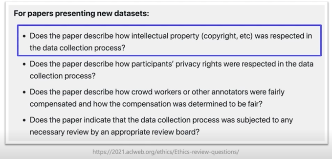
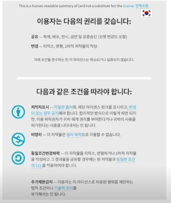
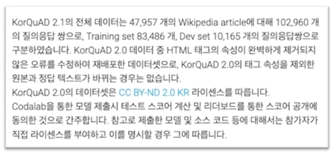
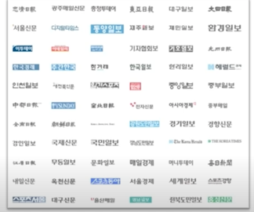
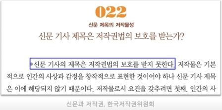

  
# [특강] [AI와 저작권법] 내가 만든 AI 모델은 합법일까, 불법일까?

## 저작권법, 우리가 왜 알아야 할까?

- "그냥 웹에 있는 데이터 크롤링해서 학습에 쓰면 되는거 아니야?"
- ~~큰일난다~~

- 좋은 AI 모델은 좋은 데이터로부터 나옴
  - 내가 풀고 싶은 문제를 푸는 모델을 만들기 위해서는 적절한 데이터가 있어야 함
  - 대부분의 경우 풀고 싶은 문제에 적합한 데이터가 없음
  - 새롭게 데이터를 제작할 때, 저작권을 고려하지 않으면 합법적으로 사용할 수 없게 됨
  - 합법적이지 않은 데이터로 학습한 모델 또한 완전한 합법의 영역에 있다고 보기 어려움

- 학계에서도 점점 저작권과 라이센스에 대해 주목하고 있음

  

- 아직 저작권법은 AI 모델 개발을 고려하지 않은 부분이 많음
  - 저작권법 제1조 (목적)
    - 이 법은 **저작자의 권리와 이에 인접하는 권리를 보호**하고 **저작물의 공정한 이용을 도모**함으로써 **문화 및
    관련 산업의 향상발전에 이바지함**을 목적으로 함
  - 하지만 현재의 저작권법은 *아직* "AI 산업"을 고려하지 않고 있음
    - AI 분야 저작권 면책조항이 신설된 저작권법 개정안이 추진되고 있는 상황
      - https://m.etnews.com/20200701000166?ibj=Tzo4OiJzdGRDbGFzcyl6Mjp7czo3OiJyZWZlcmVyljtOO3M6NzoiZm9yd2FyZCl7czoxMzoid2ViHRvlG1vYmlsZSl7fQ%3D%3D
      - AI 와 창작자 모두를 고려한 좋은 방향의 법 개정을 위해 관심을 가질 필요가 있음

## 그래서 저작권법이 뭔데?

### 용어 정의

**저작권**

사람의 생각이나 감정을 표현한 결과물(저작물)에 대하여 창작자에게 주는 권리로 "창작성"이 있다면 별도의 등록절차없이 자연히 발생함

- 예: 이 특강에 사용된 발표자료의 저작권은 저작자인 "문지형"에게 자연히 귀속됨

**저작물**

사람의 생각이나 감정을 표현한 결과물
1. 소설 $\cdot$ 시 $\cdot$ 논문 $\cdot$ 강연 $\cdot$ 연설 $\cdot$ 각본 그 밖의 어문저작물
2. 음악저작물
3. 연극 및 무용 $\cdot$ 무언극 그 밖의 연극저작물
4. 회화 $\cdot$ 서예 $\cdot$ 조각 $\cdot$ 판화 $\cdot$ 공예 $\cdot$ 응용미술저작물 그 밖의 미술저작물
5. 건축물 $\cdot$ 건축을 위한 모형 및 설계도서 그 밖의 건축저작물
6. 사진저작물(이와 유사한 방법으로 제작된 것을 포함한다)
7. 영상저작물
8. 지도 $\cdot$ 도표 $\cdot$ 설계도 $\cdot$ 약도 $\cdot$ 모형 그 밖의 도형저작물
9. 컴퓨터프로그램저작물

**저작권법에 의해 보호받지 못하는 저작물**
1. 헌법 $\cdot$ 법률 $\cdot$ 조약 $\cdot$ 명령 $\cdot$ 조례 및 규칙
2. 국가 또는 지방자치단체의 고시 $\cdot$ 공고 $\cdot$ 훈령 그 밖에 이와 유사한 것
3. 법원의 판결 $\cdot$ 결정 $\cdot$ 명령 및 심판이나 행정심판절차 그 밖에 이와 유사한 절차에 의한 의결 $\cdot$ 결정 등
4. 국가 또는 지방자치단체가 작성한 것으로서 제1호 내지 제3호에 규정된 것의 편집물 또는 번역물
5. 사실의 전달에 불과한 시사보도

### Q. 판례 검색 서비스를 제공하는 모델을 만들어서 배포하려고 해요. 괜찮을까요?

A. 네!

### Q. 부캠 특강을 보고 너무 인상깊어서 AI Stages 에 댓글을 남겼어요. 이 댓글의 저작권은 저에게 있나요?

A. 댓글의 내용에 따라 다릅니다.
- "너무 좋았아요!" 와 같이 누구나 할 수 있는 문장이라면 보호받지 못하나 "창작성"이 인정되는 수준의 문장에는 저작권이 부여됩니다.

### Q. 창작성이 인정되는 저작물에 저작권이 자연발생한다면 어떻게 데이터를 합법적으로 쓸 수 있나요?

A. 이제부터 알아봅시다

## 합법적으로 데이터 사용하기

1. 저작자와 협의하기

- 저작권자를 아는 경우, 그 사람과 교섭해서 이용 방식에 대해 협의
- 크게 저작물 이용의 허락을 받는 것, 저작재산권을 양수받는 것 등의 방법이 있음

  

**저작재산권 독점적/비독점적 이용허락**

- **독점적** 이용허락의 경우, 저작자는 계약을 체결한 이용자에게 데이터 이용에 대한 "독점적"인 권리를 행사하는 것을 허락하는 것임
  - 예: 만약 A 사가 보유한 데이터에 대해 B 사와 저작재산권 독점적 이용허락계약을 맺었다면 A 사는 C 사와 같은 계약을 체결할 수 **없음**
  - ~~(계약위반 책임을 지는 것을 감수한다면 가능함)~~
- **비독점적** 이용허락의 경우, 저작자는 계약을 체결한 이용자 외에도 데이터 이용 계약을 맺을 수 있음
  - 예: 만약 A 사가 보유한 데이터에 대해 B 사와 저작재산권 비독점적 이용허락계약을 맺었다면 A 사는 C 사와 같은 계약을 체결할 수 **있음**

**저작재산권 전부/일부에 대한 양도**

- 저작재산권은 양도할 수 있는 권리
- 따라서 저작물을 이용하려는 사람은 타인의 저작재산권을 양수받아서 이용 가능
- 양수받을 경우에는 **모든** 저작재산권 혹은 **일부**의 저작재산권을 양수받을 수 있으며, 일정한 기간을 정하여 양수받을 수도 있음

### Q. 일일이 계약을 맺고 사용하게 하는 방식은 저작자와 이용자 모두에게 비효율적인 것 같아요. 더 좋은 방법은 없나요?

A. 있습니다. "라이센스"가 그 역할을 하죠

2. 라이센스

- 저작자에게 이용 허가 요청을 하지 않아도 저작자가 제안한 특정 조건을 만족하면 이용이 가능하도록 만든 저작물에 대한 **이용허락 규약**
- 라이센스를 발행하는 단체는 다양할 수 있음
  - 가장 유명한 것은 Creative Commons 라는 비영리 단체에서 제공하는 **CCL** 이 있음
  - 국내에는 문화체육관광부에서 제공하는 **공공누리**가 있음

## Creative Commons License (CCL)

**종류**

- CC-BY
- CC-BY-ND
- CC-BY-SA
- CC-BY-NC
- CC-BY-NC-NC
- CC-BY-NC-SA

  

**BY: Attribution**
- 저작자 표시
  - 적절한 출처와, 해당 라이센스 링크를 표시하고, 변경이 있는 경우 공지

**ND: NoDerivatives**
- 변경 금지
  - 이 저작물을 리믹스, 변형하거나 2차적 저작물을 작성하였을 경우 그 결과물을 공유할 수 없음

**NC: NonCommercial**
- 비영리
  - 이 저작물은 영리 목적으로 이용할 수 없음
  - 교육과 연구 등이 비영리 목적 활용에 포함

**SA: ShareAlike**
- 동일조건 변경허락
  - 이 저작물을 리믹스, 변형하거나 2차적 저작물을 작성하고 그 결과물을 공유할 경우에는 원 저작물과 동일한 조건의 CCL 을 적용

**CC-BY-NC-SA**
- BY + NC + SA
  - BY: 저작자 표시
  - NC: 비영리
  - SA: 동일조건 변경허락

    

- 예시
  - 나무위키

    

### Q. 나무위키 데이터를 크롤링해서 MRC 데이터셋 제작을 한 이후에 제 깃헙을 통해 배포하는 것이 가능한가요?

A. 학교 소속이라면 비영리목적으로 간주되므로 가능합니다. 하지만 배포하더라도 반드시 원 데이터의 라이센스인 CC-BY-NC-SA 를
부착해야 하고, 원 데이터의 출처를 명시해야 합니다.

**CC-BY-ND**
- BY + ND
  - BY: 저작자 표시
  - ND: 변경 금지

    

- 예시
  - KorQuAD

    

### Q. KorQuAD 의 질문만 바꿔서 새롭게 MRC 데이터셋을 제작한 이후에 제 깃헙에 배포해도 될까요?

A. 변경금지 조건이 걸려있기 때문에 KorQuAD 의 지문, 질문, 정답쌍을 변경하여 공개하는 것은 불가능합니다

## AI 를 하다보면 자주 마주칠 수 있는 사례

### 뉴스 데이터의 이용

**뉴스 기사의 저작권은 언론사에 있음**

- 한국언론진흥재단에서 대부분 언론사의 저작권을 위탁해서 관리

  

**따라서 뉴스 기사를 합법적으로 사용하기 위해서는,**

- 원하는 기사를 제공하는 언론사가 한국언론진흥재단에 저작권 위탁을 맡겼다면, 한국언론진흥재단에 문의
- 아니라면 직접 언론사에 컨텐츠 사용 범위와 계약 조건에 대해 문의
- 혹은 아--주 드물게 CCL 이 적용된 언론사의 뉴스 기사를 사용

  

**한국데이터거래소에서 0원에 구매한 데이터는 내 마음대로 이용할 수 있을까?**

  

- 데이터 판매회원이 정한 이용약관에 따라 다름
- KDX 의 경우 기본적으로 아래의 가., 나., 다. 조항의 공통 이용범위 내에서만 사용 가능
- 판매회원이 추가 조건을 더 걸었다면 공통 이용범위 외의 다른 이용도 불가능할 수 있음

  

**뉴스 기사의 제목**

- 저작물로서의 가치를 인정받지 못해 저작권법의 보호를 받지 못함

  

### 공정 이용 (Fair-use)

**아래의 경우에 대해서는 저작권자의 허락을 받지 않고도 저작물을 이용할 수 있음

1) 교육, 등등
2) 재판절차 등에서의 복제
3) 정치적 연설 등의 이용
4) **학교 교육 목적** 등에의 이용
5) 시사 보도를 위한 이용
6) 공표된 저작물의 이용
7) 영리를 목적으로 하지 않은 공연 $\cdot$ 방송
8) 사적 이용을 위한 복제
9) 도서관 등에서의 복제
10) 시험 문제로서의 복제
11) 시각장애인 등을 위한 복제
12) 방송사업가의 일시적 녹음 $\cdot$ 녹화
13) 미술 $\cdot$ 사진 $\cdot$ 건축저작물의 전시 또는 복제
14) 번역 등에 의한 이용
15) 시사적인 기사 및 논설의 복제
16) 프로그램 코드 역분석
17) 정당한 이용자에 의한 보존을 위한 프로그램 복제

## 마무리

### 저작권법의 회색지

**AI 와 저작권법, 아직 갈 길이 멀다**

- GPT-3 가 생성한 데이터를 바탕으로 학습해도 될까?
- 요약 모델이 요약한 뉴스 기사의 저작권은 어떻게 될까?
  - Extractive 요약의 경우는?
  - Abstractive 요약의 경우는?
- ...

**AI 와 저작권법, Takeaways**

- 저작권법의 취지는 **저작자의 권리와 이에 인접하는 권리를 보호**하고 **저작물의 공정한 이용을 도모**함으로써 
**문화 및 관련 산업의 향상발전에 이바지함**을 목적으로 함
- 하지만 AI 산업에 대해는 아직도 회색지대에 놓인 것들이 많음
- 저작물의 저작권이 있으면서 라이센스가 부착된 경우, 해당 라이센스의 이용 범위 내에서 이용 가능
  - NOTE: CCL 라이센스가 아닌 다른 종류의 라이센스도 많음
- 저작물의 저작권이 있으면서 라이센스가 없는 경우, 직접 저작권자와 협의

