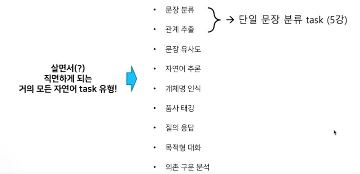
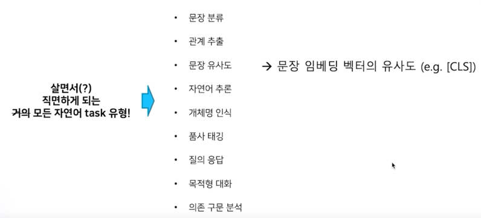
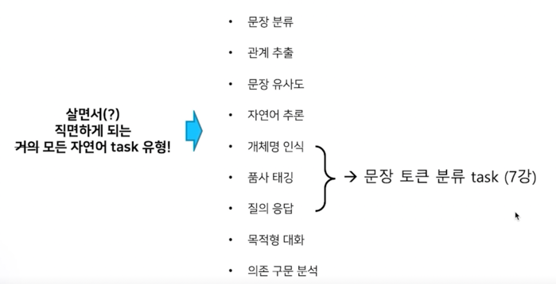
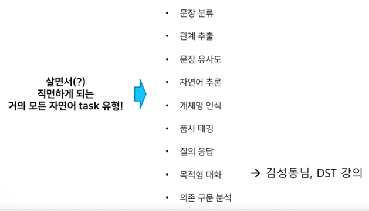
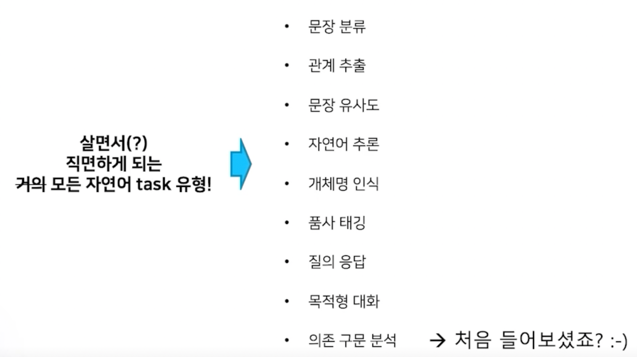
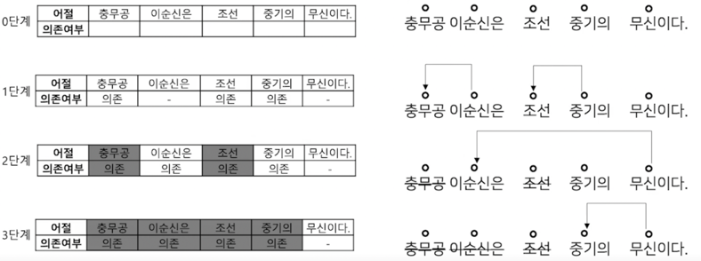
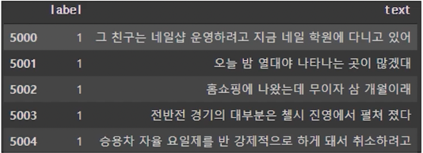
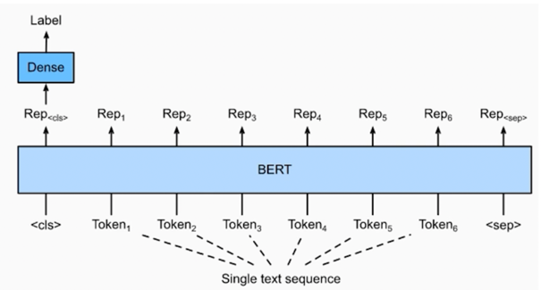
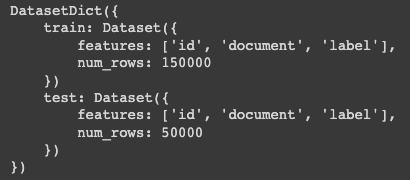

  
# BERT Pre-Training

## 1. BERT 언어모델 기반의 단일 문장 분류

### 1.1 KLUE 데이터셋 소개

**한국어 자연어 이해 벤치마크(Korean Language Understanding Evaluation, KLUE)**













### 1.2 의존 구문 분석

**단어들 사이에 관계를 분석하는 task**


1. 특징
   - 지배소: 의미의 중심이 되는 요소
   - 의존소: 지배소가 갖는 의미를 보완해주는 요소(수식)
   - 어순과 생략이 자유로운 한국어와 같은 언어에서 주로 연구된다.
2. 분류 규칙
   - 지배소는 후위언어이다. 즉 지배소는 항상 의존소보다 뒤에 위치한다.
   - 각 의존소의 지배소는 하나이다.
   - 교차 의존 구조는 없다.
3. 분류 방법
   - Sequence labeling 방식으로 처리 단계를 나눈다.
   - 앞 어절에 의존소가 없고 다음 어절이 지배소인 어절을 삭제하며 의존 관계를 만든다.



**어따 써요?**


- 복잡한 **자연어** 형태를 그래프로 **구조화**해서 표현 가능! 각 **대상**에 대한 정보 추출이 가능!

구름그림 $\rightarrow$ 새털구름을 그린 것 $\rightarrow$ 내가 그린 것

"나"는 "구름그림" 을 그렸다.

"구름 그림"은 "새털구름"을 그린 것이다.

## 2. 단일 문장 분류 task 소개

### 2.1 문장 분류 task

**주어진 문장이 어떤 종류의 범주에 속하는지를 구분하는 task**

1. 감정분석(Sentiment Analysis)
   - 문장의 긍정 또는 부정 및 중립 등 성향을 분류하는 프로세스
   - 문장을 작성한 사람의 느낌, 감정 등을 분석할 수 있기 때문에 기업에서 모니터링, 고객지원, 또는 대슥ㄹ에 대한 필터링 등을
   자동화하는 작업에 주로 사용
   - 활용 방안
     - 혐오 발언 분류 : 댓글, 게임 대화 등 혐오 발언을 분류하여 조치를 취하는 용도로 활용
     - 기업 모니터링 : 소셜, 리뷰 등 데이터에 대해 기업 이미지, 브랜드 선호도, 제품평가 등 긍정 또는 부정적 요인을 분석
2. 주제 라벨링(Topic Labeling)
   - 문장의 내용을 이해하고 적절한 범주를 분류하는 프로세스
   - 주제별로 뉴스 기사를 구성하는 등 데이터 구조화와 구성에 용이
   - 활용 방안
     - 대용량 문서 분류 : 대용량의 문서를 범주화
     - VoC(Voice of Customer) : 고객의 피드백을 제품 가격, 개선점, 디자인 등 적절한 주제로 분류하여 데이터를 구조화
3. 언어감지(Language Detection)
   - 문장이 어떤 나라 언어인지를 분류하는 프로세스
   - 주로 번역기에서 정확한 번역을 위해 입력 문장이 어떤 나라의 언어인지 타겟팅 하는 작업이 가능
   - 활용 방안
     - 번역기 : 번역할 문장에 대해 적절한 언어를 감지함
     - 데이터 필터링 : 타겟 언어 이외 데이터는 필터링
4. 의도 분류(Intent Classification)
   - 문장이 가진 의도를 분류하는 프로세스
   - 입력 문장이 질문, 불만, 명령 등 다양한 의도를 가질 수 있기 때문에 적절한 피드백을 줄 수 있는 곳으로 라우팅 작업이 가능
   - 활용 방안
     - 챗봇 : 문장의 의도인 질문, 명령, 거절 등을 분석하고 적절한 답변을 주기 위해 활용

### 2.2 문장 분류를 위한 데이터

**Kor_hate**

- 혐오 표현에 대한 데이터
- 특정 개인 또는 집단에 대한 공격적 문장
- 무례, 공격적이거나 비꼬는 문장
- 부정적이지 않은 문장


**Kor_sarcasm**

- 비꼬지 않은 표현의 문장
- 비꼬는 표현의 문장


**Kor_sae**

- 예/아니오로 답변 가능한 질문
- 대안 선택을 묻는 질문
- Wh- 질문 (who, what, where, when, why, how)
- 금지 명령
- 요구 명령
- 강한 요구 명령


**Kor_3i4k**

- 단어 또는 문장 조각
- 평서문
- 질문
- 명령문
- 수사적 질문
- 수사적 명령문
- 억약에 의존하는 의도



## 3. 단일 문장 분류 모델 학습

### 3.1 모델 구조도

**BERT 의 [CLS] token 의 vector 를 classification 하는 Dense layer 사용



**주요 매개변수**

- input_idx : sequence token 을 입력
- attention_mask : [0, 1] 로 구성된 마스크이며 패딩 토큰을 구분
- token_type_idx : [0, 1] 로 구성되었으며 입력의 첫 문장과 두번째 문장 구분
- position_ids : 각 입력 씨퀀스의 임베딩 인덱스
- inputs_embeds : input_ids 대신 직접 임베딩 표현을 할당
- labels : loss 계산을 위한 레이블
- Next_sentence_label : 다음 문장 예측 loss 계산을 위한 레이블

### 3.2 학습 과정


---

# 실습

## BERT 를 활용한 단일 문장 분류 실습

datasets 라는 라이브러리를 출시함  
어떤 라이브러리냐면?  
모든 dataset 들을 다 그들의 hub 에 저장을 해둠  
마치 우리가 bert base model 을 불러온 것 처럼 dataset 의 이름만 넣으면 내가 원하는 value 안에 dataset 이 들어오게 됨

```python
import torch
import datasets
import sys

device = torch.device('cuda:0' if torch.cuda.is_available() else 'cpu')

# 사용가능한 dataset list 불러오기
dataset_list = datasets.list_datasets()

# dataset list 확인
for datas in dataset_list:
    if 'ko' in datas:
        print(datas)
```

영어뿐만 아니라 전세계 언어에서 자연어 관련 datasets 가 전부 이 hub 안에 저장이 되어있다고 보면 됨

우리나라 말의 관련된 datasets 도 존재함

```python
# nsmc 데이터 로드
dataset = datasets.load_dataset('nsmc') # nsmc, hate, sarcasm

# 데이터셋 구조 확인
print(dataset)
```



우리가 사용하려는 dataset 은 `nsmc` 라는 dataset 임

naver 에서 제공한 영화 댓글의 감성분류 dataset 임

단읾 문장 분류에는 감성분류 말고도 사용 할 수 있는 `hate`, `sarcasm` 도 있음

dictionary 형태로 되어있고 train 과 test 가 나뉘어져 있음

### 첫번째로 우리가 만들어야 하는 것은 dataset 을 만들어야 함

dataloader 로 가기전의 전단계를 만들기 위해 다루기 편하게 pandas 를 이용해서 DataFrame 형태로 저장함

```python
import pandas as pd

# 필요한 데이터인 document와 label 정보만 pandas라이브러리 DataFrame 형식으로 변환
train_data = pd.DataFrame({"document":dataset['train']['document'], "label":dataset['train']['label'],})
test_data = pd.DataFrame({"document":dataset['test']['document'], "label":dataset['test']['label'],})

# 데이터셋 갯수 확인
print('학습 데이터셋 : {}'.format(len(train_data)))
print('테스트 데이터셋 : {}'.format(len(test_data)))
```


```python
# 데이터셋 내용 확인
train_data[:5]
```


```python
test_data[:5]
```


전처리 단계 중에 하나인 데이터 중복을 제거하고 outlier 데이터 삭제하고 label 이 0 과 1 인데 오탈자가나서 3이 있다
이런 것들을 삭제해야 함

이런 것들을 진행하는게 데이터 전처리 과정임

```python
# 데이터 중복을 제외한 갯수 확인
print("학습데이터 : ",train_data['document'].nunique()," 라벨 : ",train_data['label'].nunique())
print("데스트 데이터 : ",test_data['document'].nunique()," 라벨 : ",test_data['label'].nunique())

# 중복 데이터 제거
train_data.drop_duplicates(subset=['document'], inplace= True)
test_data.drop_duplicates(subset=['document'], inplace= True)

# 데이터셋 갯수 확인
print('중복 제거 후 학습 데이터셋 : {}'.format(len(train_data)))
print('중복 제거 후 테스트 데이터셋 : {}'.format(len(test_data)))
```


unique() 를 사용해서 개수를 보니 150000개보다 줄어들어서 중복 데이터가 있다는 것을 알 수 있음

그 다음엔 null 데이터를 제거하자

```python
import numpy as np

# null 데이터 제거
train_data['document'].replace('', np.nan, inplace=True)
test_data['document'].replace('', np.nan, inplace=True)
train_data = train_data.dropna(how = 'any')
test_data = test_data.dropna(how = 'any')

print('null 제거 후 학습 데이터셋 : {}'.format(len(train_data)))
print('null 제거 후 테스트 데이터셋 : {}'.format(len(test_data)))
```


null 데이터를 제거했더니 하나씩 줄어 들었음

```python
print(train_data['document'][0])
print(train_data['label'][0])
```


다음으로는 outlier 를 제거하는 것도 전처리 과정중에 하나임

학습 문장의 최대 길이와 평균 길이를 구하고 이 sentence 들의 histogram 을 그려보자

```python
from matplotlib import pyplot as plt

#학습 리뷰 길이조사
print('학습 문장 최대 길이 :',max(len(l) for l in train_data['document']))
print('학습 문장의 평균 길이 :',sum(map(len, train_data['document']))/len(train_data['document']))

plt.hist([len(s) for s in train_data['document']], bins=50)
plt.xlabel('length of data')
plt.ylabel('number of data')
plt.show()
```


lentgh 자체는 sentence character_length 임  
평균은 35 정도 되는데 학습 문장의 최대는 146까지도 있음  
우리가 만든 BERT 모델 자체가 이 length 를 전부다 포함할 수 있을만큼 큰 모델이기 때문에 우선 필터링 없이 넘어가도록 하자

### 학습에 사용될 pre-trained 된 BERT 모델을 가져오자

```python
# Store the model we want to use
from transformers import AutoModel, AutoTokenizer, BertTokenizer
MODEL_NAME = "bert-base-multilingual-cased"
tokenizer = AutoTokenizer.from_pretrained(MODEL_NAME)
```

### 토크나이저 준비

```python
tokenized_train_sentences = tokenizer(
    list(train_data['document']),
    return_tensors="pt",
    padding=True,
    truncation=True,
    add_special_tokens=True,
    )

print(tokenized_train_sentences[0])
print(tokenized_train_sentences[0].tokens)
print(tokenized_train_sentences[0].ids)
print(tokenized_train_sentences[0].attention_mask)
```


데이터셋을 만들기 위해서 토크나이징을 함    
토크나이징 할 때는 리스트 형태로 문장을 넣게 되면 리스트 형태로 output 이 반환 됨  
[CLS] 와 [SEP] 토큰이 부착되었음  

클래스를 거쳐서 나온 결과물에는 어떤 token 이 있는지 해당 토큰의 vocab 은 뭔지 그리고 attention_mask 는 뭔지 이런 
정보가 다 들어있음

그러면 이제 dataset 이 거의 완성이 되었음

train 을 위한 tokenized 된 data 을 이렇게 만들어 줬고

```python
tokenized_test_sentences = tokenizer(
    list(test_data['document']),
    return_tensors="pt",
    padding=True,
    truncation=True,
    add_special_tokens=True,
    )
```

test 를 위한 tokenized 된 data 도 만들어 줌

```python
train_label = train_data['label'].values
test_label = test_data['label'].values

print(train_label[0])
```


이렇게 sentence, label 을 준비해놓고

이걸 실제 모델에 입력하기 위한 구조적인 형태로 만들어 줄 거임

hugging face 가 만든 것이기 때문에 tokenizer 에서 나온 class 정보 key, value 랑 모델에 들어가는 key, value 랑
서로 일치하게 됨

그래서 사실상 고칠게 많이 없음

```python
class SingleSentDataset(torch.utils.data.Dataset):
    def __init__(self, encodings, labels):
        self.encodings = encodings
        self.labels = labels

    def __getitem__(self, idx):
        item = {key: torch.tensor(val[idx]) for key, val in self.encodings.items()}
        item['labels'] = torch.tensor(self.labels[idx])
        return item

    def __len__(self):
        return len(self.labels)
```

dataset 에는 `__getitem__` 이라는 함수가 있는데 학습이 진행되면 매 step 이 진행이 될 거고 이것이 배치단위로 동작하게
되는데 그 step 에 맞는 데이터셋을 모델에 가져오게 되는게 바로 이 `__getitem__` 함수를 통해서 가져오게 됨

모델 입장에서는 


이 3가지 정보가 전달이 되어야 하는데 이 3가지가 전부 key, value 형태로 구성이 되어있고 모델에는 그 key, value 가 그대로
들어가면 됨

```python
train_dataset = SingleSentDataset(tokenized_train_sentences, train_label)
test_dataset = SingleSentDataset(tokenized_test_sentences, test_label)
```

tokenized_train_sentences 와 train_label 을 파라미터로 넣어서 dataset class 를 통해서 dataset 을 만들어 줌

`BertForSequenceClassification` 이라는걸 제공해줌

문장 분류를 위해서는 BERT 위에 Classification 위에 head 를 부착해야 하는데 이걸 transformers 에서 제공해주고 있음

```python
from transformers import BertForSequenceClassification, Trainer, TrainingArguments
# 문장 분류를 위해선 BERT 위에 classification을 위한 head를 부착해야 합니다.
# 해당 부분을 transformers에서는 라이브러리 하나만 호출하면 됩니다! :-)
```

모델 initialize 를 `BertForSequenceClassification` 이걸로 할 거임

training arguments 를 봐보자

```python
training_args = TrainingArguments(
    output_dir='./results',          # output directory
    num_train_epochs=1,              # total number of training epochs
    per_device_train_batch_size=32,  # batch size per device during training
    per_device_eval_batch_size=64,   # batch size for evaluation
    warmup_steps=500,                # number of warmup steps for learning rate scheduler
    weight_decay=0.01,               # strength of weight decay
    logging_dir='./logs',            # directory for storing logs
    logging_steps=500,
    save_steps=500,
    save_total_limit=2
)
```

output_dir 결정하고 train_epochs 설정하고 train_batch_size 결정하고  
warmup_steps : gradient descent 를 하면서 움직이게 되는 범위를 어느정도로 할거냐를 나타내는 정보인 
learning_rate 라는게 있는데 보통 이거를 고정된 값을 하게 되는데 BERT 는 특이하게 warmup_steps 라는 아이디어를 사용함  
그래서 maximum_learning_rate 가 있으면 처음에 0에서부터 maximum 까지 올라갔다가 weight_decay 는 그걸 떨어뜨리는
형식으로 구성이 되어있음 즉, warmup_steps 는 learning_rate 를 조절하는 대상임  
마찬가지로 logging_dir 같은 경우에는 학습에 해당하는 log 를 저장할 수 있음  
loging_steps, save_steps 둘다 500이면 500 step 마다 저장하고 save_total_limit=2 이면 저장되는 모델이 2개만
존재함

이렇게 train arguments 를 정의해주고 

```python
model = BertForSequenceClassification.from_pretrained(MODEL_NAME)
model.to(device)

trainer = Trainer(
    model=model,                         # the instantiated 🤗 Transformers model to be trained
    args=training_args,                  # training arguments, defined above
    train_dataset=train_dataset,         # training dataset
)
```

모델은 BertForSequenceClasssification 으로 initialize 해주고 그 다음에 모델을 GPU 로 업로드하고  
그 다음에 Trainer 를 만들고 train_dataset 은 trainer 에서 사용됨

그 다음엔 trainer.train() 을 하면 학습이 됨

```python
trainer.train() # 1 epoch에 대략 30분 정도 소요됩니다 :-)
```

`nsmc` 같은 경우 데이터가 많아서 1epoch 에 30분정도 걸림

### 학습을 하고나면 평가가 필요함

성능 평가를 위한 함수를 만듦

```python
from sklearn.metrics import precision_recall_fscore_support, accuracy_score

def compute_metrics(pred):
    labels = pred.label_ids
    preds = pred.predictions.argmax(-1)
    precision, recall, f1, _ = precision_recall_fscore_support(labels, preds, average='binary')
    acc = accuracy_score(labels, preds)
    return {
        'accuracy': acc,
        'f1': f1,
        'precision': precision,
        'recall': recall
    }

trainer = Trainer(
    model=model,
    args=training_args,
    compute_metrics=compute_metrics
)
```

trainer 를 사용하게 되면 `evaluate` 함수를 사용할 수 있음  
`evaluate` 가 실행이 됐을 때 compute_matrics 라는 함수를 불러와서 평가를 하게 됨  
이 함수에서 입력값은 `pred` 라는 class 임  
이 class 안에는 label_ids 가 존재하고 predictions 라는 것도 존재함  
원래 정답레이블이 뭔지 나의 모델이 예측한게 뭔지 정보가 labels 와 preds 에 저장됨  
그러면 sklearn 의 metrics 를 사용해서 precision_recall_fscore 를 계산할 수 있음  
compute_metrics 함수의 반환값은 accuracy, f1, precision, recall 이렇게 반환하도록 설정해두고  
trainer 정보를 업데이트 해줌

```python
trainer.evaluate(eval_dataset=test_dataset)
```


trainer.evaluate 하면서 eval_dataset=test_dataset 으로 설정하면 evaluation 결과가 나오게 됨

trainer 를 쓰고 싶지 않으면 기존에 학습하던 코드처럼 코딩하면 됨

```python
# native training using torch

# model = BertForSequenceClassification.from_pretrained(MODEL_NAME)
# model.to(device)
# model.train()

# train_loader = DataLoader(train_dataset, batch_size=32, shuffle=True)

# optim = AdamW(model.parameters(), lr=5e-5)

# for epoch in range(3):
#     for batch in train_loader:
#         optim.zero_grad()
#         input_ids = batch['input_ids'].to(device)
#         attention_mask = batch['attention_mask'].to(device)
#         labels = batch['labels'].to(device)
#         outputs = model(input_ids, attention_mask=attention_mask, labels=labels)
#         loss = outputs[0]
#         loss.backward()
#         optim.step()
```

### 모델을 만들었으니 preiction 을 해보자

pipeline 을 쓰면 prediction 코드를 구현하지 않아도 바로 prediction 이 가능함

```python
from transformers import pipeline

nlp_sentence_classif = pipeline('sentiment-analysis',model=model, tokenizer=tokenizer, device=0)

print(nlp_sentence_classif('영화 개재밌어 ㅋㅋㅋㅋㅋ'))
print(nlp_sentence_classif('진짜 재미없네요 ㅋㅋ',model= model))
print(nlp_sentence_classif('너 때문에 진짜 짜증나',model= model))
print(nlp_sentence_classif('정말 재밌고 좋았어요.',model= model))
```


pipeline 항목 중에 'sentiment-analysis' 를 사용하면 label 이 0 아니면 1로 반화이 되게 만들 수 있음  
모델이 GPU 로 올라가있기 때문에 `device=0` 으로 설정해놓음

pipeline 코드를 쓰기 싫다면 이렇게 구현할 수 있음

```python
# predict함수
def sentences_predict(sent):
    model.eval()
    tokenized_sent = tokenizer(
            sent,
            return_tensors="pt",
            truncation=True,
            add_special_tokens=True,
            max_length=128
    )
    tokenized_sent.to(device)
    
    with torch.no_grad():# 그라디엔트 계산 비활성화
        outputs = model(
            input_ids=tokenized_sent['input_ids'],
            attention_mask=tokenized_sent['attention_mask'],
            token_type_ids=tokenized_sent['token_type_ids']
            )

    logits = outputs[0]
    logits = logits.detach().cpu().numpy()
    result = np.argmax(logits)
    return result

print(sentences_predict("영화 개재밌어 ㅋㅋㅋㅋㅋ"))
print(sentences_predict("진짜 재미없네요 ㅋㅋ"))
print(sentences_predict("너 때문에 진짜 짜증나"))
print(sentences_predict("정말 재밌고 좋았어요."))
```


input_sentence 에 대해 tokenizing 을 진행하고 tokenizing 된 거에서 모델로 input 을 넣게 됨  

이렇게 만들면 class 가 2개가 아닌 여러개인 경우에도 prediction 이 가능함

> 작성자      
```
* 김성현 (bananaband657@gmail.com)  
1기 멘토
김바다 (qkek983@gmail.com)
박상희 (parksanghee0103@gmail.com)  
이정우 (jungwoo.l2.rs@gmail.com)
2기 멘토
박상희 (parksanghee0103@gmail.com)  
이정우 (jungwoo.l2.rs@gmail.com)
이녕우 (leenw2@gmail.com)
박채훈 (qkrcogns2222@gmail.com)
```
[CC BY-NC-ND](https://creativecommons.org/licenses/by-nc-nd/2.0/kr/)
