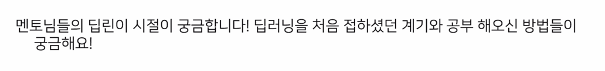

  
# [오피스아워] NLP with RL, Vision - 성예닮 멘토

## 사전질문

- 조대현 멘토님

    한번에 보고 이해를 못하고 해서 시간을 두고 한 두달 뒤에 본적도 많음  
    다시 보고 또 보고 하는게 많았던 것 같고 정리된 걸 보기전에 먼저 논문을 봐야함  

- 이유경 멘토님

    2018년 모델 구현을 해봄  
    이론이 뭔지도 모르고 돌아가는걸 초점을 두고 만들면서 입문을 했음  
    제대로 공부를 시작했다고 느낀적은 컴피티션인것 같음  
    당장 데이터가 주어져있고 baseline 이 있는 대회에 나가서 당장 성능을 만들다 보니 모듈 구현이 익숙해지고
    그렇게 하고나서 NLP 에서는 논문을 정말 많이 읽었음  
    논문의 가치를 알아보려면 코드와 매칭하는 작업이 중요함  
    논문을 읽기전에 남이 정리해놓은 자료를 보지 않음 혼자 이해하고나서 남들이 정리해놓은걸 확인함  
    내가 본 관점과 비교해보면서 어떻게 다른지 대조하는 식으로 공부하고 있음  
    논문의 제목과 abstract 그리고 related work 를 꼼꼼히 봄  
    가정을 세우고 introduction 을 보면서 가정을 세우고 생각한 것과 같이 가는지 비교해보면서 논문을 봄  
    코드와 논문 매칭을 많이 하고있고 비슷하지만 다른 방법론을 한번에 훑어보는게 정말 많은 걸 배우는 계기라고 생각해서 정리하면서 배움  
    스터디도 좋아해서 많은 토론과 생각하는 시간을 갖는게 중요  

> 논문 이해와 오픈소스 코드 이해 사이에 아주 아주 큰 간격이 있다는 걸 자주 느끼는데 혹시 이 부분을 극복하시는 요령들이 궁금합니다!

- 이유경 멘토님

    이해는 없다라고 생각하고 논문이 수식이랑 코드에서 어디에서 사용되는지를 자주 접하게되면 이런 메소드를 이런식으로 구현하는구나 라고
    방법을 알게 됨
    쉬우면서도 유명한 걸 찾아서 이런 것들을 계속 보는게 중요
    task 가 명확해서 데이터를 다시 재현해볼 수 있고 classification 같은 task 를 수행해보는게 중요함

> 놓치기 쉬운 부분에 대해서 어떻게하면 안놓칠수 있을지 경험을 듣고싶습니다!!

- 성예닮 멘토님

    두가지로 나뉘는 것 같음  
    딥러닝을 풀로서만 이용해서 어떤 문제를 풀려고 딥러닝을 활용할것인지 딥러닝이라는 알고리즘을 공부를 할 것인지가 나뉜다고 봄  
    후자의 경우 내부 모델까지 살펴보고 싶은 경우는 논문을 구현해보는게 가장 좋음  
    일단 구현을 해보는 걸 추천함  
    논문에서 원했던 결과가 안나옴 근데 이런걸 옵티마이저 이니셜라이저를 하나하나 맞추다보면 유사하게 나오는 경우가 있음  
    이런 과정을 많이 거치다 보면 이 옵티마이저가 왜 잘될까? 여기선 어떤 이니셜라이저를 했더니 잘되고 여기선 안되고 이런 부분    
    모델, 전처리, 옵티마이저 등 설계하는것이 중요한데 모델만 궁금해하는 경향이 있는 것 같음  
    어떤 옵티마이저를 왜 썼는지 나올때가 있어서 이런 것들도 잘 파악하다 보면 놓치는 부분이 줄어드는 것 같음    
    놓치기 쉬운 부분들에 대해서 NIPS 라던지 학회에서 잘 얘기해주고 있음

