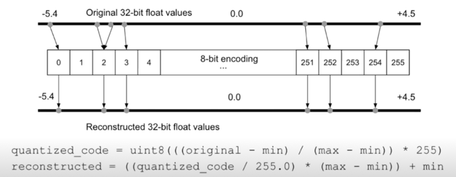
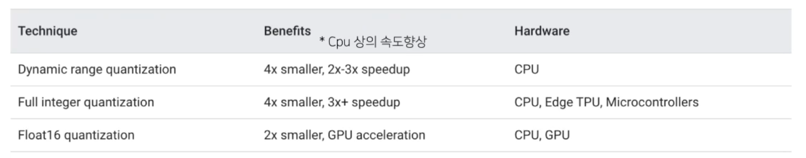
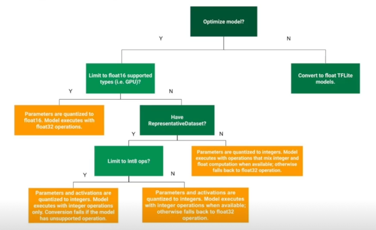
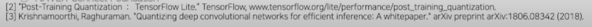
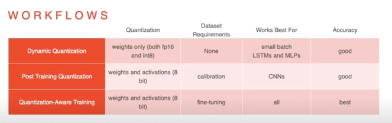
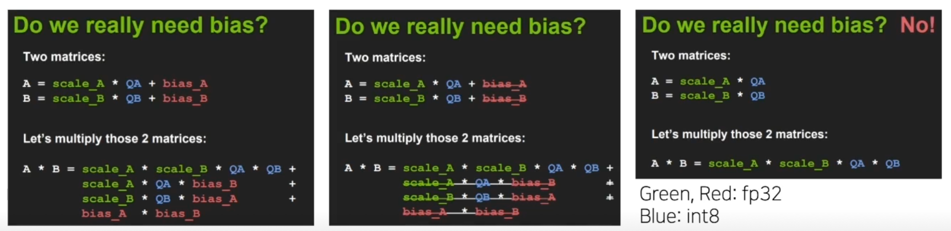
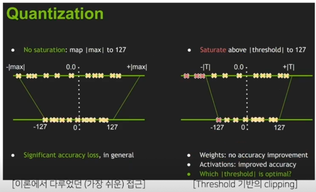

  
# 찢은 모델 꾸겨 넣기: Quantization 실습(with torch, tensorrt)

## 1. Quantization 종류

### 1.1 Review & Overview

**Quantization**

- 기존의 high precision(일반적으로 fp32) Neural network 의 weights 와 activation 을 더 적은 bit(low precision)으로 변환하는 것
- Quantized Matrix Multiplication, Activation, Layer fusion, ...

**Quantization approach 구분**

- Post Training Quantization(PTQ): 학습 후에 quantization parameter(scale, shift)를 결정
- Quantization Aware Training(QAT): 학습 과정에 quantization 을 emulate 함으로써, quantization 으로 발생하는 성능하락을 완화함

### 1.2 Post Training Quantization(PTQ)

**PTQ 기법 정리**

- Dynamic range quantization(weight only quantization): weight 만 quantize 됨(8-bit), inference 시에는 floating-point 로 
변환되어 수행
- Full integer quantization(weight and activation quantization): weight 와 더불어 모델의 입력 데이터, activation(중간 레이어의
output)들 또한 quantize
- Float 16 quantization: fp32 의 데이터 타입의 weight 를 fp16 으로 quantize

**어떨때 어떤 기법을 적용해야할까?(From TF[2])**

**참고: PyTorch 의 구분**

- Dynamic range quantization(Dynamic quantization)을 별도의 범주로 구분
- Post Training Quantization 은 Static quantization 이라고도 칭함
- Dynamic quantization 의 경우, model 수행 시간이 weights 를 load 하는 것이 실제 matrix multiplication 보다 더 오래 걸리는
LSTM, Transformer 기반의 모델에 효과적이라는 언급이 있음

**1) Dynamic range quantization(weight only quantization)**

- 네트워크의 Weight 만 quantize 됨(8bit)
- Pros 😁:
  - 별도의 calibration(validation) 데이터가 필요하지 않음
  - 모델의 용량 축소(8bit 기준 1/4)
- Cons 😥:
  - 실제 연산은 floating point 로 수행됨
  - 실제 속도의 이점이 크지 않음

**2) Full integer quantization(weight and activation quantization)**

- Weight 와 더불어 모델의 입력 데이터, activation(중간 레이어의 output)들도 quantize 됨
- Pros 😁:
  - 모델의 용량 축소(8bit 기준 1/4)
  - 더 적은 메모리 사용량, cache 재사용성 증가
  - 빠른 연산(fixed point 8bit 연산을 지원하는 경우)
- Cons 😥:
  - Activation 의 parameter 를 결정하기 위하여 calibration 데이터가 필요함  
    (주로 training 데이터에서 사용, 약 100개의 데이터) $\rightarrow$ 항상은 아님
  - TF 에서는 100개 정도면 되고 tensorRT 에서는 1000개 정도 필요

- TensorRT 의 quantization 은 bias(zero point)가 없는 Symmetric quantization  
Why? 연산이 훨씬 간단하고, (경험적으로) 성능에 큰 영향을 주지 않았다

**2) Full integer quantization; TensorRT(NVIDIA) calibration 예시**

- Calibration?; 성능 저하를 최소로 하는 threshold 찾기

# Further Reading
 
- [Pytorch official docs: quantization](https://pytorch.org/docs/stable/quantization.html)

