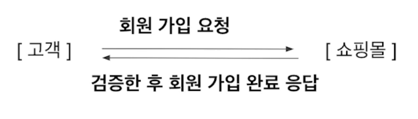
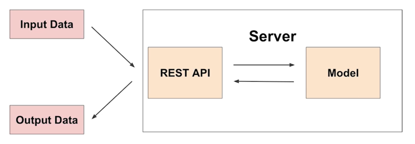
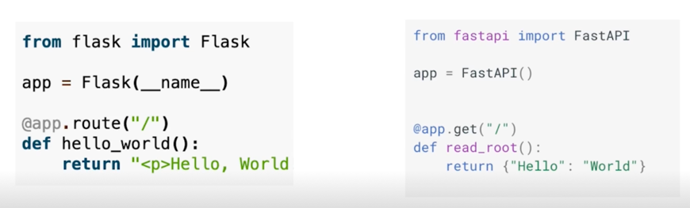
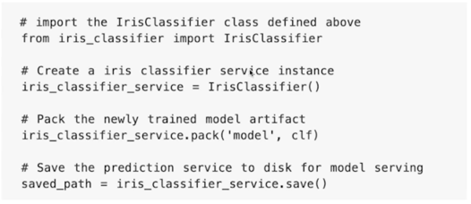
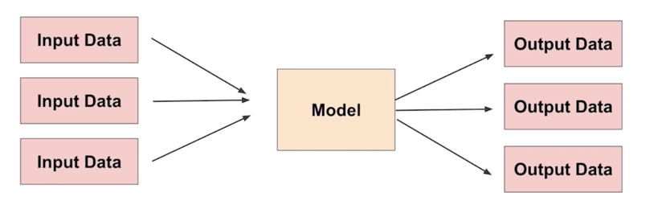
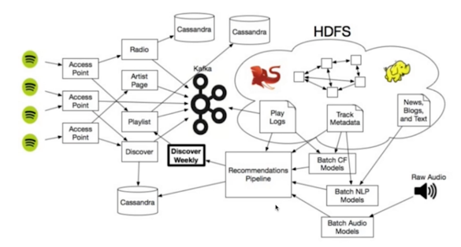
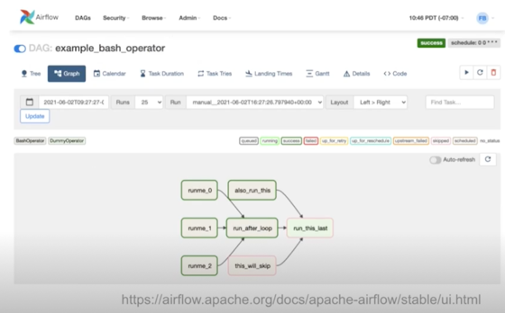

  
# Model Serving

## Serving Basic

**Serving**

- Production(Real World) 환경에 모델을 사용할 수 있도록 배포
- **머신러닝 모델을 개발하고, 현실 세계(앱, 웹)에서 사용할 수 있게 만드는 행위**
- 서비스화라고 표현할 수도 있음
- 머신러닝 모델을 회사 서비스의 기능 중 하나로 활용
  - 예: 추천 시스템의 추천 알고리즘
- Input 이 제공되면 모델이 예측 값(Output)을 반환

크게 2가지 방식 존재

- Online Serving
- Batch Serving
그 외에 클라이언트(모바일 기기, IoT Device 등)에서 Edge Serving 도 존재

## 용어 정리

Serving: 모델을 웹/앱 서비스에 배포하는 과정, 모델을 활용하는 방식, 모델을 서비스화하는 과점

Inference: 모델에 데이터가 제공되어 예측하는 경우, 사용하는 관점

Serving - Inference 용어가 혼재되어 사용되는 경우도 존재

Online Serving / Online Inference

Batch Serving(+Inference)

# Online Serving

## Web Server Basic

웹 서버(Wikipedia)

- HTTP 를 통해 웹 브라우저에서 요청하는 HTML 문서나 오브젝트를 전송해주는 서비스 프로그램
- 요청(Request)을 받으면 요청한 내용을 보내주는(Response) 프로그램

Web Server 는 Client 의 다양한 요청을 처리해주는 역할 **(주문 받기, 신규 고객 응대, 계산 등)**

Machine Learning Server 는 Client 의 다양한 요청을 처리해주느 역할 **(데이터 전처리, 모델을 기반으로 예측 등)**

머신러닝 모델 서버

- 어떤 데이터(Input)를 제공하며 예측해달라고 요청(Request)하면, 모델을 사용해 예측 값을 반환(Response)하는 서버

## API

**API(Application Programming Interface)**

운영체제나 프로그래밍 언어가 제공하는 기능을 제어할 수 있게 만든 인터페이스

## Online Serving Basic

Online Serving 에서 Inference 하는 과정

Input data 를 주면서 요청을하고 API 서버는 모델을 load 해와서 예측한 후 예측한 결과를 반환

- 요청(Request)이 올 때마다 **실시간으로 예측**
- 클라이언트(애플리케이션)에서 ML 모델 서버에 HTTP 요청(Request)하고, 머신러닝 모델 서버에서 예측한 후, 예측 값(응답)을 반환(Response)

- Online Serving / Online Inference

## Serving Input - Single Data Point

**단일** 데이터를 받아 실시간으로 예측을 하는 예제

기계 고장 예측 모델
- 센서의 실시간 데이터가 제공되면 특정 기계 부품이 앞으로 N 분 안에 고장날지 아닐지를 예측

음식 배달 소요 시간 예측
- 해당 지역의 과거 평균 배달 시간, 실시간 교통 정보, 음식 데이터 등을 기반으로 음식 배달 소요 시간 예측

## Online Serving Basic

- ML 모델 서버에 요청할 때, 필요시 ML 모델 서버에서 데이터 전처리를 해야할 수 있음  
  (혹은 분리를 위해 전처리 서버 / ML 모델 서버로 나눌 수도 있음)
- 서비스의 서버에 ML 서버를 포함하는 경우도 있고, ML 서버를 별도로 운영하는 경우도 존재
- 회사에서 개발 조직과 데이터 조직의 협업하는 방식에 따라 다르게 개발할 수 있음

Online Serving 을 구현하는 방식

1. 직접 API 웹 서버 개발 : Flask, FasgAPI 등을 사용해 서버 구축
2. 클라우드 서비스 활용 : AWS 의 SagaMaker, GCP 의 Vertex AI 등
3. Serving 라이브러리 활용 : Tensorflow Serving, Torch SErve, MLFlow, BentoML 등

## 직접 API 웹 서버 개발

- Flask, FastAPI 등을 사용해 서버 구축
- localhost(예를 들면 www.naver.com) 웹 서버 예시

## 클라우드 서비스 활용

- AWS 의 SageMaker, GCP 의 Vertex AI 등

클라우드 서비스의 장점
- 직접 구축해야 하는 MLOps 의 다양한 부분(API 서버 만들기)이 만들어짐
- 사용자 관점에선 PyTorch 사용하듯 학습 코드만 제공하면 API 서버가 만들어짐

클라우드 서비스의 아쉬운 점
- 클라우드 서비스가 익숙해야 잘 활용할 수 있음
- 비용 문제: 직접 만드는 것보단 더 많은 비용이 나갈 수 있음

회사의 상황에 따라 클라우드 서비스를 활용하는 것이 좋은 시기도 존재
- 소수의 인원만 존재하며, 소수의 인원이 많은 업무를 해야하는 경우
- 클라우드의 내부 실행 구조를 잘 알아야 문제 상황이 발견되었을 때 잘 해결할 수 있음
- 클라우드 서비스에선 어떤 방식으로 AI 제품을 만들었는지 확인할 수도 있어서 사용해보는 것도 좋음

## Serving 라이브러리 활용

- Tensorflow Serving, Torch Serve, MLFlow, BentoML 등
- Fast API 등을 활용할 수 있지만, 처음에 서버에 대한 이해가 충분하지 않으면 어려울 수 있음
- 다양한 방식으로 개발할 수 있지만, 매번 추상화된 패턴을 가질 수 있음
- 추상화된 패턴을 잘 제공하는 오픈소스를 활용하는 방식

BentoML 예시

위 코드를 실행한 후, 학습한후 CLI 에서 명령어를 입력하면 배포 끝!

bentoml serve IrisClassifier:latest

## 다양한 Serving 방법을 선택하는 가이드

어떤 방법을 쓰느냐는 **주어진 환경(회사에서 주어진 일정, 인력, 예산, 요구 성능 등)** 에 따라 다름

추천 방식
- (만약 회사에서 클라우드 비용에 대해 괜찮을 경우)
1. 프로토타입 모델을 클라우드 서비스를 활용해 배포
2. 직접 FastAPI 등을 활용해 서버 개발
3. Serving 라이브러리를 활용해 개발

이런 Flow 로 체험하는 것을 추천

이 강의에선 다음과 같은 방식으로 진행
1. 프로토타입 개발
2. Fast API 로 서버 개발
3. Serving 라이브러리로 개발

바로 Serving 라이브러리를 학습하지 않는 이유

- 사용하기엔 편하지만, 이 강의는 툴을 학습하는 강의가 아니라 **점진적으로 문제를 해결하는 강의**
- 여러가지 방법 중 **이 방법을 왜 선택하는지** 에 대한 인식을 키워주고 싶음
- 오픈소스는 계속 개발되고 있기 때문에 언제든 **새로운 오픈소스가 나올 수 있음(=라이브러리에 종속되지 말기)**
- High Level 오픈소스를 먼저 사용할 경우 Low Level 의 이해도가 부족할 수 있음
- 서버 프로그래밍은 필수적으로 경험해야 하기 때문에 먼저 서버 프로그래밍을 해보고 Serving 라이브러리를 학습!

## Online Serving 에서 고려할 부분

Serving 할 때 Python 버전, 패키지 버전 등 Dependency 가 굉장히 중요

"재현 가능"하지 않은 코드는 Risk 를 가지고 있는 코드

관련해서 Virtualenv, Poetry, Docker 도 학습할 예정

실시간 예측을 하기 때문에 예측할 때 **지연 시간(Latency)를 최소화해야 함**

Latency: 하나의 예측을 요청하고 반환값을 받는데까지 걸리는 시간

이 값은 짧을 수록 좋으며, Latency 가 길다는 것은 Loading 이 긴 것과 유사한 상황

**배달 음식 얩에서 음식 추천을 받기 위해 1분을 디라리 수 있을까요?**

1) **Input 데이터를 기반으로 Database 에 있는 데이터를 추출해서 모델 예측해야 하는 경우** 
- 데이터는 다양한 공간(Database, AWS S3)에 저장되어 있을 수 있음
- 데이터를 추출하기 위해 쿼리를 실행하고, 결과를 받는 시간이 소요
2) **모델이 수행하는 연산**
- RNN, LSTM 등은 회귀 분석보다 많은 연산을 요구하고, 더 오래 걸림
- 이를 위해 모델을 경량화하는 작업이 필요할 수 있으며, 복잡한 모델보다 간단한 모델을 사용하는 경우도 존재
3) **결과 값에 대한 보정이 필요한 경우**
- 머신러닝 알고리즘에서 유효하지 않은 예측값이 반환될 수 있음
- 예를 들어 집 값을 예측하는데, 0 이하의 마이너스 값이 나올 수 있음
- 이런 경우 결과를 보정하는 코드가 필요할 수 있음
  - 예: 집 값이 마이너스가 나오면 0으로 표시한다 등

앞의 문제를 해결하기 위해 여러가지 방법이 존재

다양한 방법
- 데이터 전처리 서버 분리(혹은 Feature 를 미리 가공 - Feature Store)
- 모델 경량화
- 병렬처리(Ray)
- 에측 결과 캐싱

등 문제 상황에 맞는 해결 방법이 존재

# Batch Serving

## Batch Serving Basic

Workflow Scheduler

위 작업을 특정 기간 단위(하루, 1시간) 등으로 실행
- ex) 10시에 python main.py, 11시에 python main.py

Batch Serving 은 주기적으로 학습을 하거나 예측을 하는 경우

- 30분에 1번씩 **최근** 데이터를 가지고 예측
- Batch 묶음(30분의 데이터)를 **한번에** 예측
- 모델의 활용 방식에 따라 30분일 수도 있고, 1주일, 하루 단위일 수 있음
- 한번에 많은 예측을 실행
- 특정 시간에 반복해서 실행
- Batch 는 데이터 엔지니어링에서 자주 활용되는 용어  
한꺼번에 배치 단위로 묶음(DataLoader 의 Batch 와 유사)

Batch Serving 관련한 라이브러리는 따로 존재하지 않음

**함수 단위를 "주기적"으로 실행함**

- 아침 10시에 python main.py
- 아침 11시에 python main.py

Airflow, Cron Job 등으로 스케쥴링 작업(Workflow Scheduler)

학습 / 예측을 별도의 작업으로 설정
- 학습: 1주일에 1번
- 예측: 10분, 30분, 1시간에 1번씩

## Batch Serving Basic - 예시

- 추천 시스템: 1일 전에 생성된 컨텐츠에 대한 추천 리스트 예측
- 1시간 뒤 수요 예측
- 재고 및 입고 최적화를 위해 매일 매장별 제품 수요 예측

- 실시간이 필요 없는 대부분의 방식에서 활용 가능

## Batch Serving Basic - 장점

Jupyter Notebook 에 작성한 코드를 함수화한 후, 주기적으로 실행하는 간단한 구조!

Online Serving 보다 구현이 수월하며, 간단함

한번에 많은 데이터를 처리하므로 Latency 가 문제되지 않음

## Batch Serving Basic - 단점

실시간으로 활용할 수 없음

Cold Start 문제: 오늘 새로 생긴 컨텐츠는 추천할 수 없음

스포티파이의 예측 알고리즘 - Discover Weekly

Batch 로 추천 모델을 만드는구나라고 알 수 있음

실시간이 항상 답은 아닐 수 있음

Workflow Scheduler

- 데이터 엔지니어링에서 자주 활용되는 Airflow
- Linux 의 Cron Job

- Awesome Workflow Engines Github

## Online Serving vs Batch Serving

Online vs Batch 를 선택하는 기준 - Input 관점

데이터 하나씩 요청하는 경우 : Online

여러가지 데이터가 한꺼번에 처리되는 경우 : Batch

Online vs Batch 를 선택하는 기준 - Output 관점

인퍼런스 Output 을 어떻게 활용하는지에 따라 다름
- API 형태로 바로 결과를 반환해야 하는 경우 : Online
- 서버와 통신이 필요한 경우 : Online
- 1시간에 1번씩 예측해도 괜찮은 경우 : Batch

처음부터 Online Serving(API 형태) 만들어야 하는 것은 아니고, **실시간 모델 결과가 어떻게 활용되는지** 에 대한 생각이 필요  
(예측해도 활용이 되지 않는다면 Batch 로 진행해도 무방)

Batch Serving 의 결과를 Database 에 저장하고, 서버는 Database 의 데이터를 쿼리해서 주기적으로 조회하는 방식으로 사용할 수 있음

우선 Batch Serving 으로 모델을 운영하면서 점점 API 형태로 변환

## 더 발전하기 위한 과제

1. Rules of Machine Learning: Best Practices for ML Engineering

위 문서 읽고 **정리하기!**

2. Online Serving / Batch Serving 기업들의 Use Case 찾아서 정리하기  
   (어떤 방식으로 되어 있는지 지금은 이해가 되지 않아도 문서를 천천히 읽고 정리하기)

