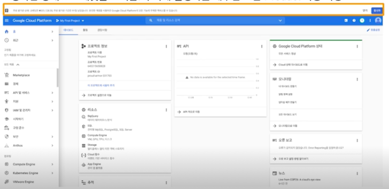
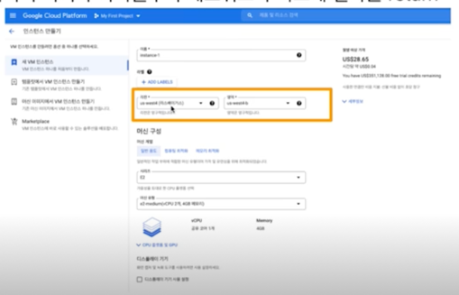

  
# Cloud

## 1. Cloud

### Cloud 서비스를 사용하는 이유

웹, 앱 서비스를 만드는 경우
- 자신의 컴퓨터(localhost)로 서비스를 만들 수도 있음
- IP 로 누구나 접근할 수 있게 수정하고, IP 를 공유하기 등

**그러나 이런 경우 자신의 컴퓨터가 종료되면 웹, 앱 서비스도 종료됨**

이런 경우 전통적인 접근 방법
- 물리적 공간, 확장성을 고려한 서버실을 만들고 운영
- IDC(Internet Data Center)
- 서버 컴퓨터를 넣을 공간 + 추후 서버를 추가할 때 즉각적으로 확장할 수 있는지
- 전기, 에어컨 등 서버가 급작스럽게 종료되지 않도록 준비가 필요함

갑자기 트래픽이 몰릴 경우, 컴퓨터 10대를 설치하기 어려움(자재 수급 이슈 등)  
반대로 트래픽이 적어서 컴퓨터 10대를 없애기가 수월하지 않음

앞선 내용보다 자유롭게 활용할 수 있는 개념으로 클라우드 서비스가 점점 발전

그 이후엔 개발자가 직접 설정해야 했던 작업 등을 클라우드에서 쉽게 할 수 있는 방향으로 발전(Managed 서비스)

- Apache Spark 를 쉽게 운영할 수 있도록 AWS EMR, GCP Dataproc 등을 활용 $\rightarrow$ 직접 하둡을 설치할 필요 없이 이미 설치되어 있음

- Jupyter Notebook 환경도 미리 설치해두고 사용할 수 있음(Tensorflow, 쿠다 등)

### 다양한 Service

직접 개발하다보면 맨 아래쪽 EC2 나 클라우드 서버를 쓰는 일이 많음

### 다양한 Cloud 회사

### Cloud 서비스의 다양한 제품 - Computing Service(Server)

연산을 수행하는(Computing) 서비스

가상 컴퓨터, 서버

CPU, Memory, GPU 등을 선택할 수 있음

가장 많이 사용할 제품

인스턴스 생성 후, 인스턴스에 들어가서 사용 가능

회사별로 월에 무료 사용량이 존재(성능은 약 cpu 1 core, memory 2G)

VM 이라고 불리기도 하고 가상 컴퓨터, 서버, 인스턴스라고 불림

### Cloud 서비스의 다양한 제품 - Serverless Computing

앞에 나온 Computing Service 와 유사하지만, 서버 관리를 클라우드쪽에서 진행

**코드를 클라우드에 제출하면, 그 코드를 가지고 서버를 실행해주는 형태**

요청 부하에 따라 자동으로 확장(Auto Scaling)

Micro Service 로 많이 활용

### Cloud 서비스의 다양한 제품 - stateless Container

Docker 를 사용한 Container 기반으로 서버를 실행하는 구조

Docker Image 를 업로드하면 해당 이미지 기반으로 서버를 실행해주는 형태

요청 부하에 따라 자동으로 확장(Auto Scaling)

### Cloud 서비스의 다양한 제품 - Object Storage

다양한 Object 를 저장할 수 있는 저장소

다양한 형태의 데이터를 저장할 수 있으며, API 를 사용해 데이터에 접근할 수 있음

점점 데이터 저장 비용이 저렴해지고 있음

머신러닝 모델 pkl 파일, csv 파일, 실험 log 등을 Object Storage 에 저장할 수 있음

### Cloud 서비스의 다양한 제품 - Database(RDB)

Database 가 필요한 경우 클라우드에서 제공하는 Database 를 활용할 수 있음

웹, 앱서비스와 데이터베이스가 연결되어 있는 경우가 많으며, 대표적으로 MySQL, PosgreSQL 등을 사용할 수 있음

사용자 로그 데이터를 Database 에 저장할 수도 있고, Object Storage 에 저장할 수도 있음  
저장된 데이터를 어떻게 사용하냐에 따라 어디에 저장할지를 결정

### Cloud 서비스의 다양한 제품 - Data Warehouse

Database 에 저장된 데이터는 데이터 분석을 메인으로 하는 저장소가 아닌 서비스에서 활용할 Database 

Database 에 있는 데이터, Object Storage 에 있는 데이터 등을 모두 모아서 Data Warehouse 에 저장

데이터 분석에 특화된 Database

보통 쿼리문도 빨라서 퍼포먼스도 좋아서 Data Warehouse 에 다 모아서 저정해 사용하는 형태로 많이 발전했음

### Cloud 서비스의 다양한 제품 - AI Platform

AI Research, AI Develop 과정을 더 편리하게 해주는 제품

MLOps 관련 서비스 제공

Google Cloud Platform : TPU

### 다양한 Cloud 회사

클라우드마다 제품의 이름은 다르지만, 비슷한 제품들이 있음  
하나의 제품 이름을 알면 다른 클라우드에서 검색할 수 있음  
예) Compute Engine Like AWS

## 2. Google Cloud Platform

### Google Cloud Platform

GCP 를 선택한 이유
- 첫 가입시 $300 크레딧 제공
- 학습할 때 클라우드 비용을 내면서 쓰는 부담을 줄이기 위해
- 하나의 클라우드 서비스에 익숙해지면, 다른 클라우드도 수월

**클라우드 서비스란 무엇이고, 어떤 방식으로 쓸 수 있구나!에 집중하기**

Gmail 로그인 후, Google Cloud 웹사이트로 접속

[https://cloud.google.com/gcp](https://cloud.google.com/gcp)

회원 가입을 진행해주세요!

프로젝트 생성 완료!

### Google Cloud Platform - Dashboard

구글 클라우드 플랫폼 메인 대시보드로 이동

[https://console.cloud.google.com/home/dashboard](https://console.cloud.google.com/home/dashboard)

프로젝트 정보 $\rightarrow$ **project_name, project_id** 를 자주 사용

GCP 의 다양한 Product 를 볼 수 있는 공간

Product 를 사용하고 있다면 모니터링해야 하는 공간

현재 무료 평가판 상태로 크레딧을 보여줌. 우측에 활성화를 해두면 모든 Product 사용 가능

### Google Cloud Platform - Compute Engine

Compute Engine 클릭 (참고 : 서버 = 인스턴스 = VM(Virtual Machine) = GCP Compute Engine, AWS EC2)

기다리면 초기화가 진행

VM 인스턴스 클릭 : 이 부분이 서버를 만드는 곳  
인스턴스 만들기 클릭

이름 지정

컴퓨터 성능 선택

오른쪽에는 해당 서버를 사용할 때 예상 가격  
다른 성능의 가격이 궁금하면 구글에서 "Compute Engine Pricing" 라고 검색

클라우드 서비스는 Region, Zone 이 존재  
물리 컴퓨터가 어디에 존재하는지에 따라 다르며,  
Region / Zone 별로 사용할 수 있는 성능이 다른 경우도 존재  
Request 하는 위치와 서버의 거리가 가까울수록 네트워크가 빠르게 결과를 return

Region 을 서울로 지정  
머신 유형을 e2-micro 로 지정  
(무료로 사용 가능한 성능)

### Google Cloud Platform - Free Tier

무료 사용이 가능한 범위  
[https://cloud.google.com/free](https://cloud.google.com/free)

### Google Cloud Platform - Compute Engine

생성된 서버

우측의 SSH 클릭 - 브라우저 창에서 열기

연결을 클릭한 후 기다리면 CLI 화면이 보임

사용하지 않는 경우엔 중지 또는 삭제!  
중지되는 경우에도 비용이 부과되는 경우가 존재할 수 있음

항상 삭제를 잘해야한다!! 몇백만원 비용 내고 싶지 않다면...

### Google Cloud Platform - Cloud Storage

Object Storage 인 Cloud Storage  
버킷 만들기 클릭

고유한 버킷 이름 지정

처음엔 default 값으로 지정해도 크게 문제 없을 것 같음

생성된 버킷

버킷을 클릭하면 이제 파일 업로드, 폴더 업로드 가능

## Special Mission

1) **Compute Engine 인스턴스 띄우고 삭제해보기**
2) **Compute Engine 인스턴스에서 Shell Command 연습하기**
3) **Cloud Storage 의 Bucket 생성하고 파일 업로드, 삭제해보기**
4) **Python Cloud Storage API 르 ㄹ사용해 Cloud Storage 에 업로드 한 파일을 파이썬에서 사용하는 코드 작성**  
   (참고 문서 : [https://googleapis.dev/python/storage/latest/index.html](https://googleapis.dev/python/storage/latest/index.html))

