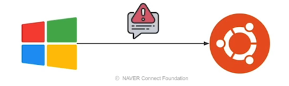
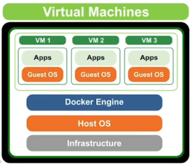
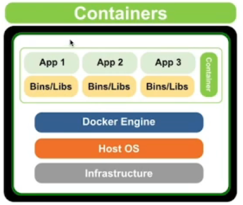
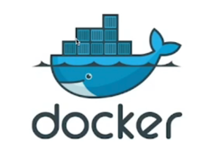
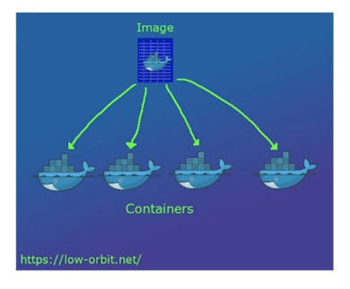
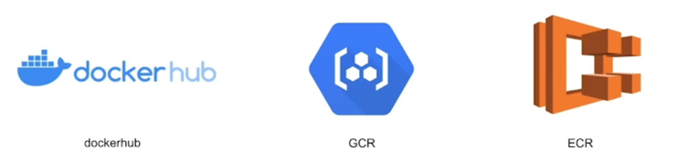

# Docker 알아가기

## 1. Docker 소개

### 1.1 가상화란?

도커에 대해 알기 전에 먼저 **"가상화"** 라는 개념을 잘 알아야 수월합니다.

가상화란 무엇이고, 왜 알아야 하는걸까요?

개발할 때는 서비스 운영에 사용하는 서버에 직접 들어가서 개발하지 않습니다.

Local 환경에서 개발하고, 완료되면 Staging 서버, Production 서버에 배포하게 됩니다.

예를들어 개발을 진행한 Local 환경과 Production 서버 환경이 다른 경우에

- Local 환경은 윈도우고 서버 환경은 Linux 인 경우 OS 가 다르기 때문에 라이브러리,
파이썬 등 설치할 때 다르게 진행해야 합니다.

또 다른 경우는 Local 환경과 서버가 같은 OS 를 사용해도, 서버에서 올바르게 작동하지 않을 수 있습니다.

- Local 의 환경변수를 지정하지 않을 수가 있는데 Production 서버에서는 환경변수를 등록하기도 합니다.
- Production 서버의 사용자 그룹, Permission 이 상이할 수 있습니다.

이렇기 때문에 다양한 설정을 README 등에 기록하고, 항상 실행하도록 하는 방법이 있습니다.

이 경우,

- 사람이 진행하는 일이라 Human Error 발생할 수 있음
- 매번 이런 작업을 해야 하는 과정이 귀찮음

예를들어, Jupyter Notebook 서버를 만들기 위해 클라우드에서 클릭 - 이름 - 클릭 만들기 -> 
인스턴스로 접속해서 필요한 패키지 설치하는 과정이 굉장히 번거로울 수 있습니다.

한 두 대면 사람이 들어가서 하는게 빠를 수 있지만 운영하고 있는 Server 가 100대 200대라면?

특정 서버에서 라이브러리 사용하던게 업데이트가 됐다면 모든 곳에 다 업데이트를 해야할 수 있습니다.

사실 업데이트를 많이 하지 말라고 하지만 윈도우 업데이트나 스마트폰 OS 업데이트가 그게 실행되면
나머지를 균일하게 유지를 해줘야 실행이 됩니다.

이 부분에서 **서버 환경까지도 모두 한번에 소프트웨어화 할 수 없을까?** 라는 고민이 생깁니다.

이런 고민을 해결하기 위해 나온 개념이 "**가상화**" 입니다.

엄밀하게는 하드웨어 가상화 등 더 넓은 개념이지만, 여기선 소프트웨어 가상화로 한정하겠습니다.

가상화란 **특정 소프트웨어 환경을 만들고, Local, Production 서버에서 그대로 활용하는 방법** 
이라고 할 수 있을것 같습니다.

- 개발(Local)과 운영(Production) 서버의 환경 불일치가 해소
- 어느 환경에서나 동일한 환경으로 프로그램을 실행할 수 있음
- 개발 외에 Researh 도 동일한 환경을 사용할 수 있음

이런 환경을 통일하면 통일할수록 생산성이 증가합니다.

### 1.2 Docker 등장 전

가상화 기술로 주로 VM(Virtual Machine)을 사용했습니다.

- VM 은 호스트 머신이라고 하는 실제 물리적인 컴퓨터 위에, OS 를 포함한 가상화 소프트웨어를 두는 
방식

예)
- 호스트 머신은 Window 인데, Window 에서 Linux 를 실행
- 호스트 머신은 Mac 인데, Mac 에서 Window 를 실행

GCP 의 Compute Engine 또는 AWS EC2 가 이런 개념을 활용했습니다.

- 클라우드 회사에서 미리 만든 이미지를 바탕으로, Computing 서비스를 통해 사용자에게 동일한 
컴퓨팅 환경을 제공합니다.

그러나 OS 위에 OS 를 하나 더 실행시키는 점에서 VM 은 굉장히 리소스를 많이 사용합니다.

- 이런 경우를 '무겁다' 라고 표현

딜레이 시간도 있고 이런 단점을 개선하기 위해 나온 기술이 **Container** 입니다. 

Container : VM 의 무거움을 크게 덜어주면서, 가상화를 좀 더 경량화된 프로세스의 개념으로 만든 기술입니다.

- 이 기술의 등장으로 이전보다 빠르고 가볍게 가상화를 구현할 수 있음

### 1.3 Docker 소개

Container 기술을 쉽게 사용할 수 있도록 나온 도구가 바로 Docker 입니다.

- 2013년에 오픈소스로 등장
- 컨테이너에 기반한 개발과 운영을 매우 빠르게 확장

VM 이 Host OS 와 Guest OS 가 있고 그 위에 App 을 올렸다고 한다면 Container 는 Host OS 하나만 존재하고
Bins 폴더나 실행할 수 있는 파일들과 함께 실행합니다.

조금 더 가벼운 기술이라고 보면 될 것 같습니다.

- 고래 위에 Container 가 있는 로고이미지

Docker 와 비슷한 느낌을 설명해본다면!

PC방에서 특정 게임만 설치하고, 고객이 특정 프로그램을 깔아도 재부팅할 때 항상 PC방에서 저장해둔
형태로 다시 복구되는걸 기억하실겁니다.

이것이 Docker Image 로 만들어두고, 재부팅하면 Docker Image 의 상태로 다시 실행하는 하는것과 유사합니다.

**대표적으로 중요한 개념 2가지**

**Docker Image**

- Container 를 실행할 때 사용할 수 있는 '템플릿'
- Read Only -> 만든 후에는 수정할 수 없음

**Docker Container**

- Docker Image 를 활용해 실행된 인스턴스
- Write 가능

### 1.4 Docker 로 할 수 있는 일

첫번째는 다른 사람들이 만든 소프트웨어를 가져와서 바로 사용할 수 있습니다.

예)

- MySQL 을 Docker 로 실행
- Jupyter Notebook 을 Docker 로 실행

다른 사람들이 만든 소프트웨어가 이미 템플릿같이 나와있어서 바로 가져와서 쓸 수 있고 직접 수정하고
라이브러리를 추가해서 사용할 수 있습니다.

다른 사람들이 만든 소프트웨어를 **Docker Image** 라고 부릅니다.

Docker Image 는 OS, 설정을 포함한 실행 환경이라고 할 수 있고 Linux, Window, Mac 어디에서나 동일하게
실행할 수 있습니다.

두번째로 자신만의 이미지를 만들면 다른 사람에게 공유할 수 있습니다.

원격 저장소에 저장하면 어디서나 사용할 수 있습니다.

원격 저장소는 Container Registry 라고 부르고 회사에서 서비스를 배포할 때 원격 저장소에 저장해서
이미지 업로드하고 그 다음에 서버에서 받아오는 식으로 진행합니다.

대표적으로는 dockerhub, GCR, ECR 이 있습니다.

다음 포스팅은 **[Docker 실습하며 배워보기]()** 를 진행하겠습니다. 

