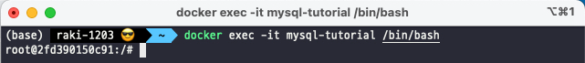
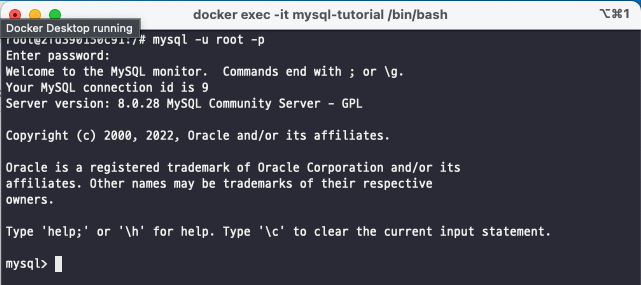
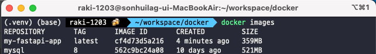

# Docker 알아가기 2 (Docker 실습하며 배워보기)

Docker 가 무엇인지 궁금하시다면 이전 포스팅 [Docker 소개](https://raki-1203.github.io/docker/Docker1/)을 참고해주세요!

## 2. Docker 실습하며 배워보기

### 2.1 Docker 설치하기

[도커 공식 홈페이지](https://www.docker.com/products/docker-desktop/) 에서 자신의 운영체제에 맞는 
Docker Desktop 설치합니다.


설치 후, 터미널에서 docker 커맨드가 동작하는지 확인합니다.

`$ docker`


### 2.2 Docker 실행하기 - MySQL 실행하기

**docker pull "이미지 이름:태그"** 명령어를 사용하여 mysql8 버전의 이미지를 다운합니다.

`$ docker pull mysql:8`

m1 mac 의 경우 "no matching manifest for linux/arm64/v8 in the manifest list entries" 이런 에러가 발생합니다.

뒤에 --platform 명령어를 사용해 linux/amd64 를 명시해주면 해결됩니다.

`$ docker pull mysql:8 --platform linux/amd64`


다운 받은 이미지 확인 하는 방법은 

**docker images** 명령어를 사용합니다.

`$ docker images`


이미지를 만들었으면 이미지를 기반으로 컨테이너를 실행해야 합니다.

**docker run "이미지 이름:태그"** 라는 명령어를 사용해 실행합니다.

다운받은 MySQL 이미지 기반으로 Docker Container 를 만들고 실행해보겠습니다.

`$ docker run --name mysql-tutorial -e MYSQL_ROOT_PASSWORD=1234 -d -p 3306:3306 mysql:8`

- --name : 컨테이너 이름 -> 지정하지 않으면 랜덤으로 생성 
- -e : e 는 environment 의 약자로 환경변수를 설정
  - 사용하는 이미지에 따라 설정이 다름
  - MySQL : 환경변수를 통해 root 계정의 비밀번호를 설정
- -d : 데몬(백그라운드) 모드
  - 컨테이너를 백그라운드 형태로 실행
  - 이 설정을 하지 않으면, 현재 실행하는 셀 위에서 컨테이너가 실행
  - 컨테이너의 로그를 바로 볼 수 있으나, 컨테이너를 나가면 실행 종료
- -p : 포트 지정
  - 로컬 호스트 포트 : 컨테이너 포트 형태로, 로컬 포트 3306 으로 접근 시 컨테이너 포트 3306 으로
  연결되도록 설정
  - mysql 은 기본적을오 3306 포트를 통해 통신 
  - 로컬 호스트 : 우리의 컴퓨터
  - 컨테이너 : 컨테이너 이미지 내부
- mysql:8 : 이 부분은 pull 명령어를 통해 다운받은 이미지를 사용하겠다라는 의미

실행한 컨테이너는 

**docker ps** 명령어로 확인할 수 있습니다.


도커 컨테이너를 실행하면 도커 컨테이너 안으로 들어가게 되는 경우가 존재합니다.

예를들어 컨테이너를 실행했는데 뭔가 동작이 안되는거 같을때, 의도와는 다르게 실행이 안될때, 이런경우
디버깅을 하기 위해 사용하는 명령어가 

**docker exec -it "컨테이너 이름(혹은 ID)" /bin/bash** 입니다.

Compute Engine 에서 SSH 와 접속하는 것과 유사합니다.

`$ docker exec -it mysql-tutorial /bin/bash`



컨테이너에 접속 후 

`$ mysql -u root -p`

위 명령어를 실행하면 MySQL 프로세스로 들어갈 수 있습니다.



이제 MySQL 쉘 화면이 보일겁니다.

작동을 멈춘 컨테이너는 

**docker ps -a** 명령어로만 확인할 수 있습니다.

- **docker ps** 는 실행중인 컨테이너 목록만 보여줌


멈춘 컨테이너를 삭제하는 방법은

**docker rm "컨테이너 이름(ID)"** 명령어를 사용합니다.

멈춘 컨테이너만 삭제할 수 있는 명령어지만 컨테이너가 실행중인 경우에는

**docker rm "컨테이너 이름(ID)" -f** 명령어로 삭제가 가능합니다.

### 2.3 Docker 실행하기 - 기본 명령어 정리

- docker pull "이미지 이름:태그" : 필요한 이미지 다운
- docker images : 다운 받은 이미지 목록 확인
- docker run "이미지 이름:태그" : 이미지를 기반으로 컨테이너 생성
- docker ps : 실행중인 컨테이너 목록 확인
- docker exec -it "컨테이너 이름(ID)" /bin/bash : 컨테이너에 진입
- docker stop "컨테이너 이름(ID)" : 실행중인 컨테이너를 중지
- docker rm "컨테이너 이름(ID)" : 중지된 컨테이너 삭제
- docker rmi "이미지 이름:태그" : 이미지 삭제

그 외 중요한 명령어는 다음과 같습니다.

**docker run** 명령어를 사용할 때 파일을 공유하는 방법입니다.

- Volume Mount
  - Docker Container 내부는 특별한 설정이 없으면 컨테이너를 삭제할 때 파일이 사라짐
  - (=Host 와 Container 와 파일 공유가 되지 않음)
  - 만약 파일을 유지하고 싶다면 Host(우리의 컴퓨터)와 Container 가 저장소를 공유해야 함
- Volume Mount 를 진행하면 Host 와 Container 의 폴더가 공유됨
- -v 옵션을 사용하며, -p(Port)처럼 사용함.
  - -v Host_Folder:Container_Folder

예)

`$ docker run -it -p 8888:8888 -v /some/host/folder/for/work:/home/jovyan/workspace/jupyter/minimal-notebook`

Host 와 Container 의 Volume Mount 는 습관화하는게 중요합니다!

우리가 이미지를 만들어서 저장할 수도 있지만 이미 많은 사람들이 이용하면서 이미지를 만들었습니다.

이런 이미지를 이용하는 방법은 다음과 같습니다.

[Dockerhub](https://hub.docker.com/) 에 공개된 모든 이미지를 다운받을 수 있습니다.

Dockerhub 에서 관심있는 부분이 있는지 검색을 하면 됩니다.


위에서 실습한 MySQL 도 Dockerhub 에서 다운로드 한 겁니다.

기본적으로 따로 설정을 하지 않았다면 Dockerhub 가져오게 됩니다.

그리고 왠만한 오픈소스들은 Dockerhub 에 이미지화해서 공개되어있기 때문에 여기 있는 이미지를 찾아
실행하고 또 새로운 이미지를 만들어 볼 수 있습니다.

### 2.4 Docker Image 만들기

이미지를 다운받아 사용하는 방법을 알았으니 이제 직접 Docker Image 를 만들어 보겠습니다.

간단한 FastAPI 애플리케이션을 실행하는 서버를 Docker Image 로 만들어보겠습니다.

#### 2.4.1 프로젝트 셋팅

먼저 폴더를 하나 만들고, 여기에 가상환경 세팅과 FastAPI 패키지를 설치합니다.

venv 를 사용해도 좋고 pyenv, conda 등 다양하게 사용하셔도 됩니다.

```
$ mkdir docker
$ cd docker
$ python -V
Python 3.9.7
$ python -m venv .venv
$ source .venv/bin/activate
$ pip install pip --upgrade
$ pip install "fastapi[all]"
```


#### 2.4.2 FastAPI 코드 작성

GET /hello 로 요청하면, 메시지를 전달하는 간단한 코드를 작성하겠습니다.

아까 만들어둔 docker 폴더에서 main.py 를 만들겠습니다.

```python
from fastapi import FastAPI
import uvicorn

app = FastAPI()


@app.get("/hello")
def hello():
    return {
        "message": "world!"
    }


if __name__ == '__main__':
    uvicorn.run(app, host="0.0.00", port=8000)

```

#### 2.4.3 사용한 라이브러리 명시

venv 나 여러 환경설정을 했으면 어떤 라이브러리가 설치되어있는지 알수도 있고 아닐수도 있는데

**pip freeze** 명령어를 사용하면 설치한 라이브러리를 모두 보여줍니다.

다른 docker 이미지 안에서 똑같이 설치를 해주기 위해 어떤 패키지를 사용했는지 저장을 해둬야합니다.

**pip freeze** 를 하시거나

**pip list --not-required --format=freeze** 를 하시면 의존성에 따라 설치된 라이브러리는 보이지 않습니다.

`$ pip freeze > requirements.txt`

명령어를 사용해 pip 로 설치한 라이브러리를 모두 requirements.txt 에 저장합니다.


#### 2.4.4 Dockerfile 작성

Docker Image 는 이름을 지정할 수 있긴 한데 표준 규격으로 Dockerfile 을 만듭니다.

**Dockerfile** 파일은 다음과 같이 작성합니다.

- Docker Image 를 빌드하기 위한 정보가 담김

```
FROM python:3.8.7-slim-buster

COPY . /app
WORKDIR /app
ENV PYTHONPATH=/app
ENV PYTHONUNBUFFERED=1

RUN apt-get update && \
    apt-get install -y gcc default-libmysqlclient-dev libjpeg-dev
RUN pip install pip==21.2.4 && \
    pip install -r requirements.txt
  
CMD ["python", "main.py"]  
```

- FROM "이미지 이름:태그" 
  - 이미지 빌드에 사용할 베이스 이미지를 지정
  - 베이스 이미지는 이미 만들어진 이미지
  - 보통 처음부터 만들지 않고, 이미 공개된 이미지를 기반으로 설정을 추가
  - python:3.9.7-slim-buster 를 사용(이 이미지는 [Dockerhub](https://hub.docker.com/) 에 존재)
- COPY . /app
  - COPY "로컬 디렉토리(파일)" "컨테이너 내 디렉토리(파일)"
  - 컨테이너는 자체적인 파일 시스템과 디렉토리를 가짐
  - COPY 명령어는 Dockerfile 이 존재하는 경로 기준 로컬 디렉토리를 컨테이너 내부의 (자체 파일
  시스템을 가진) 디렉토리로 복사
  - 해당 코드는 프로젝트 최상위에 존재하는 모든 파일을 컨테이너 내부 /app 디렉토리로 복사
  - 파일을 컨테이너에서 사용하려면 COPY 명령어로 반드시 복사해야 함
- WORKDIR /app
  - WORKDIR "컨테이너 내 디렉토리"
  - Dockerfile 의 RUN, CMD, ENTRYPOINT 등의 명령어를 실행할 컨테이너경로 지정
  - 이 라인 뒤에 등장하는 RUN, CMD 는 컨테이너 내부의 /app 에서 실행
- ENV PYTHONPATH=/app ...
  - 컨테이너 내 환경변수를 지정
  - 파이썬 애플리케이션의 경우 통상 위 두 값을 지정
- RUN pip install ...
  - RUN "실행할 리눅스 명령어"
  - 컨테이너 내에서 리눅스 명령어를 실행
  - 위의 경우 pip install pip 와 -r requirements.txt 두 명령어를 실행. 
  - 한번에 실행할 명령어가 여러 개인 경우 && \ 로 이어줌
  - 이전 라인에서 COPY 와 WORKDIR 이 실행되었기 때문에 컨테이너 내에 requirements.txt 이 존재하고,
  이를 pip install -r 명령어로 실행시킬 수 있음
- CMD ["python", "main.py"]
  - CMD ["실행할 명령어", "인자", ...]
  - docker run 으로 이 이미지를 기반으로 컨테이너를 만들 때, 실행할 명령어
  - 이 이미지는 실행되는 즉시 python main.py 를 실행하여 CMD 는 띄어쓰기를 사용하지 않음

#### 2.4.5 Docker Image Build

**docker build "Dockerfile 이 위치한 경로"** 명령어를 사용하면 이미지를 생성합니다.

- 이미지 생성(빌드라고 표현)
  - 앞에서 작성한 Dockerfile 을 기반으로 새로운 이미지가 생성됨
- 아래 이미지에서 . 는 현재 폴더에 Dockerfile 이 있음을 의미
  - **-t "이미지 이름:태그"** 옵션으로 이미지 이름과 태그 지정할 수 있음
  - 태그는 미 지정시 **"latest"** 로 채워짐

`$ docker build . -t my-fastapi-app`


#### 2.4.6 빌드된 이미지 확인

**docker images** 명령어로 방금 빌드한 이미지를 확인할 수 있습니다.

`$ docker images`



#### 2.4.7 컨테이너 실행

**docker run "이미지 이름:태그"** 명령어로 컨테이너를 실행합니다.

`$ docker run -p 8000:8000 my-fastapi-app`


잘 작동하는걸 볼 수 있습니다.

다른 터미널을 열어 curl 로 애플리케이션이 잘 작동하는지 확인할 수 있습니다.

`$ curl localhost:8000/hello`


#### 2.4.8 정리

도커이미지를 만든다는 것은 파이썬 환경 및 애플리케이션 코드를 작성해서 템플릿으로 만든다는 것과 같습니다.

도커 이미지를 만들기 위해 Dockerfile 을 작성합니다.

- **FROM** : 베이스 이미지를 지정
- **COPY** : 로컬 내 디렉토리 및 파일을 컨테이너 내부로 복사
- **WORKDIR** : RUN, CMD 등을 실행할 컨테이너 내 디렉토리 지정
- **RUN** : 애플리케이션 실행에 필요한 여러 리눅스 명령어들을 실행
- **CMD** : 이미지 실행 시 바로 실행할 명령어를 지정

**docker build "Dockerfile 이 위치한 경로" -t "이미지 이름:태그"** 명령어를 통해 이미지를 빌드합니다.

마지막으로 

**docker run "이미지 이름:태그"** 명령어로 빌드한 이미지를 실행합니다.

이외에 Dockerfile 에서 사용하는 것이 있습니다.

- **EXPOSE** : 컨테이너 외부에 노출할 포트 지정
- **ENTRYPOINT** : 이미지를 컨테이너로 띄울 때 항상 실행하는 커맨드

RUN, CMD, ENTRYPOINT 등등의 차이가 조금있으나 처음에는 하나를 먼저 써보시고 차차 넓혀가는걸
추천드립니다.

다음 포스팅은 **[Registry 에 Docker Image 올리는 방법](https://raki-1203.github.io/docker/Docker3/)** 을 진행하겠습니다.

