# Docker 알아가기 3 (Registry 에 Docker Image 푸시하기)

Docker 가 무엇인지 궁금하시다면 이전 포스팅을 참고해주세요!

1. [Docker 소개](https://raki-1203.github.io/docker/Docker1/)
2. [Docker 실습하며 배워보기](https://raki-1203.github.io/docker/Docker2/)

## 3. Registry 에 Docker Image 푸시하기

### 3.1 Registry 에 Docker Image Push

이제 우리가 만든 이미지를 인터넷에 업로드 하겠습니다!

이를 위해 이미지 저장소인 **Container Registry** 에 Docker Image **Push** 하겠습니다.

Container Registry 란 Dockerhub, GCP GCR, AWS ECR 등 다양하게 있습니다.

오픈소스의 경우는 Dockerhub 로 이미지를 푸시해주시면 되고 보통 회사에서는 클라우드 쓰는거에 따라서
custom 한 private 한 Docker Container Registry 를 운용합니다.

그래서 GCR 을 쓸 수도 있고 ECR 을 쓸 수도 있고 Dockerhub 를 자체 빌드해서 private 하게 쓸 수도 있습니다.

- GCP 에서 배포한다면, 레지스트리도 역시 GCP 서비스인 GCR 을 사용하는 식

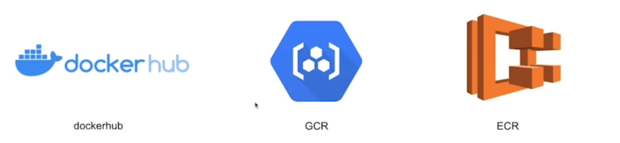

### 3.2 Dockerhub 에 푸시하기

#### 3.2.1 hub.docker.com 에 계정을 생성하고 로그인합니다.

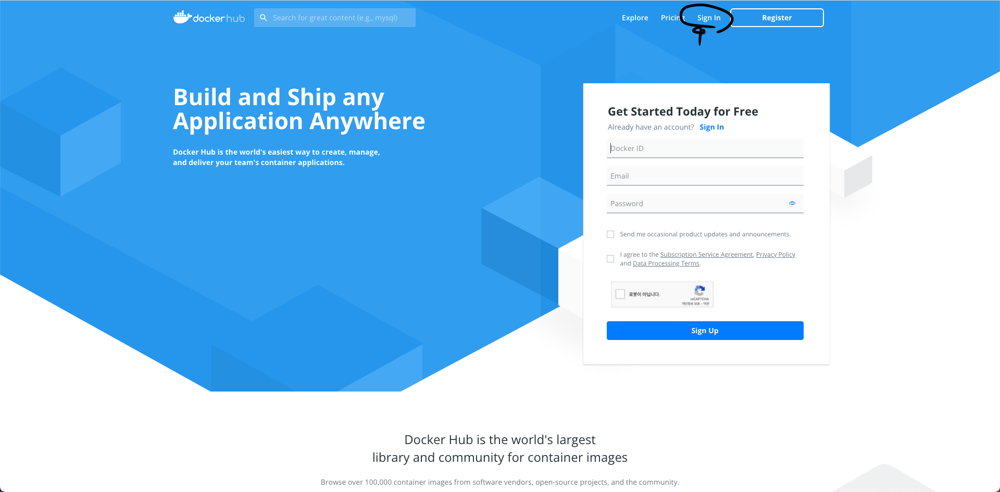

- 웹 브라우저를 통해 http://hub.docker.com 에 접속
- sign in 버튼 클릭
- 계정 생성(Google ID 등과 연동 가능)
- 로그인

#### 3.2.2 Registry 생성하기

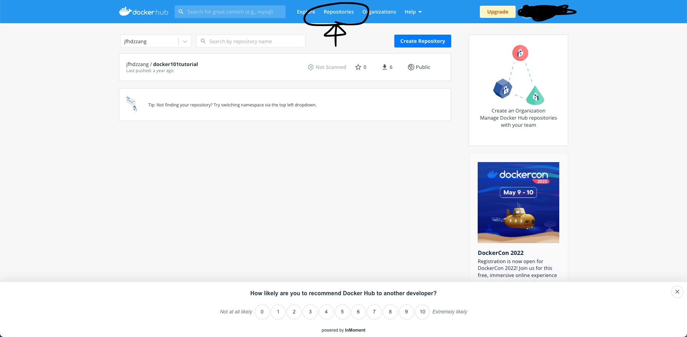

- 상단의 'Repositories' 버튼 클릭

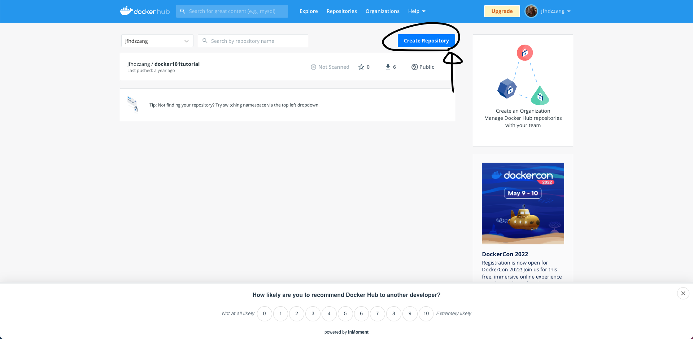

- 'Create Repository' 버튼 클릭

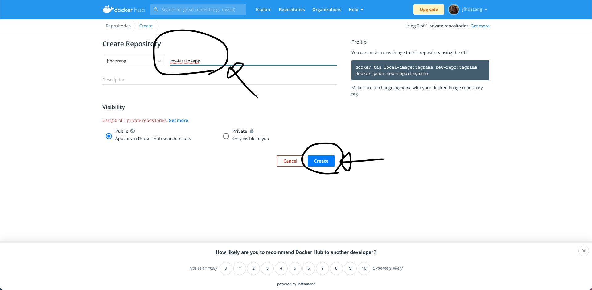

- 레파지토리(Repository)명은 'my-fastapi-app' 으로 설정 (임의로 지정해도 상관 없음)
- Visibility 옵션은 'public' 으로 선택
- 모든 입력/선택이 완료되면 'Create' 버튼 클릭

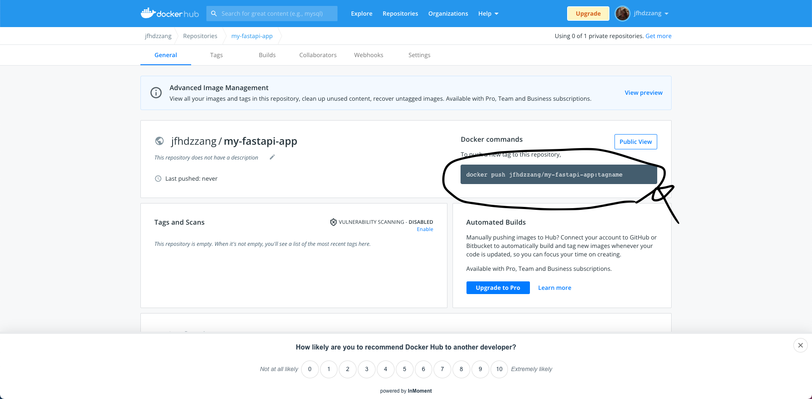

- 레파지토리(Repository) 생성 완료
- `$ docker push jfhdzzang/my-fastapi-app:tagname` docker push 명령어가 만들어졌습니다.

#### 3.2.3 콘솔에서 Docker-Hub 로그인

- 콘솔상에서 docker login 명령어를 입력
- 사용자 id 입력
- 패스워드 입력

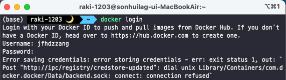

`Error saving credentials: error storing credentials` 에러 발생했습니다.

이 경우 해결방법

1. `rm /usr/local/bin/docker-credential-osxkeychain` 파일 삭제
2. `vi ~/.docker/config.json` 파일을 열고
3. `"credsStoe": ""` 이렇게 수정
4. `docker login` 다시하면 로그인 가능!

#### 3.2.4 Docker-Hub 에 이미지(Image) push

위에서 docker-hub 에 레파지토리 생성시 표시되었던 명령어를 참조해서 아래의 명령어를 입력합니다.

`$ docker push jfhdzzang/my-fastapi-app:1.0`

이때, `Cannot connect to the Docker daemon at unix:///var/run/docker.sock. Is the docker daemon running?` 에러가
발생할 경우도 있습니다.

docker 다시 실행해주세요!

mac 에서 desktop 버전으로 설치했던 docker 를 실행해주면 됩니다.

자! 이제 다시 위의 명령어를 입력해주면 됩니다.

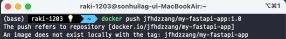

아니 또 에러가 발생한다니.....구글링을 해본 결과 docker hub 의 repository 이름과 로컬의 도커 이미지 
REPOSITORY 이름을 똑같게 해줘야 하나 봅니다.

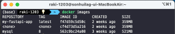

REPOSITORY 이름이 `my-fastapi-app` 으로만 되어있는데 `jfhdzzang/my-fastapi-app` 으로 변경해줍니다.

`$ docker image tag my-fastapi-app jfhdzzang/my-fastapi-app` 

명령어를 실행해줍니다.

그러면 이렇게 image 가 하나 더 추가 된 걸 확인할 수 있습니다.

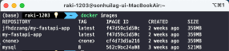

이제 다시 push 명령어를 실행해봅시다.

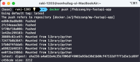

드디어 docker image 를 docker-hub 에 올리는데 성공했습니다.!!

잘 따라오셨어요 ㅎㅎ

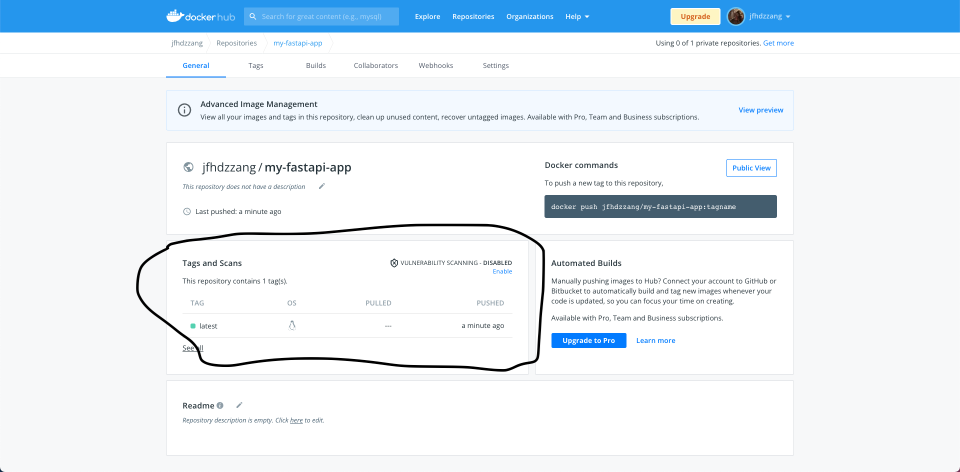

이 부분이 새롭게 추가되었습니다. 제대로 hub 에 올라갔습니다.

#### 3.2.5 docker-hub 로 부터 jfhdzzang/my-fastapi-app 이미지 가져오기(pull)

이제 docker-hub 로 부터 이미지를 가져오는 방법에 대해 알아보겠습니다.

`$ docker images` 명령어를 실행하면 가져오려는 image 가 이미 Local 에 있습니다.

`$ docker rmi <image id>` 를 통해 이미지를 삭제하도록 하겠습니다.

혹시 이 에러를 만난다면 

`Error response from daemon: conflict: unable to delete f47d59c5d50c (must be forced) - image is referenced in multiple repositories`

`$ docker rmi -f <image id>` 를 사용하시면 강제로 지웁니다.

어차피 docker-hub 에 올라와있으니 걱정하지 말고 지워버립시다.

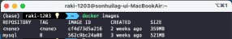

이제 docker 를 pull 해 오도록 하겠습니다.

pull 명령어를 사용하면 docker-hub 로 부터 이미지를 가져옵니다.

`$ docker pull jfhdzzang/my-fastapi-app`

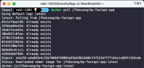

이렇게 pull 을 해왔고 다시 이미지가 있는지 확인해보겠습니다.

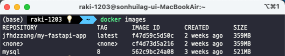

`jfhdzzang/my-fastapi-app` 이미지를 docker-hub 에서 받은 것을 확인할 수 있습니다.!!

지금까지 docker image 를 Docker-Hub 에 push 하고 pull 하는 방법을 알아보았습니다.

감사합니다.
