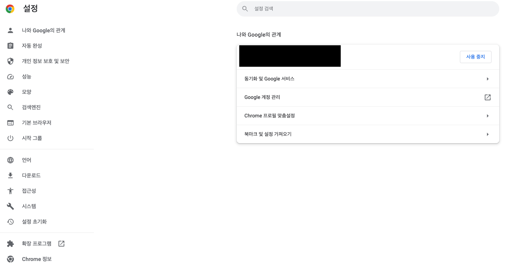
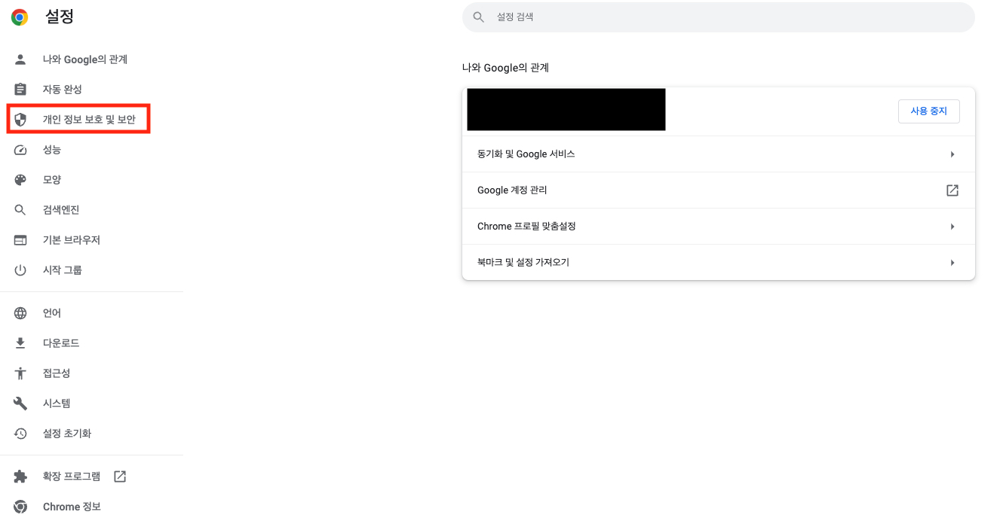
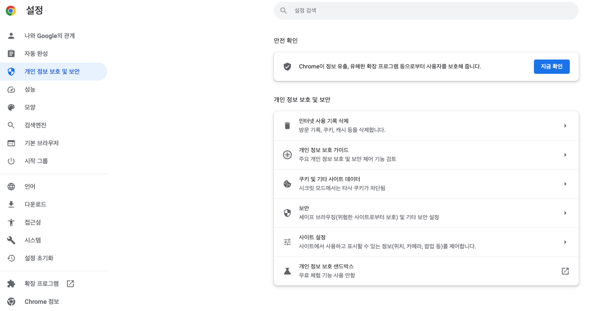
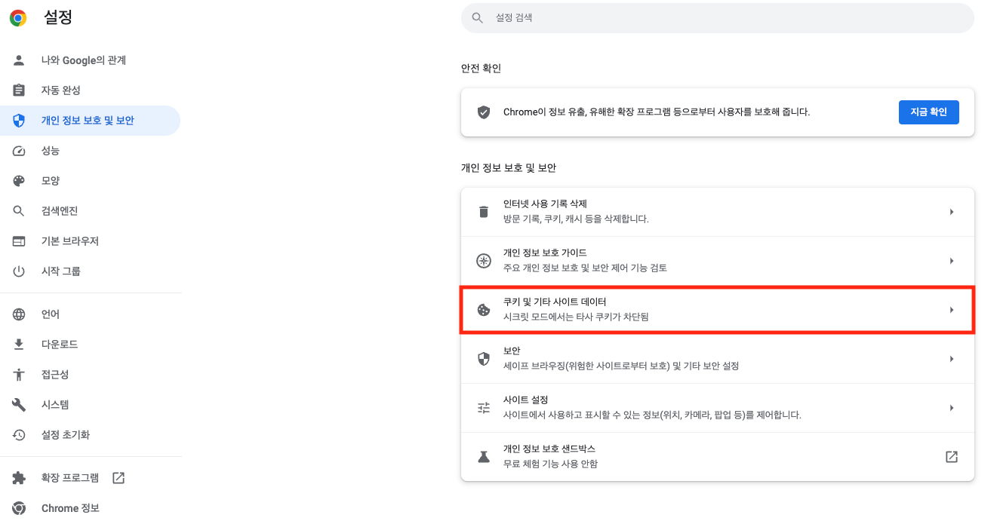
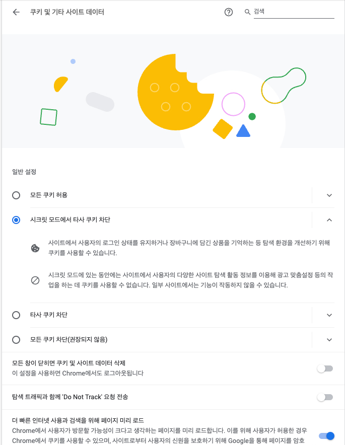
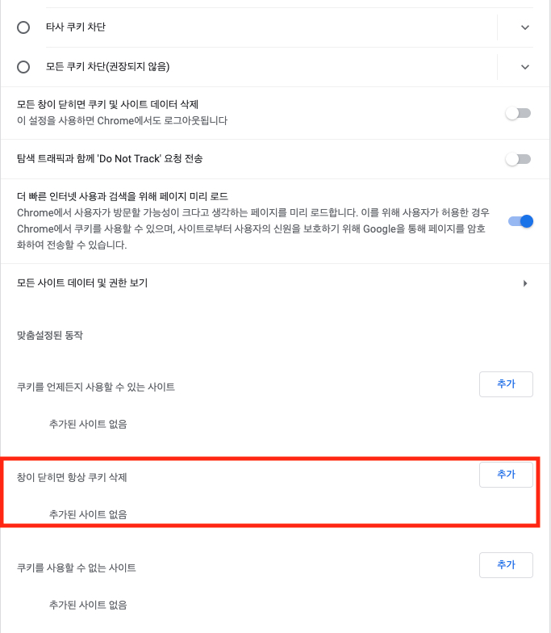
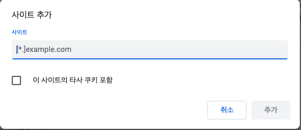
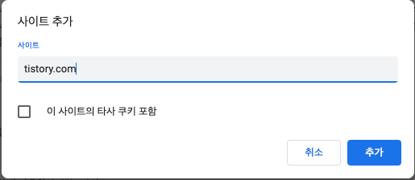

  
# 크롬에서 티스토리 블로그 400 Bad Request 오류 영구 해결방법

## 나의 상황

회사에서 구글링을 진행하던 중 티스토리 블로그만 유난히 400 Bad Request 페이지를 보여준다.

왜 티스토리만 이러는거야....... 귀찮게 너무 자주 그러자나....

처음 몇번은 다른 블로그에 적혀 있는대로 크롬 설정에 들어가 쿠키파일을 삭제했다.

다시 티스토리 블로그를 볼 수 있다.

여기까지만 보고 가면 다른 블로그 글과 다를게 없다.

## 영구 해결방법

지금부터 내가 찾은 영구 해결방법을 적어보겠다.

(혹시나 영구 해결방법이 아닐수도 있으니 아니라면 댓글을 달아주시면 감사하겠습니다.)

### 1. 크롬 브라우저의 '설정' 으로 이동

- 크롬 브라우저를 킨 상태에서 `ctrl(window)/cmd(mac) + ,` 눌러 설정으로 이동하자.

누르면 아래와 같은 화면이 뜰 것이다.

### 2. '보안 및 개인정보 보호' 메뉴로 이동

- 왼쪽 메뉴에서 3번째 `보안 및 개인정보 보호` 탭 클릭해 이동하자.

클릭하면 아래와 같은 화면이 뜰 것이다.

### 3. '쿠키 및 기타 사이트 데이터' 클릭

- 가운데 보이는 쿠키 및 기타 사이트 데이터 탭 클릭해 이동하자.

클릭하면 아래와 같은 화면이 뜰 것이다.

### 4. 티스토리 사이트 쿠키 자동 삭제 만들기

- 현재 보이는 화면에서 아래로 내려가 `창이 닫히면 항상 쿠키 삭제` 부분을 찾자.

- `추가` 버튼을 클릭하자.

- 여기에 `tistory.com` 을 추가해주자.

- 마지막으로 `추가` 버튼 클릭!

이걸로 티스토리 들어갈 때 400 Bad Request 에러를 만날 일이 없을것이다.

## 마무리

간단하게 해결하는 방법을 알려준다는 블로그들 보고 쿠키삭제라는 것을 알았지만 자꾸 반복되는 에러에 결국 해결방법을
직접 찾아버렸다.

현재까지는 문제없이 되는데 혹시 모르니 문제 생기면 수정하러 오겠다.

분명 누군가는 이걸 찾아 구글링할거라 생각하고 여기에 남긴다.

행복한 하루가 되시길 바라며 바이바이👋

