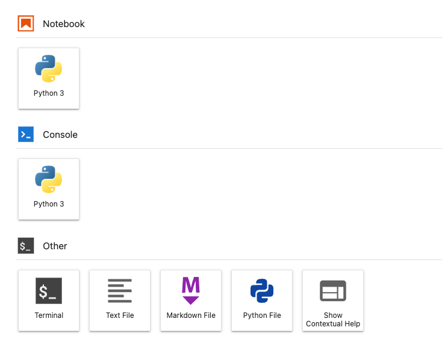
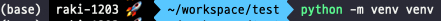
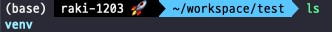
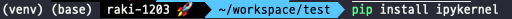
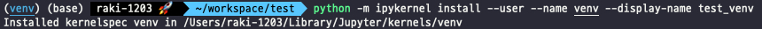
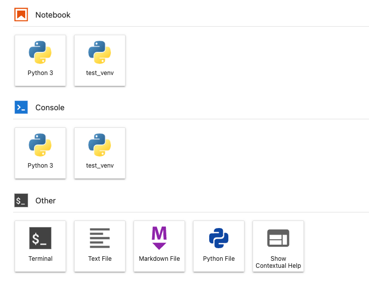
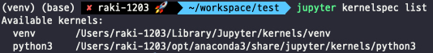
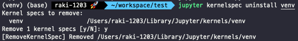
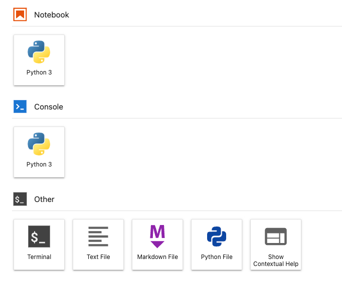

# JupyterLab 에 가상환경(Virtualenv) 연결, 삭제하기

Python 을 이용해 AI 모델링을 하다보면 Jupyter 를 사용할 일이 많이 있음

프로젝트마다 따로따로 가상환경을 두는 나에게는 Jupyter 에서 필요한 가상환경을 사용할 수 있도록 하는 방법이 필요함

이 Post 에서는 가상환경(Virtualenv)를 Jupyter Lab 에 연결하여 Kernel 을 추가하는 방법을 소개함

현재 Jupyter Lab 에서의 연결된 가상환경은 하나뿐임

지금부터 가상환경을 만들어 Jupyter Lab 에 Kernel 을 추가하자.

## 1. 테스트를 위한 가상 환경을 생성

원하는 위치에서 명령어를 통해 가상환경을 생성함

`python -m venv [가상환경 이름]`

ex) `python -m venv venv`

venv 라는 이름을 가진 가상환경을 만들겠다는 의미

가상환경 생성 명령어 실행!

`ls` 명령어를 통해 확인해보니 `venv` 폴더가 생성되었음

이 폴더가 가상환경임

## 2. 만들어진 가상환경을 활성화

새롭게 만든 가상환경을 Jupyter Lab 에 추가하기 위해 가상환경을 활성화 함

`source ./venv/bin/activate`

맥 기준으로 명령어를 작성하지만 Linux 에서도 마찬가지로 적용됨

윈도우는 활성화 명령어 검색하면 나오니 찾아보시길~!

맨 왼쪽에 (venv) 가 나오면 가상환경이 활성화 된 것임

## 3. Jupyter Kernel 추가를 위한 ipykernel 설치

다음은 `ipykernel` 라이브러리를 설치해줌

`pip install ipykernel`

명령어 실행해서 설치 완료 해줌

여기까지 하면 추가할 준비가 모두 끝남

## 4. Jupyter Lab 에 Kernel 추가

추가할 가상환경과 Jupyter 에 Display 할 이름을 지정하고 명령어를 수행함

`python -m ipykernel install --user --name [가상환경폴더] --display-name [Jupyter Lab 에서 보여질 이름]`

ex) `python -m ipykernel install --user --name venv --display-name test_venv`

이렇게 명령어를 수행하면 커널이 Jupyter Lab 에 추가됨

원하는 위치에 만들었던 가상환경 `venv` 폴더가 Jupyter Lab 상에서는 내가 설정한 `test_venv` 로 설정되었음

이렇게 쉽고 빠르게 원하는 가상환경을 Jupyter Lab 에서 활용할 수 있음

## 5. Jupyter Lab 에 Kernel 삭제

마지막으로 kernel 을 추가했으면 삭제하는 법도 알아야 함

`jupyter kernelspec list` 이 명령어를 통해 kernel 에 존재하는 가상환경 목록을 볼 수 있음

간단한 명령어를 통해 삭제할 수 있음

이 중 venv 가상환경을 지우고 싶은 경우

`jupyter kernelspec uninstall venv` 명령어 실행

y 를 눌러 커널을 삭제하게 되면 삭제 작업 완료

처음과 같이 kernel 이 없어진 것을 볼 수 있음

그럼 이만!
