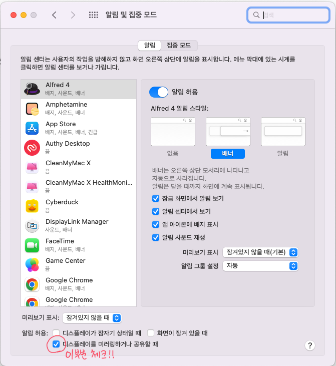

  
# M1 Macbook air 알림이 안오는 경우

## 나의 상황

회사에서 M1 Macbook Air 를 사용하고 있는데 어느순간 카톡, 슬랙 알림이 오지 않는다.

그저 배지만 남아있었다.

도대체 무슨일일까?

구글링을 해보고 카톡설정에서 알림을 모두 체크하고 

환경설정 - 알림 및 집중모드 에서 카카오톡 알림도 다시한번 체크해보고

방해금지모드는 사용하지 않아서 안켜져있다는것도 확인해보고

구글링해서 나오는 방법들을 다 동원해서 알림이 오려나 기대했지만 여전히 배지만 남아있다.

## 원인

회사에서 듀얼모니터를 사용하고자 displaylink 칩이 포함된 hdmi to usb 컨버터를 사용중이다.

이걸 사용해 displaylink 를 사용하다보니 디스플레이를 미러링하거나 공유하고 있는 중이 되는것 같다.

## 해결방법

해결방법은 너무 간단하다!

환경설정 - 알림 및 집중모드 에서 위에 사진에서 체크한 부분을 체크해주면 된다.

## 마무리

이틀동안 회사알림을 뒤늦게 보고 불편했다.

이거때매 이것저것 찾아봤는데 너무 간단해서 놀랬다.

분명 누군가는 이걸 찾아 구글링할거라 생각하고 여기에 남긴다.

행복한 하루가 되시길 바라며 바이바이👋

