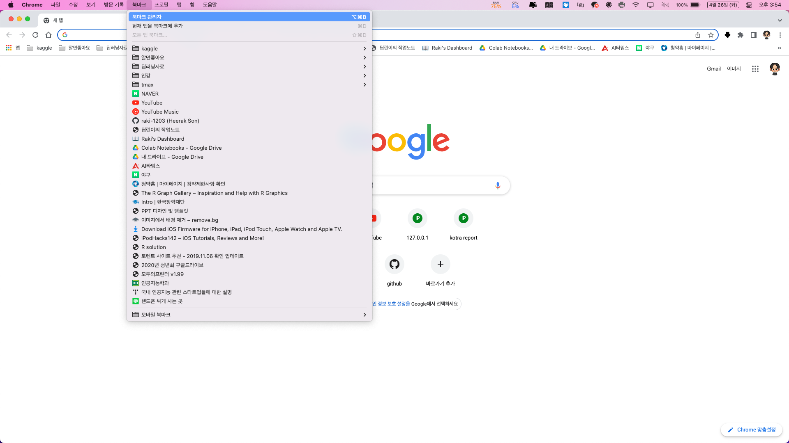

  
# 크롬 북마크를 사파리로 가져오기

크롬을 사용하며 너무 편하긴 하지만 메모리를 많이 차지하는 문제가 있다.

맥북 에어 깡통을 산 나에게는 크롬은 좀 무겁다는 느낌을 받았다.

그래서 아이폰, 아이패드, 맥북에서 자유롭게 연동되고 사용가능한 사파리로 갈아타려고 한다.

크롬에서 자주 가는 사이트를 북마크로 저장해두고 사용했던터라 사파리에서도 그대로 북마크를 가져와 사용하고 싶었다.
이를 위해 구글링해보고 다른 사람들에게도 도움이 되고자 정리해보려고 한다.

# 방법

1. 크롬을 킨다.

2. 북마크 관리자로 들어간다.

3. 북마크 내보내기를 클릭한다.

4. 원하는 위치에 저장한다.

5. 사파리를 킨다.

6. html 가져오기를 클릭한다.

7. 아까 저장한 크롬 북마크 html 파일을 선택 후 가져오기를 클릭한다.

## 마무리

굉장히 쉬운 방법이다.

이렇게 간단하게 북마크를 사파리로 가져올 수 있지만 동기화는 되지 않는 다는 점이 너무 아쉽긴하다.

그래도 크롬에서 사파리로 갈아타는 첫 작업이니만큼 사파리에서 잘 적응하길 바란다.

