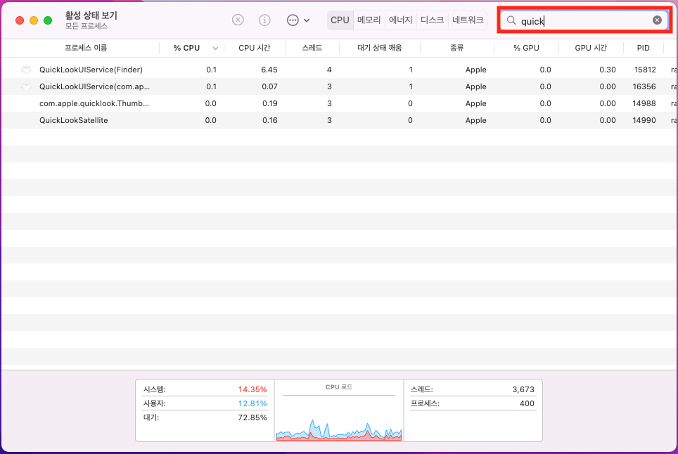
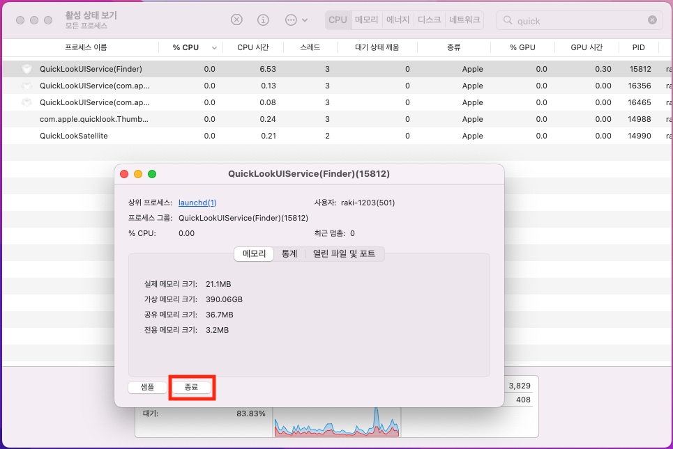
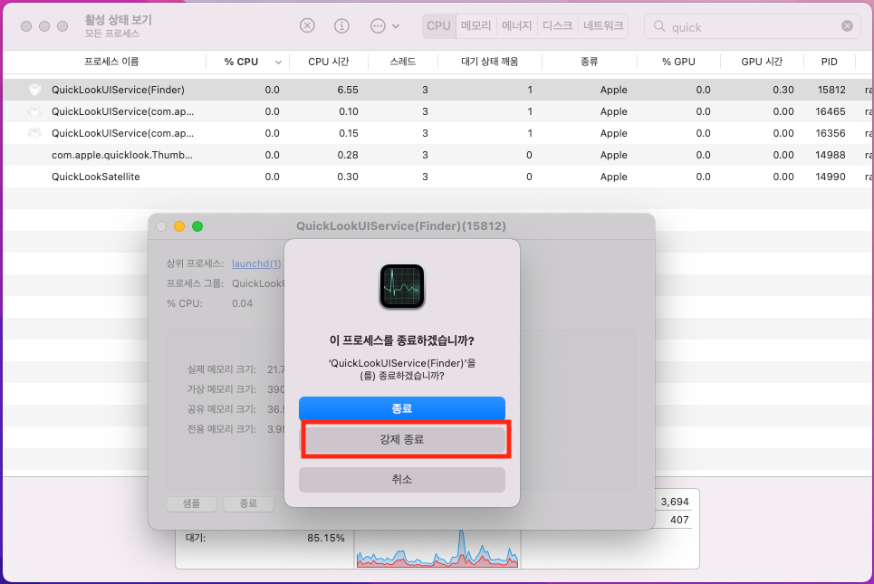

  
# M1 Macbook air 미리보기 스페이스바 pdf 내용 안보이는 오류 해결 방법

## 나의 상황

가끔 M1 Macbook Air 를 사용하다보면 어느순간 pdf 파일을 열기 전 스페이스바를 눌러 미리보기 시

pdf 안의 내용이 보이지 않고 파일명과 정보만 보여지는 경우가 있다.

평소에는 잘 나오던 내용들이 어느 순간 이렇게 되면 답답하고 안의 내용을 파악하려면 직접 실행해야 하는
번거로움이 있다.

나는 이런 평소에 쓰던 기능이 안되면 답답함을 느끼는 부류의 인간이다.

그래서 구글링을 통해 방법을 찾아내었고 나를 위해 블로그에 포스팅해두려 한다.

## 원인

원인은 미리보기가 스스로 꼬였다고 생각하는 편이 좋을거 같다.

사실은 정확한 원인을 파악하지 못하고 갑자기 발생하는 에러라고 생각해 해결방법만을 공유해보려 한다.

## 해결방법

해결방법은 너무 간단하다!

### 1. 커맨드 + 스페이스바 를 눌러 spotlight 검색에서 활성 상태 보기.app 을 실행한다.

### 2. 우측 검색창에 'quick' 을 검색한다.

검색을 하고 나면 'QuickLookUIService' 라는 항목이 보일텐데 이 프로세스가 문제의 원인이다.

충돌을 일으키는데 어째서 일으키는지는 정확히 알 수 없다.

### 3. QuickLookUIService 를 더블클릭 해 종료버튼을 눌러준다. 

한번 더 종료 / 강제 종료 / 취소 버튼이 나오는데 이 때 강제 종료를 눌러 완전히 종료해준다.

이렇게 하면 아까 일어났던 문제가 사라지게 된다.

## 마무리

미리보기에서 파일안의 내용이 보이지 않는 경우에는 간단하게 이렇게 해결할 수 있다.

분명 누군가는 이걸 찾아 구글링할거라 생각하고 여기에 남긴다.

행복한 하루가 되시길 바라며 바이바이👋

