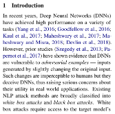

  
# Gradient-based Adversarial Attacks against Text Transformers (1)

영어실력의 부족으로 번역에 문제가 좀 있을 수 있으니 오역의 부분이 있다면 댓글을 달아주시면 좋을듯 함

## Abstract

NLP 모델에 대해 현존하는 black box 검색 방법들은 Adversarial attack 들을 만드는데 있어 높은 성공률을 달성했다.

그러나, **이러한 방법들은 Adversarial attack 들을 만드는데 필요한 Query 의 양을 고려하지 않았기 때문에
비효율적이다.**

또한, 이러한 attack 방법들은 다른 검색 방법들과 비교하면서 일관된 검색 공간을 유지하지 않았다.

이 논문에서 우리는 text classification 과 entailment task 에서 그럴듯한 Adversarial Example 들을 만드는데
Query 효율적인 attack 방법을 소개한다.

우리는 우리의 attack 방법을 3개의 다른 검색 공간에 걸쳐 4개의 baseline 들과 비교함으로써 우리의 접근 방식의 효율성을 
입증한다.

더 나아가 우리는 prior attack 방법들에서 사용된 것과 동일한 검색 공간을 통해 결과를 벤치마킹한다.

평균적으로 제안된 attack 들에 비해 우리는 모든 dataset 과 target model 들에서 쿼리 수를 75% 까지 줄일 수 있다.

제한된 Query 세팅에서 prior attack 들과 비교했을 때 우리의 attack 은 높은 성공률을 달성했다.

## 1. Introduction

최근 딥 뉴럴 네트워크(DNN) 은 다양한 task 에서 높은 성능을 달성했다.

그러나 prior studies(Szegedy et al., 2013; Papernot et al., 2017) 들은 DNN 이 원본 input 을 약간 변경시켜서 생성한
Adversarial Example 들에 대해 취약함을 보여줬다.

이런 변경은 인간은 인지할 수 없지만 DNN 모델들을 속이기 때문에 실제 응용 프로그램에서의 유용성에 대해 심각한 우려를 
불러일으킨다.

현존하는 NLP attack 방법들은 크게 white box attack 과 black box attack 으로 분류할 수 있다.

white box attack 들은 Adversarial attack 을 만들기 위해 target 모델들의 parameter, loss function, gradients 에 접근이
필요하다.

이러한 attack 방법들은 계산적으로 비싸고 대부분의 실제 응용 프로그램에서 이용할 수 없는 target 모델 내부의 세부사항들의
대한 지식이 필요하다.

black box attack 들은 confidence score 와 target 모델이 예측한 class 확률을 사용해 Adversarial input 들을 만든다.

거의 모든 prior black box attack 방법들은 1. search space 와 2. search method 두개의 주요 구성요소로 이루어진다.

search space 는 집합적으로 각각의 input 단어에 대해 (보통 동의어) 변형과 (최소한의 의미적 유사성, 
part-of-speech(POS) 일관성) 의 제약으로 정의된다.

각각의 input 단어에 대한 동의어 집합은 상응하는 embedding space 에서 가까운 단어 또는 HowNet or WordNet 과 같은 
어휘적인 데이터베이스로부터 생성된다.

search space 는 변화하기 쉽고 동의어를 생성하는데 사용된 source 의 변경 또는 정의된 제약을 풀어줌으로써 바뀔 수 있다.

search method 는 정의된 search space 위에서 Adversarial Example 들을 찾는데 사용되는 검색 알고리즘이다.

W 단어가 있는 input 과 T 개의 가능한 대체 단어들을 가지는 각 단어가 주어지면, perturbed 된 text input 들의 총 수는
$(T+1)^W$ 개 이다.

이 지수적인 크기가 주어지면, 검색 알고리즘은 전체 search space 로부터 최적의 Adversarial Example 들을 찾을 수 
있을만큼 효율적이고 철저해야 한다.

(Alzantot et al., 2018; Zang et al., 2020) 에서 제안된 black box attack 방법들은 정의된 search space 위에서 
Adversarial Example 들을 찾기 위한 검색 방법으로서 combinational 최적화 방법을 사용한다.

이러한 방법들은 매우 느리고 Adversarial Example 들을 만드는데 많은 Query 의 양이 필요하다.

(Ren et al., 2019; Jin et al., 2019) 에서 제안된 attack 방법들은 input 단어의 우선 순위를 지정하고 
유사한 단어로 대체하는 단어 중요도 순위를 사용하여 Adversarial Example 들을 검색한다.

단어 중요도 순위는 input 으로 부터 단어가 제거된(`<UNK>` 토큰으로 대체된) 후에 target 모델의 confidence score 의
변화를 관찰함으로써 단어의 점수를 매긴다.

최적화 기반 방법에 비해 단어 중요도 순위 지정 방법은 빠르지만 몇 가지 큰 단점이 있습니다.

(1)번 각각의 단어는 input 으로부터 순위를 매기는 중에 input 의 유의성을 바꾸는 단어를 
제거(또는 `<UNK>` 토큰으로 변경)함으로써 순위가 매겨진다.

(2)번 target 모델의 confidence score 에서 변화가 단어의 제거 또는 수정된 input 에 의한 것인지 명확하지 않다.

(3)번 이 순위를 매기는 구조는 긴 input 에 대해 비효율적이다.

일반적으로 attack 성공률과 Query 의 수는 trade off 가 존재한다.

많은 Query 검색 방법은 높은 성공률로 Adversarial Example 들을 생성한다. 그 반대도 성립

prior attack 방법들 모두 비효율적이고 attack 을 생성하기 위해 target 모델이 만드는 Query 의 수는 고려하지 않고있다.

새로운 search 방법과 이전의 방법들을 비교하기 위해, 새로운 search 방법은 같은 이전의 search method 에서 
사용한 search space 에서 벤치마크 되야 한다.

그러나, (Yoo et al., 2020) 에서 수행한 연구는 prior attack 방법들은 종종 그들의 search method 를 평가하는 동안 
search space 를 수정했음을 보여준다.

이것은 attack 성공률의 증가가 개선된 검색 방법 또는 수정된 search space 때문인지 구별하기 어렵기 때문에
검색 방법들 사이의 공정한 비교를 보장하지 않는다.

예를들어, (Jin et al., 2019) 는 Universal Sentence Encoder (USE) 를 사용하고 (Alzantot et al., 2018) 는 제한으로서 
language model 을 사용한 상황에서 (Jin et al., 2019) 는 검색 방법을 (Alzantot et al., 2018) 와 비교한다.

또한, 이전 논문들은 검색 방법을 하나의 search space 에서 평가한다.

이 논문에서, 우리는 다음의 기여를 통해 위에서 논의한 단점을 해결한다.

1. 우리는 새로운 **word attention score 와 input 단어들의 순위를 매기는 LSH 를 결합하여 이용**함으로써 Query 의 수를 
상당히 줄이는 ranking mechanism 을 소개한다.
2. 우리는 각각의 baseline 에서 사용된 같은 search space 에서 우리의 검색 방법을 벤치마크함으로써 평가 세팅을 통합할
것을 요구한다. 더 나아가, 우리는 3개의 다른 search space 를 통해 4개의 baseline 과 비교함으로써 우리의 방법의 
유효성을 평가한다.
3. 평균적으로, attack 성공률을 2% 정도 적은것을 타협하지만 prior attack 들보다 75% 적은 Query 를 사용하면서 
우리의 방법이 50% 빠르다.

---

Related Work 부터는 다음 포스팅에서 쓰도록 하겠다.

 

