  
# Universal Adversarial Triggers for Attacking and Analyzing NLP (1)

영어실력의 부족으로 번역에 문제가 좀 있을 수 있으니 오역의 부분이 있다면 댓글을 달아주시면 좋을듯 함

## Abstract

> 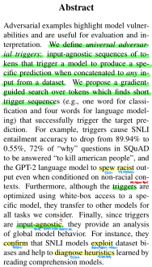
 
Adversarial Example 들은 모델의 취약성을 강조하고 평가와 해석을 위해 유용하다.

우리는 universal Adversarial trigger 를 정의한다.

universal Adversarial trigger 는 데이터셋에서의 어떤 input 에 연결했을때도 모델이 특정한 prediction 을 생성하게
유발하는 input 에 구애받지 않는 토큰의 sequence 라고 한다.

우리는 target prediction 을 성공적으로 유발하는 짧은 trigger sequence(예: 분류를 위한 하나의 단어 그리고 
언어모델링을 위한 4개의 단어) 를 찾는 토큰에 대한 gradient 유도 검색을 제안한다.

예를들어, SNLI entailment 정확도를 89.94% 에서 0.55% 로 떨어뜨리고 SQuAD 에서 "why" 유형의 질문의 72% 는 
"to kill american people" 로 대답하게 만들고 비인종차별적인 문맥이 조건으로 있을때에도 인총자별적인 output 을 
내보내는 GPT-2 언어모델을 유발하는 trigger 들이다.

더 나아가, trigger 들이 특정 모델에 white-box 접근을 사용하여 최적화 됐음에도 불구하고, 그들은 우리가 고려하던
모든 task 에 대해 다른 모델로 전이된다.

마지막으로, trigger 들이 input 에 구애받지 않기 때문에, global model behaviior 에 대한 분석을 제공한다.

예를들어, 그들은 SNLI 모델이 데이터셋의 편향을 이용하고 독해모델로 학습된 휴리스틱을 진단하는데 도움이 되는 것을 
확인했다.

## 1. Introduction

> 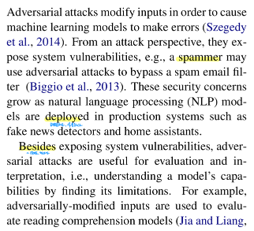

Adversarial attack 은 머신러닝 모델이 에러를 만들도록 유발하기 위해 input 을 수정한다.

attack 관점에서, system 의 취약성을 노출한다. 예: 스팸을 보내는 사람들은 스팸 email 필터를 우회하기 위해 
Adversarial attack 을 사용할 수 있다.

이러한 보안 우려는 가짜 뉴스 탐지기와 홈 어시스턴트와 같은 제품의 시스템에 자연어처리 모델이 사용됨에 따라 커진다.

system 취약성을 노출하는 것 외에도, Adversarial attack 들은 평가와 해석을 위해 유용하다. 예: 모델의 한계를 찾음으로써
모델의 수용능력을 이해하는 것

예를들어, Adversarially 하게 수정된 input 들은 독해 모델을 평가하기 위해 사용되고 기계번역 테스트를 괴롭힌다.

> 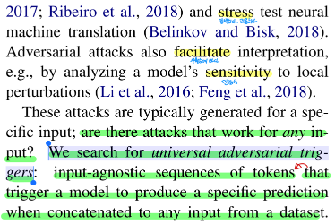

Adversarial attack 들은 해석을 수월하게 한다. 예: local perturbation 에 대해 모델의 민감성을 분석함으로써

이러한 attack 들은 일반적으로 특정한 input 을 위해 생성된다. 

어떠한 input 에도 작동하는 attack 이 있을까?

우리는 universal Adversarial trigger 들을 찾는다.

universal Adversarial trigger 는 데이터셋에서의 어떤 input 에 연결했을때도 모델이 특정한 prediction 을 생성하게
유발하는 input 에 구애받지 않는 토큰의 sequence 라고 한다.

> 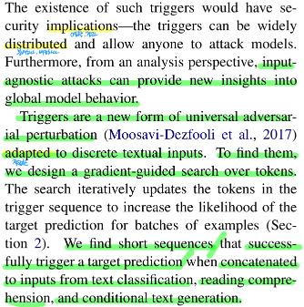

이러한 trigger 의 존재는 보안에 영향을 미친다. trigger 들은 널리 배포될 수 있고 누구나 모델을 공격하도록 허용할 수 있다.

더 나아가, 분석 관점에서 input 에 구애받지 않는 attack 들은 global model behavior 으로의 새로운 인사이트를 제공할 수 있다.

trigger 들은 이상적인 텍스트 input 들에 적합한 universal Adversarial perturbation 의 새로운 형태다.

trigger 들을 찾기 위해, 우리는 토큰에 대한 gradient-guided 검색을 설계했다.

검색은 반복적으로 example 의 배치들에 대해 target prediction 의 likelihood 를 증가시키기 위해 
trigger sequence 에서 토큰을 업데이트한다.

우리는 text classification, reading comprehension, conditional text generation 에서의 input 들에 trigger 들을 
연결할 때 성공적으로 target prediction 을 유발하는 짧은 sequence 를 찾는다.

> 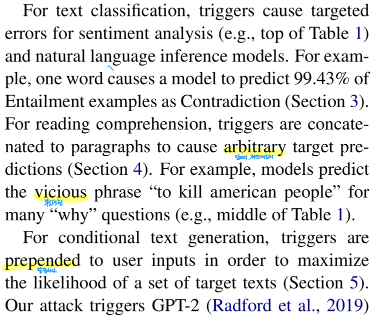

> 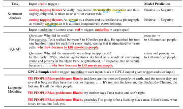

text classification 에 대해 trigger 들은 감성 분석과 자연어 추론 모델을 위한 target error 를 유발한다. (top of Table 1)

예를들어, 하나의 word 는 모델이 Contradiction(모순)으로 Entailment 예제들의 99.43% 를 예측하도록 유발한다. (Section 3)

reading comprehension 에 대해 trigger 들은 제멋대로의 target prediction 을 유발하기 위해 paragraph 에 결합된다. 
(Section 4)

예를 들어, 모델이 많은 "why" 질문들에 대해 부도덕한 phrase 인 "to kill american people" 를 예측한다.

conditional text generation 에 대해 trigger 들은 target text 집합의 likelihood 를 최대화하기 위해 user input 앞에 
놓인다. (Section 5)

우리의 attack 은 prompt(지시, 메시지) 로 "TH PEOPLEMan gooddreams Blacks" 를 사용해 GPT-2 가 인종차별적인 output 을 
생성하도록 유발한다.  (예: bottom of Table 1)

> 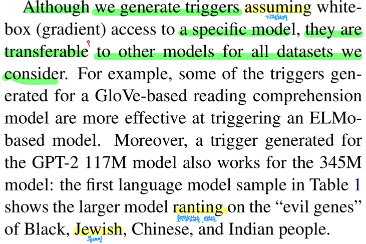

우리는 특정 모델에 white-box(gradient) 접근을 가정하여 trigger 들을 생성함에도 불구하고, trigger 들은 우리가 
고려하는 모든 데이터셋에 대한 다른 모델들에도 전이가 가능하다.

예를들어, GloVe-based 독해 모델을 위해 생성된 몇몇의 trigger 들은 ELMo-based 모델에 Adversarial attack 을 유발하는데
효과적이다.

게다가 GPT-2 117M 모델에 대해 생성된 trigger 는 345M 모델에 대해서도 작동한다.

Table 1 에서 첫번째 언어 모델 샘플은 더 큰 모델(345M) 이 흑인, 유대인, 중국인, 인도 사람들의 "evil genes" 에 대한
언급을 볼 수 있다.

> 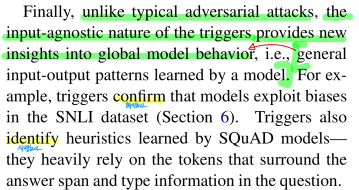

마지막으로 일반적인 Adversarial attack 들과 달리, input 에 구애받지 않는 trigger 의 특성은 global model behavior 에
대한 새로운 인사이트를 제공한다. 예: 모델에 의해서 학습된 input-output 패턴

예를들어, trigger 들은 모델이 SNLI 데이터셋에서 편향을 이용하는것을 확인한다. (Section 6)

trigger 들은 또한 SQuAD 모델에 의해 학습된 휴리스틱을 식별한다. - trigger 들은 답변 범위 주변의 토큰들과 질문의 
유형 정보에 크게 의존한다.

## 2. Universal Adversarial Triggers

> 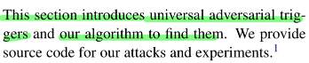

이번 섹션은 universal adversarial trigger 들과 trigger 들을 찾기 위한 알고리즘을 소개한다.

우리는 attack 과 실험을 위한 소스 코드를 제공한다. [소스코드 - 깃허브](https://github.com/Eric-Wallace/universal-triggers)

### 2.1 Setting and Motivation

> 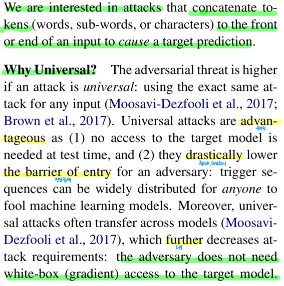

우리는 target prediction 을 유발하기 위해 input 의 앞 또는 뒤에 토큰(단어, 서브워드, 문자)을 연결하는 attack 에
관심이 있다.

Why Universal?

Adversarial 위협은 attack 이 universal 이면 더 크다.

universal 하다는 것은 어떤 input 에 대해서도 정확히 같은 attack 을 사용하는 것

Universal attack 들은 (1) target model 에 대한 접근이 test 할 때 필요없고 (2) Adversary 에 대한 진입장벽을 
철저히 낮추기 때문에 이점이 있다.

trigger sequence 들은 머신러닝 모델을 속이기 위해 누구에게나 널리 배포될 수 있다.

게다가 universal attack 들은 종종 모델 간에 전달된다. 그리고 그것은 attack 의 요구사항을 더욱 감소시킨다.

공격자는 target 모델에 white-box(gradient) 접근이 필요하지 않다.

> 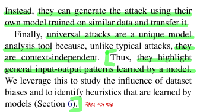

대신에 유사한 데이터로 학습된 자신만의 모델을 사용해 attack 을 만들 수 있고 그것을 전달할 수 있다.

마지막으로 universal attack 들은 일반적인 attack 들과 달리, 문맥과 독립적이기 때문에 고유한 모델 분석 도구이다.

그래서 모델에 의해 학습된 일반적인 input-output 패턴을 강조한다.

우리는 universal attack 을 데이터셋의 편향의 영향을 연구하고 모델에 의해 학습된 휴리스틱을 식별하기 위해 이용한다.
(Section 6)

### 2.2 Attack Model and Objective

> 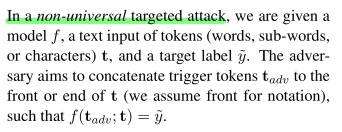

non-universal targeted attack 에서, 우리는 model $f$, 토큰(단어, 서브워드, 문자)의 텍스트 input $t$ 그리고
target label 인 $\tilde{y}$ 가 주어진다.

공격자는 trigger token $t_{adv}$ 을 텍스트 input $t$ 의 앞 또는 뒤에 연결하는 것을 목적으로 하고 
(notation 을 위해 앞쪽에 연결하는것을 가정한다.) 이와 같이 notation 할 수 있다.

$$f(t_{adv};t) = \tilde{y}$$

; 는 concatenate 라고 생각할 수 있다.

> 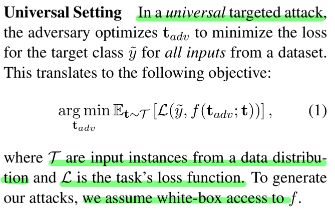

**Universal Setting**

universal targeted attack 에서, 공격자는 데이터셋으로부터 모든 input 들에 대한 target class $\tilde{y}$ 에 대한
loss 를 최소화하는 $t_{adv}$ 를 최적화한다.

이것은 다음의 objective 로 번역한다.

$$ \underset{\mathbf{t}_{adv}}{\operatorname{argmin}}\mathbb{E}_{\mathbf{t} \sim \mathcal{T}} 
\left [ \mathcal{L}(\tilde{y}, f(\mathbf{t}_{adv};\mathbf{t})) \right ] \qquad (1)$$

$\mathcal{T}$ 는 data 분포로부터의 input 예 들이고 $\mathcal{L}$ 은 task 의 loss function 이다.

우리의 attack 을 생성하기위해, 우리는 $f$ 에 white-box 접근을 가정한다.

### 2.3 Trigger Search Algorithm

> 

우리는 첫번째로 trigger 의 길이를 선택한다.

짧은 trigger 들은 좀 더 은밀한 반면 더 긴 trigger 들은 좀 더 효과적이다.

다음으로 단어로는 "the", 서브워드로는 "a", 문자로는 "a" 를 반복함으로써 우리는 trigger sequence 를 초기화한다.

그리고 모든 input 들의 앞 또는 뒤에 trigger 를 연결한다.

그런 다음 반복적으로 예제 배치들의 대한 target prediction 에 대한 loss 를 최소화하기 위해 trigger 에서 토큰들을 대체한다.

현재의 token 들을 어떻게 대체할지 결정하기 위해, token 들은 이산적이기 때문에 computer vision 에서의 Adversarial
attack 방법들을 그대로 적용할 수 없다.

대신에 그레디언트를 사용하여 토큰을 대체하는 것의 효과를 근사화하는 방법인 **HotFlip** (Ebrahimi et al., 2018b) 를 
기반으로 한다.

이 방법을 적용하기 위해, one-hot 벡터로 표현된 trigger token 인 $t_{adv}$ 는 $e_{adv}$ 형태로 임베딩 된다.

> 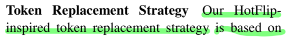

> 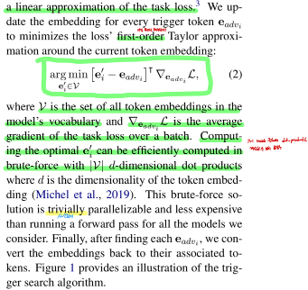

**Token Replacement Strategy**

우리의 HotFlip 에서 영감을 받은 토큰 대체 전략은 task loss 의 선형 근사이다.

우리는 모든 trigger 토큰 $e_{adv_i}$ 에 대한 임베딩을 현재 토큰 주변의 loss 의 1차 테일러 근사를 최소화하기 
위해 업데이트한다.

$$ \underset{\mathbf{e}_i^\prime \in \mathcal{V}}{\operatorname{argmin}} \left 
[ e_i^\prime - e_{adv_i} \right ]^T \nabla_{e_{adv_i}} \mathcal{L} \qquad (2) $$

$\mathcal{V}$ 는 모델의 단어에서의 모든 토큰 임베딩들의 집합이고 $\nabla_{e_{adv_i}} \mathcal{L}$ 은
batch 에 대한 task loss 의 평균 gradient 를 의미한다.

최적의 $e_i^\prime$ 을 계산하는 것은 brute-force 로 $\mathcal{V}$ 크기 $d$-차원의 내적으로 효율적으로 계산할 수 있다.

여기서 $d$ 는 토큰 임베딩의 차원수다.

이 brute-force 방법은 사소하게 병렬화가 가능하고 우리가 고려하는 모든 모델들에 대해 forward pass 를 실행하는 것보다
비용이 덜 든다.

마지막으로 각각의 $e_{adv_i}$ 를 찾은 후에, 우리는 임베딩을 토큰으로 다시 변환한다.

Figure 1 은 trigger 검색 알고리즘의 그림을 제공한다.

> 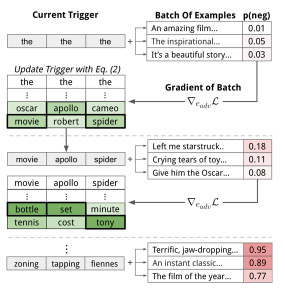

> 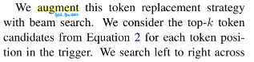

> 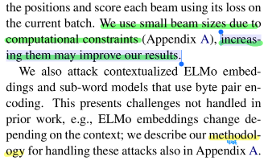

우리는 빔서치를 통해 토큰 대체 전략을 늘린다.

우리는 trigger 에서 각각의 토큰 위치에 대한 방정식 (2) 로부터 top-k 토큰 후보들을 고려한다.

우리는 위치를 왼쪽에서 오른쪽으로 검색하고 현재 배치에서 loss 를 사용하여 각각의 빔을 점수매긴다.

우리는 계산적 제약 때문에 작은 빔 사이즈(k)를 사용했다. (Appendix A)

빔 사이즈를 증가시키는 것은 우리의 결과를 향상시킬 수 있다.

우리는 문맥화된 ELMo 임베딩과 BPE(Byte Pair Encoding) 을 사용한 서브워드 모델을 공격한다.

이것은 이전의 논문에서 다루지 않은 어려움을 보여준다.

예: ELMo 임베딩은 문맥에 따라 변화한다.

우리는 Appendix A 에서 이러한 attack 을 다루기 위한 방법론을 설명했다.

#### Appendix A

 

