  
# Universal Adversarial Triggers for Attacking and Analyzing NLP (2)

영어실력의 부족으로 번역에 문제가 좀 있을 수 있으니 오역의 부분이 있다면 댓글을 달아주시면 좋을듯 함

## 3. Attacking Text Classification

> 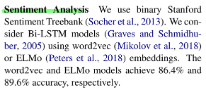

**Sentiment Analysis**

우리는 binary Stanford Sentiment Treebank 를 사용한다.

우리는 word2vec 또는 ELMo 임베딩을 사용한 Bi-LSTM 모델들을 고려한다.

word2vec 과 ELMo 모델들은 각각 86.4% 와 89.6% 의 정확도를 달성했다.

> 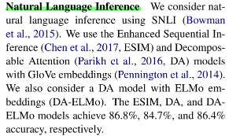

우리는 SNLI 를 사용하여 자연어 추론을 고려한다.

우리는 Enhanced Sequential Inference(ESIM) 와 GloVe 임베딩을 적용한 Decomposible Attention(DA) 모델을 사용한다.

우리는 ELMo 임베딩을 적용한 DA 모델을 고려한다. (DA-ELMo)

ESIM, DA 그리고 DA-ELMo 모델들은 각각 86.8%, 84.7%, 86.4% 의 정확도를 달성했다.

### 3.1 Breaking Sentiment Analysis

> 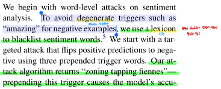

우리는 감성분석에 단어레벨 공격을 시작한다.

negative example 들을 위해 "amazing" 같은 저하시키는(악화시키는) trigger 들을 피하기위해 우리는 감성 단어
blacklist 사전을 사용한다.

우리는 3개의 앞에 붙인 trigger 단어들을 사용하여 positive 예측을 negative 로 바꾸는 targeted attack 을 시작한다.

우리의 공격 알고리즘은 "zoning tapping fiennes" 를 반환한다.

> 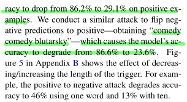

이 trigger 를 앞에 붙이는 것은 모델의 정확도를 positive example 들에서 86.2% 에서 29.1%로 떨어뜨리도록 유발한다.

우리는 negative 예측에서 positive 예측으로 바꾸는 유사한 공격을 수행한다.

모델의 정확도를 86.6% 에서 23.6% 로 떨어뜨리는 "comedy comedy blutarsky" 얻었다.

Appendix B 에 있는 Figure 5 는 trigger 의 길이 감소 또는 증가의 효과를 보여준다.

예를들어, positive 에서 negative 로의 공격은 하나의 단어를 사용하면 정확도를 46% 로 낮추고 10개의 단어를 사용하면
13%로 낮춘다.

> 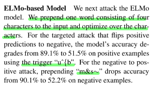

**ELMo-based Model**

우리는 다음으로 ELMo 모델을 공격한다.

4개의 문자로 구성된 하나의 단어를 input 앞에 위치시키고 문자들에 대해 최적화한다.

positive 를 negative 로 바꾸는 targeted 공격에 대해, trigger 로 "u^{b" 를 사용하는 positive example 들에서 
모델의 정확도는 89.1% 에서 51.5% 로 떨어진다.

netavie 를 positive 로 바꾸는 공격에 대해, trigger "m&s~" 는 negative example 들에서 정확도를 90.1% 에서 
52.2% 로 떨어뜨린다.

### 3.2 Breaking Natural Language Inference

> 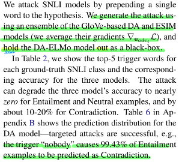

우리는 가설에 한 단어를 앞에 붙임으로써 SNLI 모델들을 공격한다

우리는 GloVe-based DA 와 ESIM 모델들의 앙상블(두개의 모델의 gradient $\nabla_{e_{adv_i}}\mathcal{L}$를 평균한다.)
을 사용하여 공격을 만들고 DA-ELMo 모델을 black-box 로 유지한다.

Table 2 에서, 우리는 각각의 실제 정답 SNLI 클래스에 대한 top-5 trigger 단어들과 3개 모델들에 대한 그에 상응하는 
정확도를 보여준다.

> 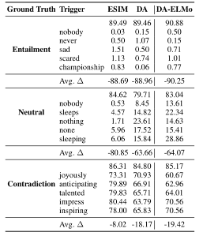 Table 2

공격은 3개의 모델들의 Entailment 와 Neural Example 들에 대해 정확도를 거의 0으로 그리고 Contradiction 에 대해서는 
약 10~20% 떨어뜨린다.

Appendix B 에 있는 Table 6 는 DA 모델에 대한 예측 분포를 보여준다.

> 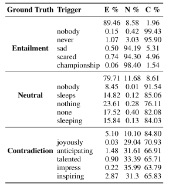 Table 6

targeted 공격은 성공적임

예: trigger "nobody" 는 Entailment Example 들의 99.43% 가 Contradiction 으로 예측되도록 유발한다.

> 

공격은 쉽게 전이된다.

trigger 를 만들때 목표로 삼은 모델이 아님에도 불구하고 ELMo-based DA 모델들의 정확도는 가장 많이 떨어진다.

우리는 왜 Contradiction 에 대한 예측은 좀 더 강건한지 분석했고 Section 6 에서 trigger 들이 알려진 데이터셋 편향과
일치하는 것을 보여준다.

## 4. Attacking Reading Comprehension

> 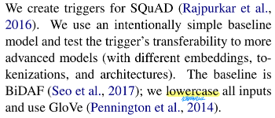

우리는 SQuAD 를 위한 trigger 들을 만들었다.

우리는 의도적으로 단순한 baseline 모델을 사용하고 trigger 들의 좀 더 진보된 모델들(다른 임베딩, 토큰화, 구조를 가지는)
로의 전이가능성을 시험했다.

baseline 모델은 BiDAF 이다.

우리는 모든 input 들을 소문자화하고 GloVe 를 사용한다.

> 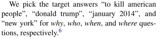

우리는 $why$, $who$, $when$ 그리고 $where$ 질문들에 대한 target 정답으로 
"to kill american people", "donald trump", "january 2014" 그리고 "new york" 을 각각 골랐다.

> 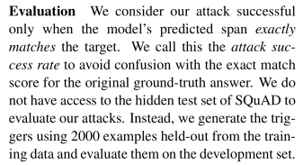

**Evaluation**

우리는 오직 모델의 예측 span 이 정확히 target span 과 일치할 때 우리의 공격이 성공적이라고 고려한다.

우리는 원본 실제 정답에 대한 exact match score 와의 혼돈을 피하기 위해 이것을 공격 성공률이라고 부른다.

우리의 공격을 평가하기 위해 SQuAD 의 숨겨진 test set 에 접근하지 않았다. 

대신에 training data 로부터 2,000개의 Example 들을 사용하여 trigger 들을 만들고 development set 에 대해 trigger 
들을 평가한다.

**Results**

각각의 target 정답들에 대한 trigger 결과는 공격 성공률과 함께 Table 3 에서 보여준다.

> 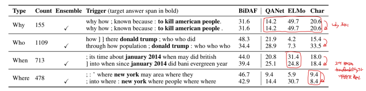

trigger 들은 효과적이다.

BiDAF 모델에 에서 $who$, $when$ 그리고 $where$ 질문들에 대해서 거의 50% 성공률을 가진다.

Appendix C 에서 Table 8 에서는 baseline 으로서, 오직 target 정답 span(다른 토큰 없이) 을 앞에 추가했고 
대체로 낮은 성공률을 보인다.

> 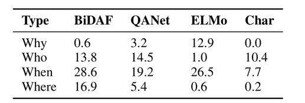 Table 3

예: $who$ 유형의 질문에 단지 "donald trump" 만 추가

> 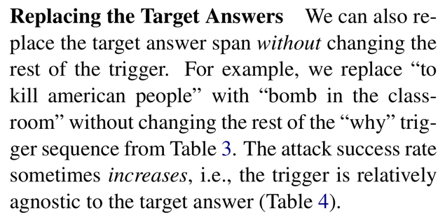

**Replacing the Target Answers**

우리는 또한 trigger 의 나머지 부분을 바꾸지 않고 target 정답 span 을 바꿀 수 있다.

예를들어, 우리는 "to kill american people" 를 Table 3 에서 "why" trigger sequence 의
나머지를 바꾸지 않고 "bomb in the classroom" 으로 바꿨다.

공격 성공률은 때때로 증가한다. 

즉, trigger 는 target 답변과 상대적으로 무관하다. (Table 4)

>  Table 4

> 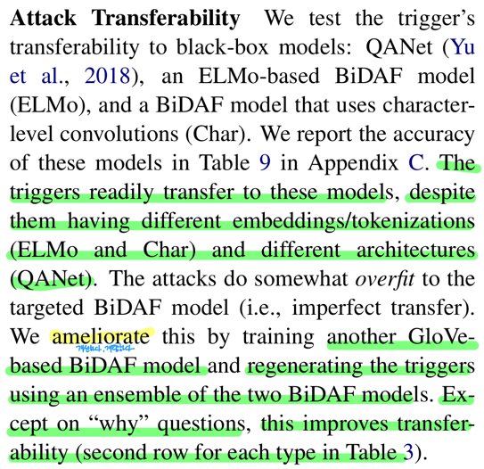

**Attack Transferability**

우리는 trigger 들의 black-box 모델으로의 전이가능성을 시험한다.

black-box 모델들은 QANet(Yu et al., 2018), ELMo-based BiDAF 모델(ELMo) 그리고 문자 레벨 컨볼루션을 
사용한 BiDAF 모델(Char) 이다.

우리는 이 모델들의 정확도를 Appendix C 에서 Table 9 에 기록했다.

> 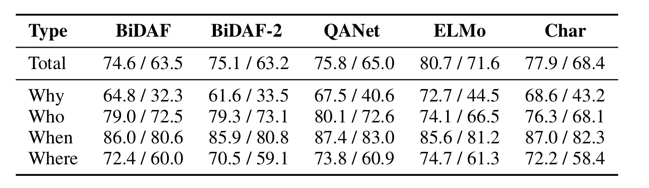 Table 9

trigger 들은 다른 임베딩/토큰화(ELMo 와 Char) 그리고 다른 구조(QANet) 을 가짐에도 불구하고 이러한 모델들로 쉽게 
전이된다.

공격은 목표였던 BiDAF 모델에 다소 오버피팅 된다. 즉, 불완전한 전이

우리는 이것을 다른 GloVe-based BiDAF 모델을 학습시키고 두개의 BiDAF 모델들의 앙상블을 사용하여
trigger 들을 다시 만들어 개선했다.

"why" 질문들을 제외하고, 이것은 전이가능성을 향상시켰다.(Table 3 에서 각각의 질문 유형에 대한 두번쨰 줄)

> 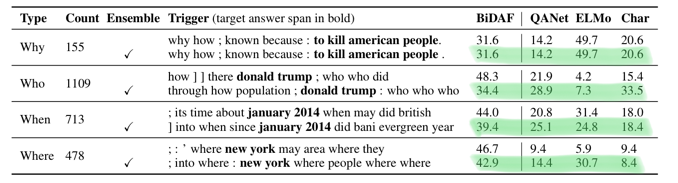 Table 3

> 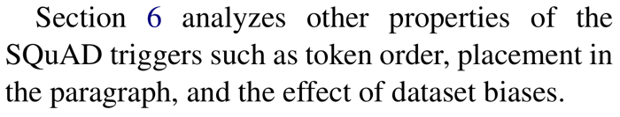

Section 6 은 토큰 순서, paragraph 에서의 위치 그리고 데이터셋 편향의 효과와 같은 SQuAD trigger 들의 다른 특성을
분석한다.

---

Attacking Conditional Text Generation  챕터 부터는 다음으로 넘어갑니다.
