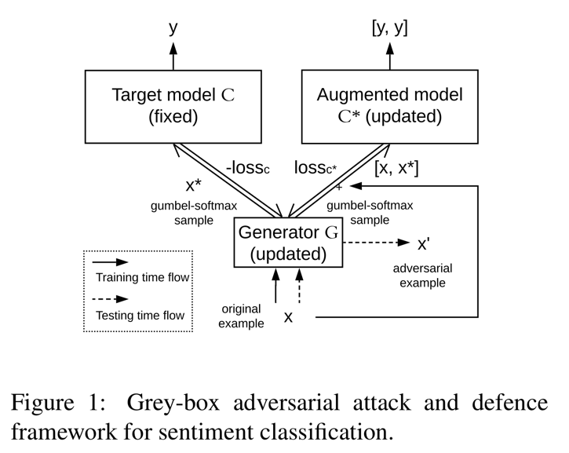
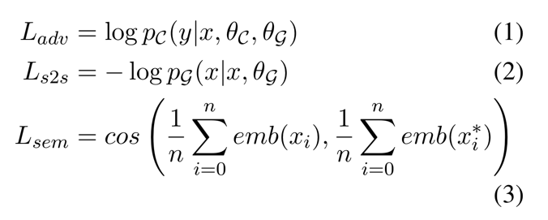
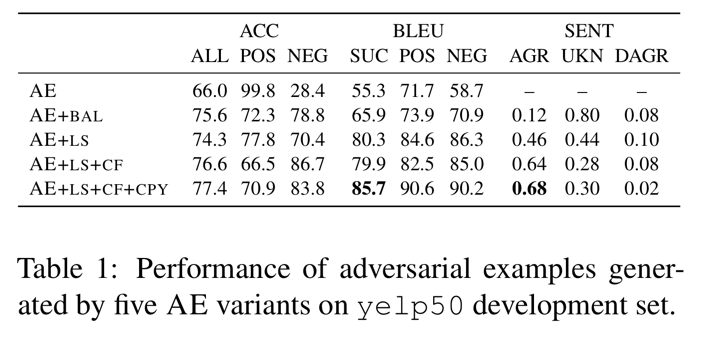
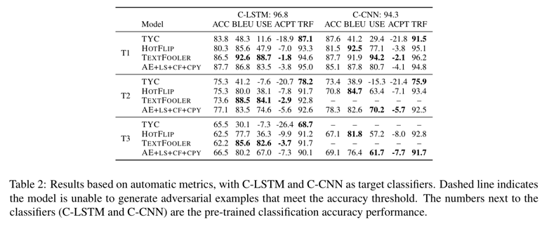
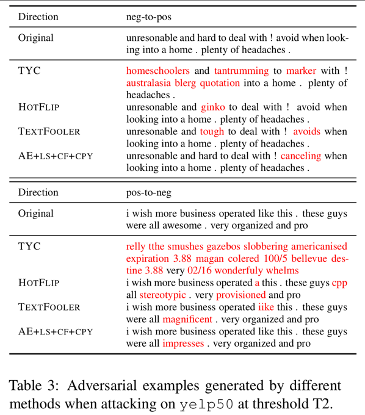
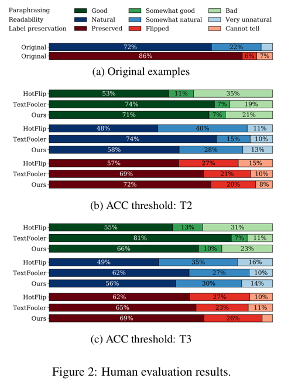
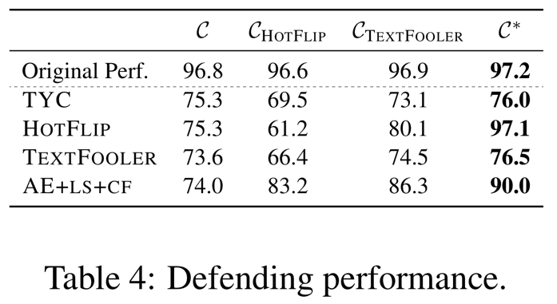

  
# Grey-box Adversarial Attack And Defence For Sentiment Classification

중요하다고 생각하는 부분만 적는다는 마음으로 글을써본다. 

## Abstract

감성분석을 위한 grey-box Adversarial attack 과 defence 프레임워크를 소개한다.

우리의 결과들은 일단 학습되면, attacking 모델은 고품질의 Adversarial example 들을 SOTA attacking 방법들보다 
상당히 빠르게 만들 수 있다는 것을 보여준다.

코드를 보고 싶다면 [Github](https://github.com/ibm-aur-nlp/adv-def-text-dist) 로 가서 보면 됩니다.

## 1. Introduction

이 분야의 연구는 크게 Adversarial machine learning 으로 분류되고 작게는 target 모델들을 바보로 만드는 
Adversarial example 들을 생성하도록 찾는 Adversarial attack 과 Adversarial attack 들에 대항하는 모델들을
만들기 위함이 목적인 Adversarial defence 가 있다.

Adversarial attack 방법들은 일반적으로 3가지 타입으로 분류된다.

- white-box
  - target 모델들에 완전한 접근이 가능하고 Adversarial example 생성의 유도를 위해 target 모델들의 그레디언트를
  사용한다.
- black-box
  - target 모델의 구조에 대한 지식이 없고 반복적으로 target 모델에게 쿼리를 날리면서 attack 을 수행한다.
- grey-box
  - Adversarial example 들을 만들기 위해 generative 모델을 학습하고 학습하는 중에만 target 모델에 접근이 가능하다.

grey-box attacking 의 장점은 attack 단계에서 target 모델에 접근하지 않아 높은 시간 효율성을 포함하고 
Adversarial defending 알고리즘과 더 쉬운 통합을 포함한다.

이 논문에서, Adversarial defending 을 위한 향상된 감성 분석기를 학습하는 동시에 고품질 텍스트의 Adversarial example 
들을 만드는 grey-box 프레임워크를 제안한다.

**Contribution**

- Adversarial example 생성기와 target 모델을 하나의 통일된 학습가능한 네트워크로 결합하기 위한 차별성 문제를 
해결하기 위해 Gumbel-softmax (Jang et al., 2016) 를 사용하는 것을 제안한다.
- input example 들과 유사성을 유지하는 반면 생성된 Adversarial example 들이 target 분류기를 바보로 만들 수 있게 
하기 위해 Adversarial attack 학습을 위한 multiple competing objective 들을 제안한다. 우리는 어휘와 의미 유사성과
label 보존과 같은 텍스트에 대한 성공적인 attacking example 을 정의하기 위해 많은 유사성 측정을 고려한다.
- 생성 모델이 가능한 정확하게 input 문장들을 재구성할 수 있도록 돕기 위해, input 으로부터 직접 단어를 선택적으로
복사하기 위해 참신하지만 단순한 복사 메카니즘을 디코더에 도입한다.
- 자동과 인간 평가방식을 둘다 사용하여 단순히 attacking 성능을 넘어서 Adversarial example 들과 내용 유사도, 
유창성 그리고 label 보존을 평가한다.
- 생성(attacking) 모델을 학습하는 동시에 향상된 감성 분석기를 만든다. 이 방법으로 생성된 분류기는 
Adversarial example augmentation 에 기초한 Adversarial defending 보다 좀 더 robust 하ek. 

## 2. Related Work

생략

## 3. Methodology

Adversarial attack 의 목적은 pre-trained target 모델(예: 감성 분석기) $f$ 를 위한 input example $x$ 에 
$f(x) \ne y$ ($y$ 는 $x$ 의 실제 정답)가 되게 하기 위해 약간 perturb 하는 것이다.

perturbed example $x'$ 은 $x$ 와 유사해 보이고 input example 들의 도메인에 따라 다르게 측정될 수 있다.

### 3.1 General Architecture

generator $\mathcal{G}$ (updated) 와 pre-trained target 분류기의 두개의 복사본(고정된 분류기 $C$ 와 
update 되고 증강된 분류기 $C^\*$)으로 구성된 grey-box attack 과 defence 프레임워크를 제안한다.

학습 단계에서 $\mathcal{G}$ 의 output 은 직접 결합된 구조 형태로 $C$ 와 $C^\*$ 에 입력으로 주어진다.

학습 후에, generator $\mathcal{G}$ 는 Adversarial example 들을 만들기(Adversarial attack) 위해 독립적으로 사용된다. 

반면에 증강된 분류기 $C^\*$ 는 robustness 가 증가한 향상된 분류기다. (Adversarial defence)

$C$ 와 $C^\*$ 는 같은 pre-trained weight 들에서 시작한다. 오직 $C^\*$ 만 학습 중에 업데이트된다.

> 

학습 단계는 attacking step 과 defending step 으로 나뉜다.

attacking step 은 오직 generator $\mathcal{G}$ 만 업데이트하고 input 에 target 모델 $C$ 의 objective 함수를
최대화함으로써 약간의 perturbation 을 도입하도록 배운다.

defending step 은 원본 example 들과 $\mathcal{G}$ 에 의해 생성된 Adversarial example 들을 input 으로 줌으로써 
$C^\*$ 와 $\mathcal{G}$ 를 업데이트한다.

여기서, Adversarial example 들은 원본 example 들과 같은 label 을 공유한다고 가정된다.

이산적인 decoding step(예: argmax)을 거쳐 text 를 생성하는 것은 결합 구조를 구별할 수 없게 만든다.

그러므로 우리는 이산적인 output 의 범주형 분포를 근사하기 위해 Gumbel-softmax (Jang et al., 2016) 을 사용할 것을
제안한다.

각각의 생성 step $i$ 에 대해, vocabulary 로부터 단어를 샘플링하는것 대신에, vocabulary 안에 단어들에 대한 완전한
확률 분포를 갖는 Gumbel-softmax 샘플 $x_i^\*$ 를 뽑는다.

$\rightarrow$ 생성된 단어의 확률은 1.0에 가깝고 다른 단어들은 0에 가깝다.

우리는 샘플 $x_i^\*$ 와 target 모델 $C$ 의 단어 임베딩 행렬 $M_C$ 를 곱함으로써 $C$ 와 $C^\*$ 에 대한 input 임베딩
($x_i^\* \cdot M_C$)을 얻는다.

generator $\mathcal{G}$ 는 데이터 조건에 의해 본질적으로 구별되는 auto-encoder 또는 paraphrase generator 로 
구현될 수 있다.

auto-encoder 는 target 으로 input sequence 를 사용하고 paraphrase generator 는 
paraphrase(예: PARANMT-50M (Wieting and Gimpel, 2017)) 들을 사용한다.

이 논문에서는 우리의 서두의 실험들은 pre-trained paraphrase generator 는 test 도메인(예: Yelp reviews)에 적용했을 때 
안좋은 성능을 내는것을 발견했기 때문에 $\mathcal{G}$ 를 auto-encoder 로 구현한다.

### 3.2 Objective Functions

auto-encoder $\mathcal{G}$ 는 input example 이 주어지면 Adversarial example 을 생성한다.

auto-encoder 는 input example 을 재구성하려고 시도하지만 재구성하려는 것을 억제하는 Adversarial loss term 에 의해 
제한된다.

> 

- $L_{adv}$ 는 본질적으로 $C$ 의 negative cross-entropy loss
- $L_{s2s}$ 는 input 재구성에 대한 sequence-to-sequence loss
- $L_{sem}$ 는 $x$ 와 $x^\*$ 의 averaged 임베딩들 사이의 코사인 유사도
- $n$ 은 단어의 수

여기서 $L_{s2s}$ 는 $x'$ (test 시 생성되는) 에게 어휘적으로 $x$ 와 유사하게 되도록 장려하고 논리적인 문장들을 생성하는 
것을 돕는다.

그리고 $L_{sem}$ 은 의미적인 유사성을 장려한다.

우리는 2개의 웨이트를 주는 하이퍼 파라미터 를 가지고 3개의 objective 함수들을 가중하고 total loss 는 이와 같다.

$$ L = \lambda_1 (\lambda_2 L_{s2s} + (1 - \lambda_2) L_{sem} ) + (1 - \lambda_1) L_{adv} $$

우리는 이러한 objective 로 훈련된 auto-encoder 기반 generator 를 **AE** 로 나타낸다.

우리의 서두의 실험들로부터 얻어진 정보는 generator 는 다른 class 들 사이에 불균형된 attacking 을 수행하는 경향이 
있다는 것이다. (예: AE 는 완전히 한 방향 attacking 에 집중해 학습한다. positive $\rightarrow$ negative or 
negative $\rightarrow$ positive attack)

우리는 FGSM 과 DeepFool 같은 white-box attack 방법들에서 유사한 문제를 발견했다.

이 문제를 해결하기 위해, 우리는 각각의 배치에서 특정 클래스의 loss 가 최대가 되도록 $L_{adv}$ 를 수정하는 것을 제안한다.

즉,

$$ L_{adv} = max^{\vert C \vert}_{t=1} ( L_{adv}^t ) $$

- $L^t_{adv}$ 는 t 클래스에서 example 들의 Adversarial loss 
- $\vert C \vert$ 는 class 들의 전체 수

우리는 이렇게 대체된 loss 로 학습된 generator 를 **AE+BAL** 로 나타낸다.

Adversarial defence 에 대해, 다음의 예외를 가지고 같은 objective 함수를 사용한다.

방정식 (1) $ L_{adv] = log p_C(y \vert x, \theta_C, \theta_{\mathcal{G}}) $ 을 분류기 $C^\*$ 의 objective 함수로 바꾼다.

즉,

$$ L_{def} = - log p_{C^{*}} (  [ y, y  ] \vert  [ x, x^{*}  ], \theta_C, \theta_{\mathcal{G}} ) $$

우리는 원본과 Adversarial example 들($x$ 와 $x^\*$)과 모델 $C^\*$ 가 Adversarial example 들에게 오버피팅되는 것을 
막아주는 원본 label($y$) 을 사용하여 모델 $C^\*$ 를 학습한다.

### 3.3 Label Preservation

텍스트적인 Adversarial example 생성의 주요 어려움 중 하나는 원본 실제 정답 label 을 보존하는 것이다.

이것을 **label preservation** 이라고 부른다.

텍스트에서 문장에 약간의 perturbation 은 실제 정답을 완전히 바꾼다.

우리는 label preservation 에 대한 우리의 접근 방법을 설명하기 위해 context 로 감성 분석을 사용한다.

Adversarial attack 의 목표는 인간 독자의 관점으로부터 실제 정답 감성은 보존하면서 target 모델의 예측 감성이 뒤바뀐 
Adversarial 문장을 생성하는 것이다.

우리는 label preservation 을 돕기 위한 2가지 방법을 제안한다.

첫번째 접근방법은 task 에 구애받지 않는 즉, 어떤 분류 문제에 대해서도 작동하는 방법이다.

반면에 두번째 접근방법은 감성 분류에 적합하다.

**Label smoothing (+LS)**

우리는 generator 는 고정된 분류기 $C$ 로부터의 감성 점수와 반대로 높은 확신을 가진 Adversarial example 들을 생산하는 
경향을 가지는 것을 관찰했다.

우리는 generator 에게 generator 가 감성을 완전히 바꾸지 못하도록 의사결정 경계에 근접한 example 들을 만들도록 
강요하기 위해 label smoothing 의 사용을 연구했다.

우리는 방정식 (1) 에 실제 label 의 확률 덩어리를 일정하게 다른 label 들에게 재분배함으로써 label smoothing 을 포함했다.

정식으로, 스무딩된 label 

$$ y_{ls} = (1 - \alpha) * y + \alpha / K $$

- $\alpha$ 는 하이퍼 파라미터
- $K$ 는 클래스의 수

예를들어, negative 에서 positive 공격을 수행할 때, {pos: 1.0, neg: 0.0} (from $C$)의 label 분포를 가지는 Adversarial example 
들을 생산하는 $\mathcal{G}$ 를 최적화하는 것 대신에 {pos: 0.6, neg: 0.4} 의 label 분포를 목표로 최적화한다.

이런 부가적인 제약을 가지고 학습된 generator 는 **+LS** 접미사를 붙여 나타낸다.

**Counter-fitted embeddings (+CF)**

Mrkšic ́ et al. (2016) 는 GloVe 와 같은 unsupervised 단어 임베딩들은 종종 동의어와 반의어 관계들을(예: cheap 과 pricey 는
매우 높은 유사성을 가진다.) 잡지 못함을 발견했다.

저자들은 이러한 어휘적인 관계들을 더 잘 잡도록 대응하는 임베딩들을 생산하기 위해 pre-trained 워드 임베딩을 어휘적인 
자원(예: WordNet)으로 후처리하는 것을 제안한다.

generator $\mathcal{G}$ 가 반대 감정을 가지는 단어들을 생성하는 것을 억제하기 위해, 대응하는 임베딩들을 가지고 
$\mathcal{G}$ 학습을 시도했다.

대응하는 임베딩을 사용한 모델들은 **+CF** 접미사를 붙여 나타낸다.

### 3.4 Generator with Copy Mechanism (+CPY)

white-box 또는 black-box attacking 방법들은 input example 들에서 토큰을 더하고, 빼고, 바꾸는 것이 기본이다.

그러므로 원본 example 들의 유사성을 유지하는 것은 밑바닥부터 한단어 한단어씩 Adversarial example 들을 생산하는 
grey-box 방법들보다 쉽다.

우리는 grey-box attack 이 원본 문장의 신뢰할 수 있는 재구성을 할 수 있도록 돕는 단순한 copy 메카니즘을 소개한다.

우리는 마스킹 되지 않은 단어 위치에 대해서만 생성하도록 하는 decoder 에 고정된 copy mask 를 포함한다.

예: 

input 문장 $x =  [ w_0, w_1, w_2  ]$, target $x^\* =  [ w_0, w_1, w_2  ]$, 
mask $m =  [ 1, 0, 1  ]$ 가 주어지면 test 시점에 decoder 는 $w_0$ 와 $w_2$ 를 만들기 위해 
첫번째 input ($w_0$) 과 3번째 input ($w_2$)에 대한 target 으로부터 "copy" 할 것이다.

하지만, 2번째 input ($w_1$) 을 위해 vocabulary 로부터 decode 될 것이다.

학습하는동안, 우리는 마스킹되지 않은 input 단어들에 대해서만 cross-entropy 를 계산한다.

고정된 copy mask 는 pre-trained target 분류기들(**C-LSTM**) 중 하나로부터 얻어진다.

**C-LSTM** 는 **LSTM** hidden state 들에 가중치를 주는 self-attention 에 의해 따라오는 양방향 **LSTM** 으로 된 분류기다.

우리는 self-attention 에 기반해 input 단어들의 순위를 매기고 decoder 로부터 생성된 가장 높은 weight 들을 가지는
top-N 단어들에 대응하는 위치에만 copy mask 를 만든다.

일반적으로 `awesome` 과 `bad` 같은 감정이 격한 단어들은 self-attention layer 에서 좀 더 높은 weight 들을 가지는 
경향이 있다.

이 self-attention layer 는 어떤 토큰들이 먼저 교체되거나 교체해야하는지를 결정하는 중요도 순위를 매기는 함수로 보여질 
수 있다.

copy 메카니즘을 적용한 모델들은 **+CPY** 접미사를 붙여서 나타낸다.

## 4. Experiments and Results

### 4.1 Dataset

[Yelp review dataset](https://www.yelp.com/dataset) 을 사용해 실험을 수행했다.

Ratings 가 4점 이상이면 positive 그리고 Ratings 가 2 이하이면 negative 로 이진분류했다.

토크나이제이션을 위해 [spaCy](https://spacy.io) 를 사용했다.

그리고 review 들을 50개 이하의 토큰으로 유지했다.

그래서 데이터셋을 `yelp50` 으로 나타낸다.

우리는 데이터를 train(90%, 407,298개)/dev(5%, 22,536개)/test(5%, 22,608개) 비율로 나눴고 각각의 set 에서
positive class 를 negative class 와 같도록 다운샘플링했다.

### 4.2 Implementation Details

target 분류기($C$ 와 $C^\*$) 에 대해서, `yelp50` 을 사용하여 3개의 감성 분류 모델들을 사전학습했다.

- **C-LSTM** (Wang et al., 2016)
  - 하나의 embedding layer, 하나의 2-layer 양방향 **LSTM**, 하나의 self-attention layer, 하나의 output layer 로 
  구성된다.
- **C-CNN** (Kim, 2014)
  - 많은 다양한 크기의 컨볼루션 필터들을 가지고 그들의 output 들을 결합하고 크기를 줄여주는 풀링을 하고 
  output layer 에 따라오는 fully-connected layer 에 입력으로 준다.
- **C-BERT**
  - 감성 분류를 위한 **BERT-Base** 모델 파인튜닝 함으로써 얻어진다.
  
우리는 learning rate, batch size, layer 의 수, 모든 분류기들에 대한 hidden unit 들(특별히 **C-LSTM** 을 위한 
attention unit 들의 수와 컨볼루션 필터 크기와 **C-CNN** 을 위한 dropout rate)의 수를 튜닝했다.

auto-encoder 에 대해, 우리는 `yelp50` 에서 문장들을 재구성하기 위해 사전학습했다.

사전학습하는 동안, 우리는 learning rate, batch size, layer 의 수, hidden unit 들의 수를 튜닝했다.

Adversarial attacking 의 학습하는 동안 우리는 $\lambda_1$ 과 $\lambda_2$ 그리고 learning rate $lr$ 을 튜닝했다.

또한 Gumbel-softmax 샘플링을 위해 다른 temperature $\tau$ 를 테스트했고 $\tau = 0.1$ 이 가장 좋은 성능을 내는 것을
발견했다.

모든 단어 임베딩들은 고정되었다.

더 많은 하이퍼 파라미터와 학습 configuration 은 보충 자료에 설명되어 있다.

### 4.3 Attacking Performance

우리는 주어진 생성된 Adversarial 샘플들의 특정한 성공률인 퀄리티(예: 유창성, content/label 보존)를 이해하기를 원한다.

그러므로 우리는 attack 성공률의 수준들을 같도록 모든 attacking 방법들을 조정했고 생성된 Adversarial example 들을
비교했다.

Adversarial attack 데 대한 결과들은 $\mathcal{G} + C$ 결합 구조를 사용하여 얻어진 반면에 Adversarial defence 에 대한 
결과들은 $\mathcal{G} + C + C^\*$ 결합 구조에 의해 얻어진 것을 주목(주의)하자

#### 4.3.1 Evaluationo Metrics

**Attacking performance**

Adversarial example 들의 attacking 성능을 측정하기 위해 target 분류기 ($C$)의 표준 분류 정확도 (ACC) 를 사용한다.

낮은 정확도는 더 나은 attacking 성능을 의미한다.

**Similarity**

원본과 그에 대응되는 Adversarial example 들 사이의 텍스트와 의미적 유사도를 평가하기 위해, BLEU 와 universal 문장 
encoder 에 의해 만들어진 Adversarial 문장 임베딩과 원본 사이의 코사인 유사도를 계산하는 USE 를 계산했다.

두개의 metric 에 대해 높은 점수는 더 나은 성능을 나타낸다.

**fluency**

생성된 Adversarial example 들의 읽을 수 있음의 정도를 측정하기 위해, XLNet 으로 만들어진 표준화된 문장 확률에 기반한 
Acceptability(용인가능성) 점수 (ACPT) 를 사용했다.

높은 점수는 더 나은 유창성을 가리킨다.

**Transferability**

다른 보지 못한 감성 분류기(TRF) 를 공겸함에 있어 Adversarial example 들의 효과를 이해하기 위해, 
**C-LSTM** 과 **C-CNN** 분류기들을 공격하기 위해 생성된 Adversarial example 들을 이용하여 **C-BERT** 의 정확도를 
평가했다.

낮은 정확도는 더 나은 transferability 를 가리킨다.

**Attacking speed**

각각의 attacking 방법이 하나의 Adversarial example 을 만드는데 평균적으로 얼마나 걸리는지를(초단위) 측정했다.

#### 4.3.2 Automatic Evaluation

**Comparison between AE variants**

Table 1 에서 먼저 grey-box 모델에서 auto-encoder(generator) 의 다양한 변형을 실험하면서 development set 에 대한 
결과들을 보여준다.

모든 변형들의 Attacking 성능은 target 분류기인 $C$ (C-LSTM) 에 대해 대략적으로 70%-80% 정확도를 생산하기 위해 조정되었다. 

> 

얼마나 Adversarial example 들이 원본 감성을 잘 보존하는지를 이해하기 위해, 내부적으로 각각의 auto-encoder 변형에 의해
생산된 Adversarial example 들의 작은 샘플을 annotate 하기 위해 두명의 annotator 를 채용했다.

AGR 과 DAGR 은 원본 감서과 동일한지 아닌지에 대한 Adversarial example 들의 퍼센트를 가리키고 UKN 은 annotator 들이
감성을 판단할 수 없는 것의 퍼센트다.

**AE+BAL** 은 positive-to-negative 와 negative-to-positive attack 에 대해 더 균형있는 성능을 만드는데 효과적임을 
볼 수 있다.

우리는 **AE** 는 모든 input example 들에 대해 positive(또는 negative) 단어들을 생성하는 것이 더 쉽고
특정 attack 성능을 달성하기 위해 다른 방향으로의 성능을 포기하는 것이 더 쉽기 때문에 단방향 attack 을 수행하는것을 
배운다고 가설을 세웠다.

그렇긴 하지만 낮은 AGR 점수(0.12)는 **AE+BAL** Adversarial example 들이 실제 감성을 보존하지 못하는 것을 나타낸다.

label smoothing (**AE+LS**)의 도입과 counter-fitted 임베딩 (**AE+LS+CF**)는 AGR 을 0.12 에서 0.46, 0.64로 향상시키기
때문에 label perservation 을 해결한 것 처럼 보인다.

비록 좀더 중요한 효과는 문장 재구성(BLEU 점수 5점 상승)에 있음에도 불구하고 copy 메카니즘(**AE+LS+CF+CPY**)을 더하는 
것은 또한 AGR 에서 조금의 향상을 제공한다. 

**Comparison with baselines**

다음으로 Table 2 에서 test set 에 대한 결과를 보여준다.

> 

TYC, HOTFLIP, TEXTFOOLER 방법들과 비교했다.

우리는 비교를 위해 3개의 ACC threshold 를 골랐다.

- T1 : 80-90% 정확도
- T2 : 70-80% 정확도
- T3 : 60-70% 정확도

일반적으로 모든 모델들은 T3 에서 낮은 BLEU, USE 그리고 ACPT 점수에 의해 나타나는 attacking 비율에 대한 example 퀄리티를
절충(Trade-off)한다.

**C-LSTM** 과 **C-CNN** 을 비교하면서, 우리는 **C-CNN** 이 일반적으로 같은 threshold 에서 BLEU 와 USE 점수가 높기 때문에
공격하기 더 쉬운 분류기임을 발견했다.

흥미롭게도, T1 threshold 미만의 ACC 를 생성하는 Adversarial example 들을 생성하기 위해 TEXTFOOLER 를 조정할 수 없기 
때문에 TEXTFOOLER **C-CNN** 공격하기에 효과적이지 않은 것으로 보인다.

**C-LSTM** 에 집중하면서 attacking 모델들을 비교하면, TEXTFOOLER 는 일반적으로 위쪽에 있다.

**AE+LS+CF+CPY** 는 상대적으로 성능이 좋고 일반적으로 TEXTFOOLER 에 크게 뒤지지 않는다.

HOTFLIP 좋은 BLEU 점수를 생산하지만 USE 점수는 상당히 안좋다.

TYC 의 Adversarial example 들은 본적없는 분류기 **C-BERT** 를 바보로 잘 만들지만 
도메인 내의 성능과 전이 가능성 사이에 음의 상관관계가 있을을 암시하면서 TYC 는 가장 성능이 좋지 않은 
모델이다. (다른 모델들에 비해 TRF 가 낮다.)

전반적으로 대부분의 방법들은 **C-BERT** 공격하기에 매우 효과적인 Adversarial example 들을 생산하지 못한다.

**Case study**

Table 3 에서 5가지 attacking 방법들이 모두 **C-LSTM** 을 성공적으로 바보로 만드는 두가지 랜덤하게 선택된 
Adversarial example(positive-to-negative 와 negative-to-positive) 들을 제시한다.

> 

TYC 는 주로 알수없는 output 을 생산한다.

HOTFLIP 은 원본 단어들을 낮은 의미적 유사성을 가지는 단어들로 바꾸는 경향이 있다. (예: hard 를 ginko 로 바꾸는 것)

이러한 경향은 HOTFLIP 의 높은 BLEU 점수를 설명하고 낮은 USE 와 ACPT 점수를 설명한다.

**TEXTFOOLER** 와 **AE+LS+CF+CPY** 둘다 유창하고 일반적으로 원본 의미를 잘 유지하는 Adversarial example 들을 만든다.

이러한 결과들은 Table 2 에서 볼 수 있는 정량적 성능과 일치한다.

**Time efficiency**

T2 에서 `yelp50` 을 attacking 을 수행하기 위해 걸리는 시간들을 기록했다.

GPU v100 을 사용해 각각의 example 에 걸리는 시간의 평균은 TYC 는 1.2초, TEXTFOOLER 는 1초, HOTFLIP 은 0.3초,
**AE+LS+CF+CPY** 는 0.03초이다.

**AE+LS+CF+CPY** 방법이 가장 빠르지만 오프라인에서 수행되어질 수 있는 학습 단계를 필요로 한다는 점에 주의해야 한다.

#### 4.3.3 Human Evaluation

자동 metric 들은 Adversarial example 들의 품질을 정량화하기 위한 프록시를 제공한다.

이러한 metric 들의 작동을 평가하기 위해, Appen 에서 크라우드소싱 실험을 수행했다.

우리는 2가지 attacking threshold(T2 와 T3)에서 가장 성능 좋은 모델 3개(HOTFLIP, TEXTFOOLER 그리고 **AE+LS+CF+CPY**)를
테스트했다.

각각의 방법들에 대해서, 랜덤하게 positive-to-negative 와 negative-to-positive 방향으로의 성공적인 
Adversarial example 을 25개씩 샘플링했다.

품질 관리를 위해, 샘플의 10%를 관리 질문으로 annotate 한다.

근로자들은 먼저 10문항 퀴즈를 풀고 80% 이상의 정확도를 가지고 퀴즈를 통과한 사람만이 task 를 수행할 수 있다.

10개 질문마다 품질 관리 질문을 포함시켜 annotation 프로세스 전반에 걸쳐 작업 품질을 모니터링 하고 작업자가 관리 질문에
대한 정확도가 80% 미만으로 떨어질 때마다 작업을 멈추도록 한다.

우리는 미국, 영국, 호주, 캐나다에 있는 노동자들에게만 우리의 일을 제한한다.

크라우드 워커들에게 다음의 질문들을 물어본다.

1. snippet(작은 정보, 한 토막) B 가 snippet A 의 좋은 표현인가요?
   - Yes \| Somewhat yes \| No
2. 텍스트는 얼마나 자연스럽게 읽히나요?
   - Very unnatural \| Somewhat natural \| Natural
3. 텍스트의 감정은 무엇인가?
   - Positive \| Negative \| Cannot tell

Figure 2 에서 인간 평가 결과를 제시한다.

> 

위에 2개의 막대인 원본 example 들을 보면, 유창하고 크라우드워커들에게 인지되는 감성이 리뷰저자들의 원본 감성과 매우
일치함을 볼 수 있다.

3가지 방법들을 비교하면서, TEXTFOOLER 는 원본과 가장 유사한(green) Adversarial 문장들을 생산하고 
다른 방법들보다 좀 더 자연스럽다.(blue)

HOTFLIP 은 여기서 가장 덜 인상적인 방법이고 이러한 관찰은 Table 2 에서의 자동 metric 의 점수와 일치한다. 

그러나, label preservation(red)에서 우리의 방법인 **AE+LS+CF+CPY** 는 생성된 Adversarial 문장들은 주로 원본 감성을
보존하는 것을 암시하면서 가장 좋은 성능을 가진다.

자동과 인간 평가 결과들 사이의 일관성은 USE 와 ACPT 점수들은 적당하게 두개의 텍스트에 특정된 중요한 평가 방식인 
의미적 유사성과 읽히는 정도를 가지는 것을 나타낸다.

### 4.4 Defending Performance

attacking 성능 실험과는 달리, 여기서 우리는 augmented 분류기($C^\*$) 를 grey-box 학습의 부분으로 포함한다.

Adversarial defence 의 성능을 평가하기 위해, 여러가지의 attacking 방법들에 대항하는 augmented 분류기들의 정확도를
평가했다.

HOTFLIP 과 TEXTFOOLER 로부터 생성된 Adversarial example 들로 adversarially 학습된 augmented 분류기와 
우리의 augmented 분류기를 비교했다.

사전 결과가 copy 메카니즘 없이 학습한 $C^\*$ 가 더 나은 defending 성능을 제공하는 것을 보여준다.

그래서 $C^\*$ 를 얻기 위해 **AE+LS+CF** 구조를 사용한다.

공정한 비교를 위해, 우리의 augmented 분류기($C^\*$)는 고정된 분류기($C$)에서 T2 정확도(70%)의 attacking 성능을 생산하는
generator($\mathcal{G}$)을 학습함으로써 얻어진다.

다른 두가지 방법들을 위해, 우리는 원본 학습 데이터와 같은 T2 attacking 성능을 가지는 HOTFLIP 과 TEXTFOOLER 에 의해 
만들어진 Adversarial example 들을 함꼐 제공해 분류기의 augmented 버전을 학습했다.

이 두개의 분류기를 $C_{TEXTFOOLER}$ 와 $C_{HOTFLIP}$ 으로 각각 나타낸다.

테스트 시점에 3개의 augmented 분류기들을 TYC, HOTFLIP, TEXTFOOLER 그리고 **AE+LS+CF** 를 사용하여 공격하고 
분류 정확도를 평가했다.

결과들은 Table 4 에서 제시된다.

> 

두번째 줄 "Original Perf." 는 augmented 분류기에 input 으로 원본 테스트 example 들을 사용했을 때 성능을 나타낸다.

여기서 높은 정확도를 볼 수 있는데 이것은 augmented 분류기가 여전히 원본 데이터에 대해 잘 수행된다는 것을 나타낸다.

여러가지의 분류기들과 비교하며, 우리의 augmented 분류기 $C^\*$ 는 다양한 Adversarial attacking 방법들에 대항해
방어함에 있어 다른 2개의 분류기보다($C_{HOTFLIP}$, $C_{TEXTFOOLER}$) 뛰어나다. (특별히 HOTFLIP 에 대해서 좋다.)

원본 분류기 $C$ 와 비교해 TYC 는 0.7, HOTFLIP 은 21.8, TEXTFOOLER 는 2.9 그리고 **AE+LS+CF** 는 16.0 포인트의 
가장 큰 분류 성능향상을 만들었다.

흥미롭게도 HOTFLIP Adversarial example 들을 가지고 학습된 augmented 분류기 ($C_{HOTFLIP}$) 은 더 취약한 모델을 만든다.

Adversarial defending 중에 더 많은 노이즈를 도입하는 저품질의 Adversarial example 들을 가지고 학습한 결과라고 의심한다.

TEXTFOOLER example 들을 가지고 학습한 ($C_{TEXTFOOLER}$) 는 이득의 대부분이 다른 공격 방법(HOTFLIP 과 **AE+LS+CF**)에 
대항하는 방어에 있음에도 불구하고 도움이 된다.

요약하자면, 이러한 결과들은 우리의 augmented 분류기를 generator 와 함께 학습하는 grey-box 프레임워크는 
Adversarial example 들에 의해 augmented 된 데이터를 사용하여 분류기를 학습하는 baseline 접근방법과 비교하여 
좀 더 강건한 분류기를 만들어냄을 증명한다.

## 5. Conclusion

우리의 결과들은 generator 는 원본 정답을 보존하는 고품질의 Adversarial example 들을 생산할 수 있고 
SOTA attacking 방법들과 비교해 Adversarial example 들을 만들어내는데 10배나 빠름을 증명한다.

이 프레임워크는 Adversarial 방법에서 NLP task 를 위해 동시에 Adversarial attacking 모델들과 defending 모델들을 
학습 가능하게 만들었다.
