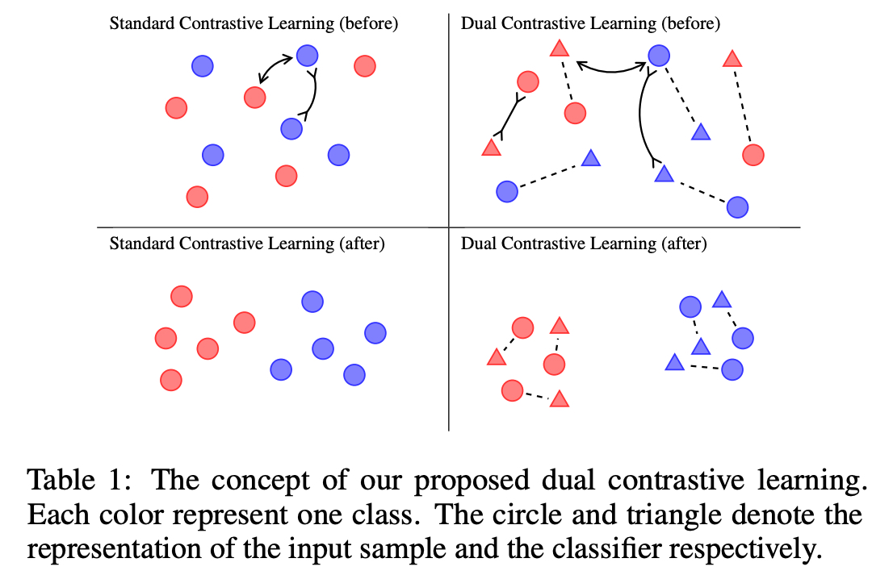

부족하겠지만 처음으로 논문을 읽고 번역해보려 함

영어실력의 부족으로 번역에 문제가 좀 있을 수 있으니 오역의 부분이 있다면 댓글을 달아주시면 좋을듯 함
  
- 1편 Dual Contrastive Learning Paper Review (1)
- 2편 [Dual Contrastive Learning Paper Review (2)]({{site.url}}/contrastivelearning/Dual_Contrastive_Learning-paper-reveiw-(2)/)
- 3편 [Dual Contrastive Learning Paper Review (3)]({{site.url}}/contrastivelearning/Dual_Contrastive_Learning-paper-reveiw-(3)/)
  
# Dual Contrastive Learning: Text Classification via Label-Aware Data Augmentation paper review

[Dual Contrastive Learning: Text Classification via Label-Aware Data Augmentation](https://arxiv.org/abs/2201.08702)

## 1. Abstract

Contrastive Learning 은 Unsupervised Setting 에서 Self-Supervision 을 통해 Representation Learning 에서 두드러진
성공을 달성했음

그러나, 효과적으로 Supervised Learning Task 들에 Contrastive Learning 을 적용하는 것은 현실에서 challenge 로 남아있음

이 논문에서, 우리는 Input Sample 의 Feature 와 Classifier 의 Parameter 를 같은 공간에서 동시에 학습하는
Dual Contrastive Learning (DualCL) 프레임워크를 소개함

명확하게, DualCL 은 Classifier 의 Parameter 들을 다른 레이블과 연관된 Augmented Sample 로 간주한 다음에 
Input Sample 과 Augmented Sample 간의 Contrastive Learning 을 사용함

5개의 Text Classification 벤치마크 데이터셋과 Low-Resource 버전에 대한 경험적 연구는 Classification Accuracy 의
향상을 입증하고 DualCL 의 Discriminative Representation 학습 능력을 확인함

## 2. Introduction

Representation Learning 은 현대 딥러닝의 핵심임

Unsupervised Learning 의 맥락에서, Contrastive Learning[Hadsell et al., 2006] 은 최근에 Down-Stream Task 에 대한
일반적인 Representation 을 얻기 위한 효과적인 접근법으로 입증되었음[He et al., 2020; Chen et al., 2020]

간단히, Unsupervised Contrastive Learning 은 동일한 Example 의 다른 "관점" 의 Representation 이 유사해지도록
그리고 다른 Example 의 Representation 이 구별되도록 강제하는 Loss Function 을 채택함

최근에 Contrastive Learning 의 효과는 "Alignment(정렬)" 와 "uniformity(균일성)" 둘다를 동시에 달성한다는 측면에서 
옳다고 여겨짐(justify)

이러한 Contrastive Learning 접근법은 동일한 Class 의 Example 의 Representation 은 유사해지고 다른 Class 의 Example 의 
Representation 은 구별되도록 하는 유사한 Contrastive Loss 가 사용되어 
Supervised Representation Learning[Khosla et al., 2020] 에도 적용되었음 

그러나 입증된 성공에도 불구하고, 이러한 접근법은 Unsupervised Contrastive Learning 과 비교하여 훨씬 원칙적이지 않다고
보임

예를 들어, Representation 의 Uniformity(균일성)은 더이상 타당하지 않고; 필요하지도 않음

사실, 우리는 Standard Supervised Contrastive Learning 접근법은 Supervised Representation Learning 을 위해 자연스럽지
않다고 주장함

이는 적어도 이 접근법의 결과가 Classifier 를 직접 제공하지 않고 Classification Task 를 해결하기 위해 또 다른 
Classification 알고리즘을 개발해야 한다는 사실로 나타남

이 논문은 Supervised Setting 에서 Contrastive Learning 에 대한 보다 자연스러운 접근법을 개발하는 것을 목표로 함

우리 개발의 핵심 인사이트는 Supervised Representation Learning 은 두가지 종류의 양(Quantities) 학습을 포함해야 한다는 것임

1. Classification Task 를 위해 충분히 구별이 가능한 적절한 Space 에서의 Input $x$ 의 Feature $z$ 
2. 1에서의 Space 에 대한 Classifier 또는 그 Space 에 작용하는 Classifier 의 Parameter $\theta$

우리는 이 Classifier 를 Example $x$ 에 대한 "one-example" Classifier 로 부를 것임

이러한 관점에서, 각각의 Example $x$ 의 두가지 양(Quantities), 즉 적절한 Feature Space 차원 $d$ 에 대한 벡터
$z \in \mathbb{R}^d$ 과 $x$ 에 대한 Linear Classifier 를 정의하는 행렬 $\theta \in \mathbb{R}^{d \times K}
(K 개의 Class 를 가지는 Classification 문제라고 가정하였을 때) 에 연관되는 것은 당연함

Supervised Setting 에서 Representation Learning 문제는 Input Example $x$ 에 대한 쌍(pair) $(z, \theta)$ 를 생성하기 위한
학습으로서 여겨질 수 있음

Classifier $\theta$ 가 Feature $z$ 에 유효하려면, $\theta^Tz$ 의 softmax 변환을 표준 Cross-Entropy Loss 을 사용한
$x$ 의 label 에 맞추기만 하면 됨

또한, Contrastive Learning 접근법은 Example 통해 나온 $(z, \theta)$ Representation 들에 제약을 강제하기 위해 
사용될 수 있음

구체적으로, $\theta^*$ 가 $x$ 의 Ground-Truth Label 에 해당하는 $\theta$ 의 열(column)을 나타내면, 우리는 두가지
Contrastive Loss 를 설계할 수 있음

첫번째 Loss 는 $(z, \theta^\*)$ 와 많은 $(z^\prime, \theta^\*)$ 들을 대조시킴

여기서 $z^\prime$ 는 $x$ 로 다른 Label 을 가지는 Example 의 Feature 임

두번째 Loss 는 $(z, \theta^\*)$ 와 많은 $(z, \theta^{\prime\*})$ 들을 대조시킴

여기서 $\theta^\prime$ 는 다른 Class 로부터의 Example 와 연관된 Classifier 임

우리는 이러한 Learning Framework 를 Dual Contrastive Learning (DualCL) 로서 부름

우리가 개념적인 인사이트에 기반한 Dual Contrastive Learning 을 제안하지만, 
우리는 이러한 학습 체계(scheme)를 고유한 데이터 증강(Data Augmentation) 접근법을 활용하는 것으로 해석할 수 있다고 주장함

특히, 각각의 Example $x$ 에 대해, 그것의 $\theta$ 의 각각의 열(column) 은 "Label-Aware Input Representation" 또는
Label 정보가 불어넣어진 Feature Space 에서 $x$ 의 증강된 관점(Augmented View) 로 간주될 수 있음

Table 1 의 그림은 이 접근법의 이점을 보여주는데, 왼쪽의 두 그림으로 부터 Standard Contrastive Learning 은 Label 정보를
활용할 수 없음을 알 수 있음

반대로, 오른쪽의 두 그림에서 DualCL 은 효과적으로 그들의 Class 에서 Input Sample 을 분류하기 위해 Label 정보를 이용함

실험에서, 우리는 5개의 벤치마크 텍스트 분류 데이터셋에서 DualCL 의 효과를 검증함

Dual Contrastive Loss 를 사용하여 사전 훈련된 언어 모델(BERT 및 RoBERTa)을 파인튜닝 함으로써, DualCL 은
Contrastive Learning 을 사용한 기존의 Supervised Baseline 들과 비교하여 가장 좋은 성능을 달성함

우리는 또한 DualCL 이 특히 Low-Resource Scenario 에서 분류 정확도를 향상시킨다는 것을 발견함

또한, 우리는 학습된 Representation 과 Attention Map 을 시각화하여 DualCL 에 대한 몇가지 설명을 제공함

### Contribution

1. Supervised Setting 에 자연스럽게 Contrastive Loss 를 적용하기 위한 Dual Contrastive Learning (DualCL) 을 제안함
2. DualCL 의 훈련을 위한 Input Sample 의 여러 관점을 얻기 위해 Label-Aware Data Augmentation 을 소개함
3. 5개의 벤치마크 텍스트 분류 데이터셋에서 DualCL Framework 의 효과를 경험적으로 검증함

## 이 다음 부분은 다음편에서 작성하도록 하겠음

