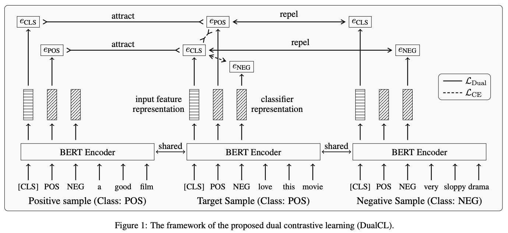

부족하겠지만 처음으로 논문을 읽고 번역해보려 함

영어실력의 부족으로 번역에 문제가 좀 있을 수 있으니 오역의 부분이 있다면 댓글을 달아주시면 좋을듯 함
  
- 1편 [Dual Contrastive Learning Paper Review (1)]({{site.url}}/contrastivelearning/Dual_Contrastive_Learning-paper-reveiw-(1)/)
- 2편 Dual Contrastive Learning Paper Review (2)
- 3편 [Dual Contrastive Learning Paper Review (3)]({{site.url}}/contrastivelearning/Dual_Contrastive_Learning-paper-reveiw-(3)/)
  
# Dual Contrastive Learning: Text Classification via Label-Aware Data Augmentation paper review

[Dual Contrastive Learning: Text Classification via Label-Aware Data Augmentation](https://arxiv.org/abs/2201.08702)

## 2. Preliminaries

K 개의 Class 가 있는 텍스트 분류 작업을 고려하자

우리는 주어진 데이터셋 $\lbrace x_i, y_i \rbrace^N_{i=1}$ 에 $N$ 개의 Training Sample 이 포함되어 있다고 가정함

여기서 $x_i \in \mathbb{R}^L$ 은 $L$ 개의 단어로 이루어진 Input Sentence 이고 $y_i \in \lbrace 1, 2, \cdots, K \rbrace$
는 Input 에 할당된 Label 임

이 연구 전반에 걸쳐, 우리는 $I = \lbrace 1, 2, \cdots, N \rbrace$ 에 의해 Training Sample 의 인덱스(Index) 집합과
$K = \lbrace 1, 2, \cdots, K \rbrace$ 에 의해 Label 의 인덱스(Index) 집합을 나타냄

우리의 방법을 소개하기 전에, 우리는 많은 연구에서 효과가 널리 확인된 Self-Supervised Contrastive Learning 연구들을
살펴봄

$N$ 개의 Training Sample $\lbrace x_i \rbrace^N_{i=1}$ 이 많은 Augmented Sample 과 함께 주어지면, 
여기서 각각의 Sample 은 데이터셋에 적어도 하나의 Augmented Sample 을 가짐

$j(i)$ 가 $i$ 번째 Sample 에서 파생된 Augmented Sample 의 인덱스(Index) 라고 하면, Standard Contrastive Loss 는
다음과 같이 정의됨

$$ \mathcal{L}_{self} = \frac{1}{N} \sum_{i \in I} - \log \frac{\exp(z_i \cdot z_{j(i)} / \tau)}{\sum_{a \in A_i} \exp (z_i \cdot z_a / \tau)} \quad (1)$$

여기서, $z_i$ 는 $x_i$ 의 Normalized Representation 이고 $A_i := I \backslash \lbrace i \rbrace$ 는 Contrastive Sample 의
인덱스(Index) 집합이고 $\cdot$ 은 내적(Dot Product)를 나타내고 $\tau \in \mathbb{R}^+$ 은 Temperature Factor 를 나타냄

여기서, 우리는 $i$ 번째 Sample 을 "Anchor" 로 정의하고, $j(i)$ 번째 Sample 은 "Positive" Sample 이고 나머지 $N - 2$ 
Sample 은 $i$ 번째 Sample 의 "Negative" Sample 임

그러나, Self-Supervised Contrastive Learning 은 Supervised 신호(Signal)를 활용할 수 없음

이전 연구 [Khosla et al., 2020] 는 간단한 방식으로 Contrastive Learning 에 Supervision 을 통합함

이 방식은 단순히 동일한 Class 로부터 Positive Sample 을 가져오고 다른 Class 로부터 Negative Sample 을 가져옴

다음과 같은 Contrastive Loss 는 Supervised Task 를 위해 정의됨

$$ \mathcal{L}_{sup} = \frac{1}{N} \sum_{i \in I} \frac{1}{\vert P_i \vert} \sum_{p \in P_i} - \log \frac{\exp(z_i \cdot z_p / \tau)}{\sum_{a \in A_i} \exp(z_i \cdot z_a / \tau)} \quad (2)$$

여기서, $P_i := \lbrace p \in A_i : y_p = y_i \rbrace$ 는 Positive Sample 의 인덱스(Index) 의 집합이고 
$\vert P_i \vert$ 는 $P_i$ 의 원소의 개수임

이 접근법이 우수성을 보여주었지만, 우리는 여전히 Contrastive loss 부분과는 별개로 Cross-Entropy Loss 를 사용하여
Linear Classifier 를 학습시킬 필요가 있음

이것은 Contrastive Loss 는 Input Example 에 대한 일반적인 Representation 만 학습할 수 있기 때문임

따라서, 우리는 지금까지 개발된 Supervised Contrastive Learning 이 Classification 문제에 대해 Unsupervised Contrastive
Learning 의 순진한(Naive) 적용으로 보인다고 주장함

Supervised Setting 에서 Contrastive Learning 을 위한 좀 더 멋진 접근법을 기대할 수 있음

다음 편에서 

## 3. Dual Contrastive Learning

이 논문에서, 우리는 "dual" Representation 을 학습하는 Supervised Contrastive Learning 접근법을 제안함

첫번째는 적절한 Space 에서 Classification Task 를 위한 차별적인 Feature 의 Input Representation 이고,
두번째는 Classifier 또는 적절한 Space 에서 Classifier 의 매개변수(Parameter) 임

$z_i \in \mathbb{R}^d$ 를 Input Example $x_i$ 의 Feature 로 하고 $\theta_i \in \mathbb{R}^{d \times K}$ 은
$x_i$ 와 관련된 Classifier 로 하자

우리의 목표는 제안된 접근법을 사용하여 $\theta^T_i z_i$ 의 softmax 변환을 $x_i$ 의 Label 과 일치시키기 위해 
$z_i$ 의 (Normalized) Representation 과 $\theta_i$ 를 학습하는 것임

### 3.1 Label-Aware Data Augmentation

Training Sample 의 다른 관점(View)을 얻기 위해, 우리는 Feature $z_i$ 와 Classifier $\theta_i$ 의 Representation 을 
얻기 위해 Data Augmentation 의 아이디어를 활용함

우리는 $\theta_i$ 의 $k$ 번째 열(column)을 $\theta^k_i$ 로 표기되는 Label $k$ 와 관계된 Input Example $x_i$ 의
고유한 관점(View)으로 간주함

우리는 $\theta^k_i$ 를 Label $k$ 의 정보가 주입된 $x_i$ 의 Augmented 관점(View)이기 때문에 Label-Aware Input 
Representaion 으로 부름

여기서, 우리는 Label-Aware Data Augmentation 을 소개함

우리는 실제로 추가적인 Sample 도입하지 않지만, 한번의 Feed-Forward 절차만으로 $K + 1$ 개의 관점(View)을 얻음

특히, 우리는 1개의 Feature Representation 과 $K$ 개의 Label-Aware Input Representation 을 학습하기 위해 사전 훈련된
Encoder 를 사용함

여기서, $K$ 는 Class 의 수임

사전 훈련된 언어 모델(PLMs) 는 Natural Language Representation 을 추출하는데 놀라운 성능을 보여줌

따라서, 우리는 사전 훈련된 Encoder 로 PLM 을 채택함

사전 훈련된 Encoder(예: BERT, RoBERTa)를 $f$ 로 하자

우리는 Input Sentence 와 모든 가능한 Label 들을 Encoder $f$ 에 입력으로 넣고 각각의 Label 을 하나의 토큰(Token)으로
간주함

구체적으로, 우리는 모든 Label $\lbrace 1, \cdots, K \rbrace$ 를 나열하고 Input Sentence $x_i$ 앞에 삽입함

이 과정은 새로운 Sequence $r_i \in \mathbb{R}^{L + K}$ 를 형성함

그런 다음 Encoder $f$ 는 이 Sequence 에서 각 토큰(Token)의 Feature 를 추출하기 위해 사용함

우리는 각 Input Sentence 의 Representation 으로서 [CLS] 토큰의 Feature 를 취하고 Label-Aware Representation 으로
각각의 Label 에 대응하는 토큰의 Feature 을 취함

우리는 $z_i$ 로 Input $x_i$ 의 Feature Representation 을 나타내고 $\theta^k_i$ 로 Label $k$ 의 Label-Aware Input
Representation 을 나타냄

실제로, 우리는 Sequence $r_i$ 를 만들기 위해 "Positive", "Negative" 등과 같은 Label 의 이름을 토큰(Token)으로 취함

여러 단어를 포함하는 Label 에 경우, 우리는 Label-Aware Input Representation 을 얻기 위해 Token Feature 의 Mean-Pooling
을 취함

### 3.2 Dual Contrastive Loss

Input Example $x_i$ 에 대한 Feature Representation $z_i$ 와 Classifier $\theta_i$ 를 이용하여, 우리는
$\theta^T_i z_i$ 의 Softmax 변환과 $x_i$ 의 Label 을 맞추려고 시도함

$\theta^*_i$ 는 $x_i$ 의 Ground-Truth Label 에 대응하는 $\theta_i$ 의 열(Column) 을 나타내도록 하자

우리는 내적 ${\theta^*_i}^T z_i$ 이 최대가 되길 기대함

따라서, 우리는 Supervised 신호(Signal)를 가지고 $\theta_i$ 와 $z_i$ 의 더 나은 Representation 을 학습하기 위해 전환함

여기서 우리는 서로 다른 Training Sample 사이의 관계를 활용하기 위해 Dual Contrastive Loss 를 정의하는데,
이는 만약 $x_j$ 가 $x_i$ 와 동일한 Label 을 가지면 ${\theta^\*_i}^T z_j$ 를 최대화하려고 시도하고,
만약 $x_j$ 가 $x_i$ 와 다른 Label 을 가지면 ${\theta^\*_i}^T z_j$ 를 최소화하려고 시도함

Input Example $x_i$ 로부터 나온 Anchor $z_i$ 가 주어지면, 우리는 Positive Sample 로 
$\lbrace \theta_j^\* \rbrace_{j \in P_i}$ 을 취하고 
Negative Sample 로 $\lbrace \theta_j^\* \rbrace_{j \in A_i \backslash P_i}$ 를 취하고
다음과 같은 Contrastive Loss 를 정의함

$$ \mathcal{L}_z = \frac{1}{N} \sum_{i \in I} \frac{1}{\vert P_i \vert} \sum_{p \in P_i} - \log \frac{\exp(\theta_p^* \cdot z_i / \tau)}{\sum_{a \in A_i} \exp(\theta_a^* \cdot z_i / \tau)} \quad (3)$$

여기서, $\tau \in \mathbb{R}^+$ 은 Temperature Factor 이고 $A_i := I \backslash \lbrace i \rbrace$ 는 Contrastive Sample
의 인덱스(Index) 의 집합이고 $P_i := \lbrace p \in A_i : y_p = y_i \rbrace$ 는 Positive Sample 의 인덱스(Index)의 집합
이고 $\vert P_i \vert$ 는 $P_i$ 의 원소의 개수임

유사하게, Anchor $\theta_i^*$ 가 주어지면, 우리는 Positive Sample 로 $\lbrace z_j \rbrace_{j \in P_i$ 를 취하고
Negative Sample 로 $\lbrace z_j \rbrace_{j \in A_i \backslash P_i}$ 를 취하고 또 다른 Contrastive Loss 를 정의함

$$ \mathcal{L}_{\theta} = \frac{1}{N} \sum_{i \in I} \frac{1}{\vert P_i \vert} \sum_{p \in P_i} - \log \frac{\exp(\theta_i^* \cdot z_p / \tau)}{\sum_{a \in A_i} \exp(\theta_i^* \cdot z_a / \tau)} \quad (4)$$

Dual Contrastive Loss 는 위의 두개의 Contrastive Loss Term 의 결합임

$$ \mathcal{L}_{Dual} = \mathcal{L}_z + \mathcal{L}_{\theta} \quad (5) $$

### 3.3 Joint Training & Prediction

Supervised 신호(Signal)을 완전히 활용하기 위해, 우리는 또한 $\theta_i$ 는 $z_i$ 를 위한 좋은 Classifier 임을 기대함

그래서 우리는 각각의 Input Example $x_i$ 에 대한 ${\theta_i^*}^T z_i$ 를 최대화하기 위해 Cross-Entropy Loss 의
수정된 버전을 사용함

$$ \mathcal{L}_{CE} = \frac{1}{N} \sum_{i \in I} - \log \frac{\exp(\theta_i^* \cdot z_i)}{\sum_{k \in K} \exp(\theta_i^k \cdot z_i)} \quad (6) $$

마지막으로, 우리는 Encoder $f$ 를 학습하기 위해 두개의 Training Objective 를 최소화 함

두개의 Objective 는 Feature 의 Representation 과 Classifier 의 질(Quality)을 동시에 향상시킴

전체 Loss 는 다음과 같아야 함

$$ \mathcal{L}_{overall} = \mathcal{L}_{CE} + \lambda \mathcal{L}_{Dual} \quad (7) $$

여기서 $\lambda$ 는 Dual Contrastive Loss Term 의 영향을 조절하는 하이퍼파라미터임

Classification 에서 우리는 Input Sentence $x_i$ 에 대한 Feature Representation $z_i$ 와 Classifier $\theta_i$ 를
생성하기 위해 학습된 Encoder $f$ 를 사용함

여기서 $\theta_i$ 는 Example $x_i$ 을 위한 "One-Example" Classifier 로서 보여질 수 있음

우리는 $\theta_i^T z_i$ 의 Argmax 결과를 모델의 예측으로 간주함

$$ \hat{y}_i = \arg \max_k (\theta_i^K \cdot z_i) \quad (8) $$

그림 1 은 Dual Contrastive Learning 의 Framework 를 보여줌

여기서, $e_{CLS}$ 는 Feature Representation, $e_{POS}$ 와 $e_{NEG}$ 는 Classifier Representation 임

이 구체적인 Example 에서, 우리는 "Positive" Class 를 가진 Target Sample 이 Anchor 역할을 한다고 가정하고
동일한 Class Label 을 가지는 Positive Sample 과 다른 Class Label 을 가지는 Negative Sample 이 있음

Dual Contrastive Loss 는 동시에 Positive Sample 들 사이의 Classifier Representation 들과 Feature Representation 들을
끌어당기고 Negative Sample 들 사이의 Classifier 와 Feature Representation 들을 멀리보냄

### 3.4 The Duality between Representations

Contrastive Loss 는 Representation 들 사이의 유사도의 측정으로 내적(Dot Product) Function 을 채택함

이것은 DualCL 에서 Feature Representation $z$ 와 Classifier Representation $\theta$ 사이의 이중 관계(Dual Relationship)
를 가져옴

유사한 현상은 Input Feature 와 Linear Classifier 에서 Parameter 사이의 관계에서도 나타남

그런 다음, 우리는 사전 훈련된 Encoder $f$ 가 각각의 Input Sample 에 대한 Linear Classifier 를 생성할 수 있도록
$\theta$ 를 Linear Classifier 의 Parameter 로서 간주할 수 있음

따라서 DualCL 은 Classification Task 를 수행하기 위해 각각의 Input Sample 에 대한 Linear Classifier 를 생성하는 방법을
자연스럽게 학습함

### 3.5 Theoretical Justification of DualCL

Dual Contrastive Learning 의 이론적인 정당성은 하위 섹션에서 제공됨

$\mathcal{X} = \lbrace x_i \rbrace_{i=1}^N$ 과 $\mathcal{Y} = \lbrace y_i \rbrace_{i=1}^N$ 은 N 개의 
Training Sample 들의 Input 과 Label 이라 하자

다음 정리는 Dual Contrastive Learning 에 적용됨

**정리(Theorem).** 

모든 $i \in I$ 와 $\frac{p(y_j \vert x_i)}{p(y_j)} \propto \phi(x_i, y_j)$ 에 적용되는 
$p(x_i, y_i) \ge \epsilon$ 을 만족하는 상수 $\epsilon$ 이 존재함

$$ MI(\mathcal{X}, \mathcal{Y}) \ge \log N - \epsilon \mathcal{L}_{Dual} \quad (9) $$

여기서 $\phi$ 는 다른 정의를 가질 수 있는 대칭 함수(Symmetric Function) 임

우리의 경우, $\phi(x_i, y_i) = (\exp(\theta_i^* \cdot z_j) + \exp(\theta_j^* \cdot z_i)) / 2$.

Dual Contrastive Loss 를 최소화하는 것은 Input 과 Label 사이의 상호 정보(Mutual Information)를 
최대화하는 것과 동등하다는 것을 알 수 있음

상세한 증명(Proof) 는 Appendix 를 보길 바람

#### Appendix

**증명(Proof).**

$\phi(x_i, y_j) = (\psi(x_i, y_j) + \psi(x_j, y_i)) / 2$ 이고 $M_i = \sum_{j=1}^N \frac{p(y_j \vert x_i)}{p(y_j)} 라고
하자

여기서, $\psi(x_i, y_j) = \exp(\theta_i^* \cdot z_j)$ 임

우리는 $\vert P_i \vert$ 가 충분히 클때, $\frac{1}{\vert P_i \vert} \sum_{p \in P_i} \phi(x_i, y_p) = \phi(x_i, y_i)$ 
라는 것을 가정함

$$ 
\begin{align}
MI(\mathcal{X}, \mathcal{Y}) & = \frac{1}{N} \sum_{i=1}^N \sum_{j=1}^N p(x_i, y_j) \log \left( \frac{p(y_j \vert x_i)}{p(y_j)} \right) \\
& = \frac{1}{N} \sum_{i=1}^N \sum_{j=1}^N p(x_i, y_j) \log \left ( \log \frac{p(y_j \vert x_i)}{p(y_j)M_i} + \log M_i \right ) \\
& = \frac{1}{N} p(x_i, y_j) \log \frac{\phi(x_i, y_i)}{\sum_{t=1}^N \phi(x_i, y_t)} \\
&    + \frac{1}{N} \sum_{j \neq i} p(x_i, y_j) \log \frac{\phi(x_i, y_j)}{\sum_{t=1}^N \phi(x_i, y_t)} + \log N \\
& \ge \log N + \frac{\epsilon}{N} \sum_{i=1}^N \log \frac{\phi(x_i, y_i)}{\sum_{t=1}^N \phi(x_i, y_t)} \\
& = \log N + \frac{\epsilon}{N} \sum_{i=1}^N \frac{1}{\vert P_i \vert} \sum_{p \in P_i} \log \frac{\phi(x_i, y_p)}{\sum_{t=1}^N \phi(x_i, y_t)} \\
& \ge \log N + \frac{\epsilon}{N} \sum_{i=1}^N \frac{1}{\vert P_i \vert} \sum_{p \in P_i} \log \frac{\psi(x_i, y_p)}{\sum_{t=1}^N \psi(x_i, y_t)} \\
&    + \frac{\epsilon}{N} \sum_{i=1}^N \frac{1}{\vert P_i \vert} \sum_{p \in P_i} \log \frac{\psi(x_i, y_p)}{\sum_{t=1}^N \psi(x_t, y_i)} \\
& = \log N - \epsilon \mathcal{L}_{Dual}
\end{align}
$$

이것은 Negative Dual Contrastive Loss 는 상호 정보(Mutual Information) $MI(\mathcal{X}, \mathcal{Y})$ 의 Lower Bound 
임을 증명함

따라서, 우리가 Dual Contrastive Loss 를 최소화 할 때, Input 과 Label 사이의 상호 정보(Mutual Information) 따라서 
최대화 됨

## 이 다음 부분은 다음편에서 작성하도록 하겠음

