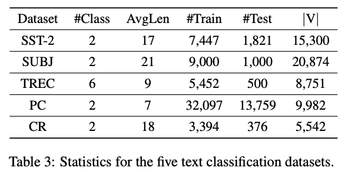
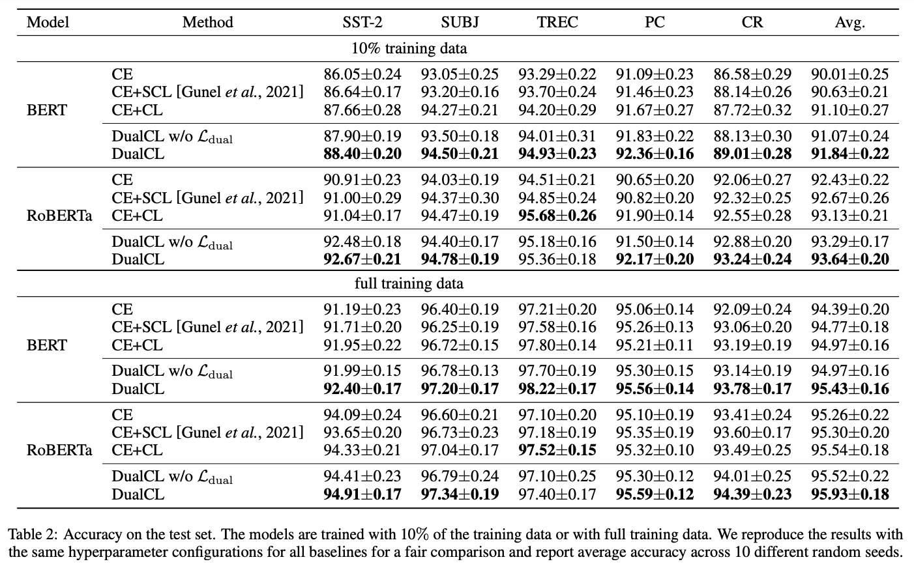
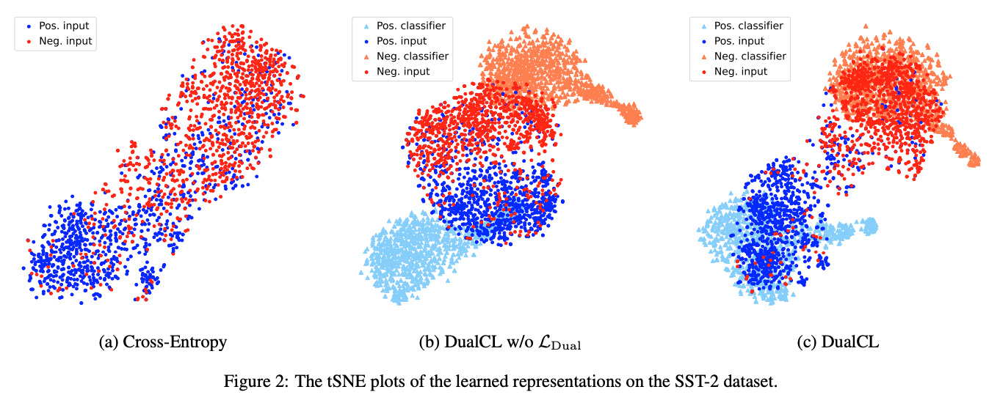
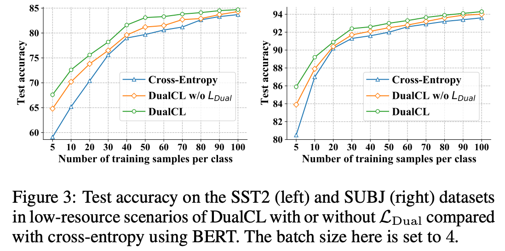
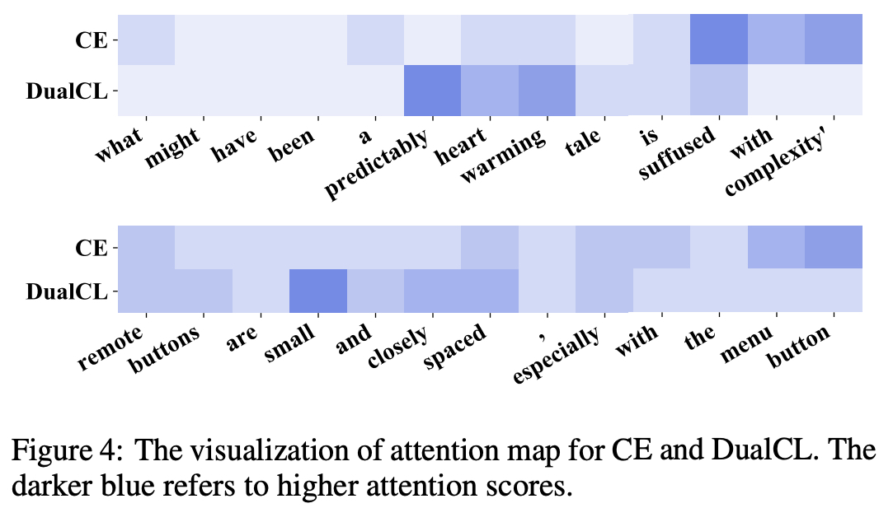

부족하겠지만 처음으로 논문을 읽고 번역해보려 함

영어실력의 부족으로 번역에 문제가 좀 있을 수 있으니 오역의 부분이 있다면 댓글을 달아주시면 좋을듯 함
  
- 1편 [Dual Contrastive Learning Paper Review (1)]({{site.url}}/contrastivelearning/Dual_Contrastive_Learning-paper-reveiw-(1)/)
- 2편 [Dual Contrastive Learning Paper Review (2)]({{site.url}}/contrastivelearning/Dual_Contrastive_Learning-paper-reveiw-(2)/)
- 3편 Dual Contrastive Learning Paper Review (3)
  
# Dual Contrastive Learning: Text Classification via Label-Aware Data Augmentation paper review

[Dual Contrastive Learning: Text Classification via Label-Aware Data Augmentation](https://arxiv.org/abs/2201.08702)

## 4. Experiments

### 4.1 Datasets

우리는 다음의 다섯 가지 벤치마크 텍스트 분류 데이터셋에 대한 실험을 수행함

SST-2 [Socher et al., 2013] 는 영화 리뷰의 감성분석 데이터셋임

SUBJ [Pang and Lee, 2004] 는 주관적 또는 객관적으로 레이블링 된 문장을 가진 리뷰 데이터셋임

TREC [Li and Roth, 2002] 은 설명(Description), 개체(Entity), 약어(Abbreviation), 사람(Human), 위치(Location) 및
숫자(Numeric) 을 포함하여 6가지 다른 도메인의 질문이 포함되어 있음

PC [Ganapathibhotla and Liu, 2008] 는 찬성(Pros) and 반대(Cons) 데이터를 포함하는 이진 감성 분류 데이터셋임

CR [Ding et al., 2008] 은 각각의 Sample 이 긍정 또는 부정으로 레이블링 된 고객 리뷰 데이터셋임

표 3 은 데이터셋의 통계가 요약되어 있음

### 4.2 Implementation Details

BERT 계열 사전 훈련된 언어 모델에 입력 형식을 적용하기 위해, 각 Input Sentence 에 대해 모든 Label 의 이름을
Token Sequence 로 나열해 Input Sentence 앞에 추가하고 Special Token [SEP] 로 이 둘을 구분함

우리는 또한 Input Sequence 앞에 Special Token [CLS] 을 추가하고 Input Sequence 의 끝에 [SEP] Token 을 추가함

BERT 와 RoBERTa 모두 Position Embedding 을 사용하여 Input Sequence 에서 Token 의 순서를 사용하므로 Class Label 이
고정된 순서로 나열되면 위치 임베딩과 연결됨

Label 순서의 영향을 줄이기 위해, Training Phase 에서 Input Sequence 를 형성하기 전에 Label 순서를 무작위로 변경함

Test Phase 중에는 Label 순서는 변경되지 않음

우리는 사전 훈련된 BERT-base-uncased 와 RoBERTa-base 모델 [Wolf et al., 2019] 을 파인튜닝 하기 위해
AdamW [Loshchilov and Hutter ,2018] Optimizer 를 사용하고 Weight Decay 로 0.01 을 사용함

우리는 30 Epoch 동안 모델을 학습하고 2e-5 에서 1e-5 까지 Linear Learning Rate Decay 를 사용함

Dropout Rate 는 모든 Layer 에 0.1 로 적용하고 Batch Size 는 모든 데이터셋에서 64 로 적용함

하이퍼파라미터를 위해 우리는 최적의 $\lambda$ 를 선택하기 위해 $\lbrace 0.01, 0.05, 0.1 \rbrace$ 에서 Grid Search
전략을 적용함

Temperature Factor $\tau$ 는 0.1로 선택함

우리의 PyTorch 구현은 [깃허브 코드](https://github.com/hiyouga/Dual-Contrastive-Learning) 로 올려놔서 이용가능함

### 4.3 Experimental Results

우리는 DualCL 을 3가지 Supervised Learning Baseline 들과 비교함

1. Cross-Entropy Loss (CE) 를 사용해 학습한 모델
2. Cross-Entropy Loss 와 Standard Supervised Contrastive Loss (CE+SCL) [Gunel Et al., 2021] 둘다 사용해 학습한 모델
3. Cross-Entropy Loss 와 Self-Supervised Contrastive Loss (CE+CL) [Gao et al., 2021] 둘다 사용해 학습한 모델

결과는 표 2에서 보여줌

결과로 부터, BERT 와 RoBERTa Encoder 모두 DualCL 은 RoBERTa 를 사용한 TREC 데이터셋을 제외하고 모든 Setting 에서 
최고의 분류 성능을 달성함

전체 Training Data 를 사용한 CE+CL 과 비교하여 DualCL 의 평균적인 성능 향상은 BERT 에서는 0.46% RoBERTa 에서는 0.39% 임

또한, 10% 의 Training Data 를 사용하면 DualCL 은 BERT 와 RoBERTa 에서 각각 0.74% 와 0.51% 만큼 더 높이 CE+CL 방법을
큰 차이로 능가하는 것을 발견함

반면, CE 와 CE+SCL 은 DualCL 의 성능을 능가할 수 없음

이는 CE 방법은 Sample 들간의 관계를 무시하고 CE+SCL 방법은 Classification Task 를 위한 Classifier 를 직접적으로 
학습할 수 없기 때문임

또한, Dual Contrastive Loss Term 은 모델이 5개의 데이터셋 모두에서 더 좋은 성능을 달성하는데 도움이 되는 것을 발견함

이는 Sample 간의 관계를 활용하는 것이 모델이 Contrastive Learning 에서 더 나은 Representation 을 학습하는 데 도움이 되는
것을 보여줌

### 4.4 Visualization

Dual Contrastive Learning 이 어떻게 Representation 의 질(Quality)을 향상시키는지 조사하기 위해, 우리는 SST-2 
테스트 셋에서 학습된 Representation 의 tSNE 그림을 그림

우리는 Encoder 로 RoBERTa 를 사용하고 Class 당 25개의 Sample 을 가지고 Encoder 를 파인튜닝함

우리는 그림 2 에서 $\mathcal{L}_{Dual}$ 이 없는 DualCL, CE 및 DualCL 의 결과를 보여줌

그림 2 에서 DualCL 은 Input Sample 과 각 Sample 과 연관된 Classifier 모두에 대한 Representation 을 학습한다는 것을
알 수 있음

그림 2 (b) 와 (c) 를 비교하면, Dual Contrastive Loss 는 Training Sample 사이의 관계를 활욤하고 모델에게 추가적인
제약을 부과함으로써 모델이 Input Feature 와 Classifier 에 대한 Representation 을 보다 차별적이고 강건하게 학습하는 데
도움이 되는 것을 발견함

### 4.5 Effects in Low-Resource Scenarios

DualCL 에서는 Input Sample 의 다른 관점(View) 으로 Label-Aware Input Representation 을 사용함

따라서 우리는 Label-Aware Data Augmentation 이 Low-Resource 시나리오에 도움이 될 것이라고 추측함

이를 검증하기 위해, 우리는 Low-Resource 시나리오에서 SST-2 와 SUBJ 데이터셋을 가지고 실험을 수행함

우리는 Class 당 N 개의 Training Sample 을 사용하여 모델 성능을 평가함

여기서, $N \in \lbrace 5, 10, 20, 30, 40, 50, 60, 70, 80, 90, 100 \rbrace$.

우리는 그림 3 에 CE, $\mathcal{L}_{Dual}$ 이 없는 DualCL, DualCL 로 학습된 BERT 의 결과를 그림

그림 3 에서 DualCL 은 감소된 데이터셋에서 CE 방법을 크게 능가함을 볼 수 있음

구체적으로, Class 당 Training Sample 이 5개 뿐인 경우에 SST2 데이터셋에서 최대 8.5% 그리고 SUBJ 에서 5.4% 의 향상이
있음

심지어 DualCL 이 없더라도 Label-Aware Data Augmentation 은 감소된 데이터셋에서 모델의 성능을 꾸준히 향상시킬 수 있음

### 4.6 Case Study

DualCL 이 Informative Feature 를 사로잡을 수 있는지 검증하기 위해, [CLS] Token 의 Feature 와 Sentence 에서 각각의
Word 의 Feature 사이의 Attention Score 를 계산함

우리는 먼저 전체 Training Set 에서 RoBERTa Encoder 를 파인튜닝 함

그런 다음 Feature 사이의 $l_2$ Distance 를 계산하고 그림 4 에서 Feature 사이의 Attention Map 을 시각화 함

감성을 분류할 때, 포착한 Feature 는 다르다는 것을 보여줌

위의 예는 SST-2 데이터 셋에서 나온 것으로, 우리는 DualCL 이 "Positive" 감성을 표현하는 문장에 대해 
"predictably heart warming" 에 많이 주의를 기울이는 것을 볼 수 있음

아래의 예는 CR 데이터 셋에서 나온 것으로, 우리는 DualCL 이 "Negative" 감성을 표현하는 문장에 대해 "small" 에
많이 주의를 기울이는 것을 볼 수 있음

반대로, CE 방법은 이러한 차별적인 Feature 에 집중하지 못함

이 결과는 DualCL 이 Sentence 에서 성공적으로 Informative Keyword 에 주의를 기울일 수 있음을 시사함

## 5. Related Work

### 5.1 Text Classification

Text Classification 은 Text 를 감성분석, 질문 답변 등을 포함한 그룸들로 Categorizing 하는 전형적인 Task 임

Text 의 구조화되지 않은 특성(Unstructured Nature)으로 인해, Text 에서 유용한 정보를 추출하는 것은 매우 시간이 많이
걸리고 비효율적일 수 있음

딥러닝의 급속한 발전으로, RNN [Hochreiter and Schmidhuber, 1997; Chung et al., 2014] 과 
CNN [Kim, 2014; Zhang et al., 2015] 과 같은 신경망 방법들은 Text Sequence 를 효율적으로 Encoding 하기 위해 광범위하게
연구되었음

그러나 RNN 과 CNN 의 능력은 Computational Bottleneck 과 Long-Term Dependencies 의 문제로 인해 제한됨

최근에, Transformer [Vaswani et al., 2017] 를 기반으로 한 거대한 사전 학습된 언어 모델 (PLMs) 이 Text Modeling 의
기술로 떠오르고 있음

이러한 Auto-Regressive 사전 학습 언어 모델들의 일부는 GPT [Radford et al., 2018] 과 XLNet [Yang et al., 2019] 를 포함함
그리고 Auto-Encoding 사전 학습 언어 모델들의 일부는 BERT [Devlin et al., 2019], RoBERTa [Liu et al., 2019] 그리고
ALBERT [Lan et al., 2019] 를 포함함

PLM 의 놀라운 성능은 주로 사전 학습에 사용되는 대규모의 말뭉치에 대한 광범위한 지식에서 비롯됨

### 5.2 Contrastive Learning

Supervised Learning 에서 Cross-Entropy 의 최적성(Optimality)에도 불구하고, 많은 연구들이 Cross-Entropy Loss 의 단점을
밝혀 냈음

Cross-Entropy Loss 의 단점 예
1. 노이즈가 많은 레이블(Noisy Label)에 취약함 [Zhang and Sabuncu, 2018]
2. 낮은 마진(Poor Margins) [Elsayed et al., 2018] 
3. 약한 적대적 견고성(Weak Adversarial Robustness) [Pang et al., 2019]

InfoNCE loss [Oord et al., 2018] 에서 영감을 받은 Contrastive Learning [Hadsell et al., 2006] 은 Downstream Task 에
대한 좋은 일반적인 Representation 을 학습하기 위해 Unsupervised Learning 에 널리 사용되었음

예를 들어, [He et al., 2020] 은 Input Example 을 Encoding 에 대한 Look-Up Dictionary 를 유지하기 위해 Momentum Encoder
를 활용함

[Chen et al., 2020] 은 Positive Sample 로 Data Augmentation 을 사용하여 Input Example 의 다양한 관점(View) 를 생성하고
데이터 셋에서 Negative Sample 과 비교함

[Gao et al., 2021] 은 유사하게 Positive Pair 를 생성하기 위해 각각의 Sentence 를 두번씩 Dropout 함

Supervised 시나리오에서, [Khosla et al., 2020] 은 동일한 Class 내에 Training Example 의 Representation 의 유사도를
최대화 하면서 다른 Class 간의 Representation 의 유사도를 최소화 하기 위해 Label 에 따라 Training Example 을 
클러스터링 함

[Gunel et al., 2021] 은 Supervised Contrastive Learning 을 사전 학습된 언어 모델을 가지고 자연어 도메인으로 확장함

[Lopez-Martin et al., 2022] 는 잘 설계된 Supervised Contrastive Loss 를 사용하여 Network Intrusion Detection Problem
을 연구함

## 6. Conclusion

본 연구에서, Text Classification Task 의 관점에서 우리는 Supervised Learning Task 를 해결하기 위한 Dual Contrastive
Learning 접근법인 DualCL 을 제안함

DualCL 에서 사전 학습된 언어 모델을 사용하여 두가지 Representation 을 동시에 학습함

하나는 Input Example 의 차별적인 Feature 이고 다른 하나는 Example 에 대한 Classifier 임

우리는 Feature 와 Classifier 를 포함한 Input Sample 의 다른 관점(View) 를 생성하기 위해 Label-Aware Data Augmentation
을 도입함

그런 다음 Classifier 가 Input Feature 에 대해 유효하도록 만들기 위한 Dual Contrastive Loss 를 설계함

Dual Contrastive Loss 는 더 나은 Representation 을 학습하기 위해 Training Sample 사이의 Supervised Signal 을 활용함

우리는 광범위한 실험을 통해 Dual Contrastive Learning 의 효과를 검증함

DualCL 은 5개의 벤치마크 텍스트 분류 데이터 셋에서 SOTA 를 성공적으로 달성함

우리는 또한 학습된 Representation 을 시각화함으로써 Dual Contrastive Learning 내부의 메커니즘(Mechanism)을 설명함

마지막으로, 우리는 DualCL 이 Low-Resource 데이터 셋에서 모델의 성능을 향상시킬 수 있음을 발견함

이미지 분류 그리고 그래프 분류와 같은 다른 Supervised Learning Task 에서 Dual Contrastive Learning 에 대한 추가 조사가
향후에 수행될 예정임

