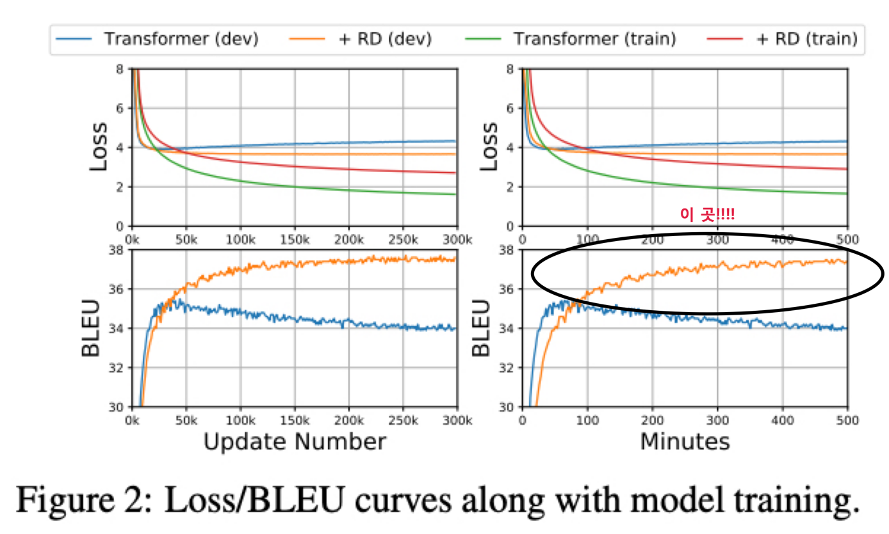

  
# R-Drop: Regularized Dropout for Neural Networks paper review

35th Conference on Neural Information Processing Systems (NeurIPS - 2021), Sydney, Australia

[R-Drop: Regularized Dropout for Neural Networks](https://arxiv.org/abs/2106.14448)

## 1. 저자가 뭘 해내고 싶어했는가?

Dropout 이 효과적이고 성능도 잘 나오지만, dropout 에 의해 나타나는 randomness 가 training 과 inference 사이의
무시할 수 없는 불일치의 원인이 되는 문제가 있음

이 논문에서 Dropout 을 정규화하기 위한 간단하고 일관성 있는 학습전략 R-Drop 을 소개함

이 방법은 dropout 에 의해 생성된 서로 다른 sub model 의 output distribution 이 서로 일치하도록 강요함

R-Drop 이 이 불일치를 줄이는 것을 이론적으로 증명하고 성능향상을 시킬 수 있음을 보여줌

## 2. 이 연구의 접근에서 중요한 요소는 무엇인가?

### Main Idea 

R-Drop 을 통해 Training 과 Inference 사이의 불일치를 줄일건데 어떻게 하는지를 적어보겠음

각각의 mini-batch 학습중에, 각각의 data sample 을 가지고 모델에 forward 를 2번 진행함

각각의 forward 과정은 랜덤하게 몇몇 hidden unit 이 dropout 적용됨으로써 서로 다른 sub model 을 통과함

동일한 모델이지만 Dropout 을 사용하면 학습중에는 forward 를 할 때마다 사용되는 hidden unit 이 다른 sub model 을 
통과한다고 생각할 수 있음

R-Drop 은 같은 data sample 에 대한 2개의 sub model 의 output distribution 이 만들어지면 2개의 output distribution 
사이의 양방향 Kluuback-Leibler (KL) divergence 를 최소화함으로써을 서로 일치하도록 강요함

즉, R-Drop 은 학습중에 각각의 data sample 에 대한 dropout 으로 부터 랜덤하게 샘플링된 2개의 sub model 의 output 을
정규화하는 것으로 볼 수 있음

이와 같은 방식으로 training 과 inference 사이의 불일치를 완화시킬 수 있음

전통적인 뉴럴넷 학습중에 dropout 전략을 적용하는 것과 비교하면 R-Drop 은 구조적인 변경없이 KL-divergence loss 만
더해줄 뿐임

수식으로 좀 보자면,

학습데이터 $D = {(x_i, y_i)}^n_{i=1}$ 가 주어지면, 딥러닝 모델을 위한 Main learning objective 는 
negative log-likelihood loss function 을 최소화하는 것임

$$ L_{nll} = \frac{1}{n} \sum^n_{i=1} - \log P^w(y_i \vert x_i) $$

구체적으로, 각각의 training step 에서 input data $x_i$ 가 주어지면, $x_i$ 를 모델에 입력으로 넣고 2번의 forward 과정을
거침

이 과정을 통해 모델의 예측 distribution $P^w_1(y_i \vert x_i)$ 와 $P^w_2(y_i \vert x_i)$ 를 얻게 됨

이 때, 위에서 설명했듯이 dropout 이 적용된 sub model 들로 인해 output distribution 이 생성되므로 2개의 output 
distribution 은 서로 다름

그런 다음 training step 에서, R-Drop 방법은 2개의 output distribution 사이의 양방향 KL-divergence 를 최소화함으로써
모델 예측에 정규화를 시도함

양방향 KL-divergence loss 는 이와 같음

$$ L^i_{KL} = \frac{1}{2}(D_{KL}(P^w_1(y_i \vert x_i) \parallel P^w_2(y_i \vert x_i)) + D_{KL}(P^w_2(y_i \vert x_i) \parallel P^w_1(y_i \vert x_i))) $$

Main learning objective 였던 NLL loss 는 2번의 forward 를 통해 나온 확률 분포에 대해 다음과 같이 구함

$$  L^i_{NLL} = -\log P^w_1(y_i \vert x_i) - \log P^w_2(y_i \vert x_i) $$

최종 training objective 는 data $(x_i, y_i)$ 에 대한 $L^i$ 를 최소화하는 것임

이때, $L^i$ 는 다음과 같음

$$ 
\begin{align}
L^i & = L^i_{NLL} + \alpha \cdot L^i_{KL} \\
& = -\log P^w_1(y_i \vert x_i) - \log P^w_2(y_i \vert x_i) + \frac{\alpha}{2}[D_{KL}(P^w_1(y_i \vert x_i) \parallel P^w_2(y_i \vert x_i)) + D_{KL}(P^w_2(y_i \vert x_i) \parallel P^w_1(y_i \vert x_i))] 
\end{align}
$$

$\alpha$ 는 $L^i_{KL}$ 를 통제하기 위한 가중치임

이와 같은 방식으로 R-Drop 은 dropout 을 넘어 model space 까지 정규화하고 model 의 일반화 성능을 향상시킴

### Theoretical Analysis

#### 본문내용

#### Appendix B

본문 내용과 Appendix 부분을 읽고 이해해보려 했으나 완벽한 이해를 못해서 적는것을 포기함

내욤 청부하니 설명 가능하신 분은 댓글이나 메일로 연락주시면 감사하겠습니다. 

이해가 쉽지가 않네요

### Main Contribution

- 다양한 종류의 deep 모델들을 훈련하는 데 보편적으로 적용될 수 있는 단순하지만 효과적인 정규화 방법인 R-Drop 을 제안함
- R-Drop 이 dropout 이 적용된 모델들의 training 과 inference 사이의 불일치를 줄일 수 있음을 이론적으로 보여줌
- 총 18개의 dataset 을 가지고 4개의 NLP, 1개의 CV task 실험을 통해, R-Drop 이 여러개의 SOTA 결과들을 포함한 아주 뛰어난 
성능을 보여줌

### Main Result

R-Drop 방법을 평가하고 보편적인 영향을 보여주기 위해 논문에서 5개의 다른 Task 실험을 수행함

#### 첫번째 task 는 Neural Machine Translation

low-resource 데이터셋인 IWSLT14 와 IWSLT17 에서는 original Transformer 모델과 R-Drop 을 추가한 Transformer 를 
비교했을 때 R-Drop 을 추가해 학습한 모델의 BLEU score 결과가 대략 2점정도 좋은걸 확인할 수 있음

rich-resource 데이터셋인 WMT14 에서는 단순히 Transformer 모델에 R-Drop 만을 추가한 방법이 BERT-fused NMT 와 같은 
SOTA 모델을 뛰어 넘음

#### 두번째 task 는 Language Understanding 임

여기서는 GLEU 데이터셋으로 평가를 진행했고 모델로 BERT-base 모델과 RoBERTa-large 모델을 R-Drop 을 적용한 모델로 사용했음

BERT-base 에서는 GLEU 벤치마크 평균 점수가 1.21점(클릭) 향상됐고 RoBERTa-large 에서는 평균 0.80점(클릭) 향상됐음

다른 모델구조를 가지고 사전학습 방법이 다른 XLNet 과 ELECTRA 와의 비교에서도 RoBERTa-large 모델에 R-Drop 을 적용한 
경우 대부분 조금씩 성능이 우월함을 볼 수 있음

#### 세번째 task 는 Abstractive Summarization 임

여기서는 데이터셋으로 CNN/Daily Mail 을 사용했고 모델로 BART 를 사용했음

성능은 ROUGE F1-score 로 측정했는데 RG-1 은 unigram, RG-2 는 bigram, RG-L 은 가장 긴 시퀀스의 Recall 을 구하는 방법임

더 자세한 내용은 [참고 링크](https://supkoon.tistory.com/26) 확인해보시길!

R-Drop 방법을 적용한 BART 모델이 ROUGE-1 과 ROUGE-2 에서는 SOTA를 달성했고 특히, 요약을 위해 설계된 새로운
self-supervised 패러다임을 가져온 PEGASUS 방법을 뛰어넘고 이전에 가장 잘하던 BART+R3F 모델도 뛰어넘었음

그렇지만 ROUGE-L 에서는 ProphetNet 과 0.06점 정도 차이를 보임

#### 네번째 task 는 Language Modeling 임

여기서는 데이터셋으로 Wikitext-103 을 사용했고 모델은 Basic Transformer decoder 와 좀 더 발전된 
Adaptive Input Transformer 를 사용했음

여기서 평가지표는 낮을수록 성능이 좋은 perplexity 임

Adaptive Input Transformer 의 경우 test set 에서 0.80 만큼(클릭) 성능을 향상시켰고 Basic Transformer decoder 의 
경우에는 1.68 만큼(클릭) 성능이 향상됨

baseline model 의 성능이 낮을 때 좀 더 성능 향상이 많이 되는것을 확인할 수 있음

#### 다섯번째 task 는 Image Classification 임

여기서는 데이터셋으로 CIFAR-100 과 ISLVRC-2012 ImageNet 을 사용했고 모델은 Vision Transformer(ViT) 를 사용했고 
평가지표는 Accuracy 임

CIFAR-100 에서는 R-Drop 적용한 경우에 ViT-Base 에서 0.65(클릭), Vit-Large 에서는 0.41점(클릭) 성능 향상되었고 
large-scale 의 ImageNet 데이터에서도 0.41(클릭), 0.42(클릭) 정도 성능이 향상됨

이렇게 4개의 NLP Task 와 Image Classification Task 를 통해서 R-Drop 이 효과적이고 보편적으로 적용이 가능함을 보여줬음

#### Regularization and Cost Analysis

논문에서 R-Drop 의 regularization 효과와 training cost 를 보여주기 위해 Transformer 모델을 사용했고 
IWSLT14 독일어에서 영어로의 번역 task 를 수행함

왼쪽 2개는 step 마다의 training/valid loss 와 BLEU 이고 오른쪽 2개는 1분마다의 loss 와 BLEU 임

Train 시 training loss 는 초록색이고 valid loss 는 파란색인데 Transformer 는 빠르게 over-fitting 되고 
train 과 loss 의 차이가 큼

반면에 R-Drop 을 적용하면 valid loss 는 주황색이고 R-Drop 을 적용하지 않았을 때의 valid loss 는 파란색인데 
R-Drop 적용시에 valid loss 가 더 낮은 것을 볼 수 있음

이것은 R-Drop 이 학습중에 regularization 을 잘 한다고 할 수 있음

학습 초기 에는 R-Drop 을 적용하지 않은 Transformer 의 BLEU 점수가 빠르게 향상되지만 곧 잘못된 local optima 에 수렴하게 됨

하지만 R-Drop 을 적용한 Transformer 는 점차적으로 BLEU 를 향상시키고 훨씬 우월한 성능을 보여줌

수렴하기 위해 더 많은 학습이 필요하지만 더 나은 optimum 을 찾음

R-Drop 은 매 step 마다 training cost 를 증가시키는데 이유는 input x 에 대한 forward 과정을 2번 하기 때문임

그래서 성능은 올라가지만 training cost 는 증가한다는 trade-off 가 있음

#### K-step R-Drop

R-Drop 이 성능을 향상시킬 수 있지만 수렴하기 까지 오래걸린다는 단점이 있는데 R-Drop 을 매 step 마다 적용하지 않고 
k 번째 step 마다 적용하도록 해서 진행한 결과임

k 는 1, 2, 5, 10 에 대해서 진행했고 결과는 k 가 커질수록 수렴속도는 빨라지지만 최적의 optima 를 찾는데 실패함

결국 수렴하기 까지 오래걸린다는 단점을 해결하진 못하고 R-Drop 은 매 step 마다 진행하는것이 가장 좋은 성능을 낸다는 
것을 볼 수 있음

#### Effect of Weight $\alpha$

NMT task 에 대해 alpha 를 1, 3, 5, 7, 10 5개의 값으로 실험을 수행함

표에서 보여주듯이 alpha 가 1 일때는 KL-divergence regularization 에 좀 더 집중하는 5일때보다 성능이 좋지 않음

하지만 너무 많은 regularization 인 alpha 가 10 인 경우도 또한 좋지 않음

최적의 alpha 값은 실험적으로 찾아낼 수 밖에 없을것 같고 각각의 task 의 data size 와 model size 에 따라 alpha 값은 
조정이 필요함

좀 더 자세한 내용은 논문 참고 해주세요.
