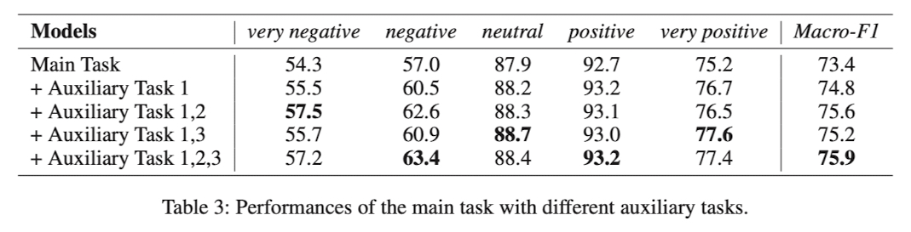

  
# Sentiment Classification in Customer Service Dialogue with Topic-Aware Multi-Task Learning paper review

AAAI Conference - 2020

[Sentiment Classification in Customer Service Dialogue with Topic-Aware Multi-Task Learning](https://ojs.aaai.org/index.php/AAAI/article/view/6454)

고객과 상담사의 대화에서 발화의 감성을 분석하기 위해 제안한 Topic-Aware Multi-Task Learning(TML) 아키텍처를 제안

## 1. 저자가 뭘 해내고 싶어했는가?

대화에서의 감성분석에서의 이전 연구들은 일부 유형의 대화에서 전반적인 정보를 포착하는데 중요한 주제 정보를 크게 무시했음

이 논문에서 Customer Service(고객 서비스) 대화와 같은 중요한 유형의 대화에서 감성 분류작업에 초점을 맞추고
분류 성능을 향상시키기 위해 Overall 정보를 잡아내는 새로운 접근 방식을 제안함

## 2. 이 연구의 접근에서 중요한 요소는 무엇인가?

대화의 감성분석을 위해 하나의 발화만을 사용하여 분석하지 않고 전반적인 토픽 정보와 고객의 토픽 정보 그리고 상담사의
토픽정보를 모두 활용했음

문장의 Encoder 로 RNN 또는 Transformer 를 사용했던 방법들과 달리 감성분석을 위해 대화에서 다양한 토픽 정보들을 얻는
다양한 토픽 모델들과 함께 Topic-Aware Multi-Task Learning 을 이용함

Main Model + Overall Topic Model + Customer-role Topic Model + Agent-role Topic Model 을 조합해서 최종 감성 분석했음

**Main Task(Dialogue Sentiment Classification)**를 담당하는 Main Model 의 구조는 다음과 같음

사전 훈련된 BERT 모델을 사용했고 각각의 발화 $x_t$ 앞에 [CLS] 토큰을 추가해 BERT 를 통과한 [CLS] 토큰의 마지막 
hidden state 를 $u_t$ 라고 함

즉, $u_1$, $u_2$, ..., $u_t$ 들은 발화 $x_1$, $x_2$, ..., $x_t$ 가 BERT 를 통과한 후 나오는 마지막 hidden state 중
가장 맨 앞에 [CLS] 토큰의 hidden state 를 의미함

각각의 발화의 감성은 대화의 문맥에 의존함

대화에서 정보의 흐름을 특징짓기 위해 LSTM 을 사용했고 attention 메카니즘을 적용

**Auxiliary Tasks(Topic Modeling)**의 구조는 다음과 같음

Inference Network 는 토픽 분포인 문서 $d$ 로부터 $\theta$ 를 추론하기 위해 사용됨

이 부분이 정확히 이해가 안되지만 논문에 나온대로 한번 정리를 해보겠음

$V$ 는 vocabulary 이고 $d$ 는 document 의 BOG(Bag-Of-Words) representation $\vert V \vert$ 차원의 vector 임

처음엔 $N(\mu(d), \sigma^2(d))$ 를 따르는 diagonal Gaussian distribution 인 $q(z \vert d)$ 의 매개변수인 
$\mu(d)$ 와 $\sigma(d)$ 를 생성하기 위해 Inference Network 를 구성함

$\mu(d)$ 와 $\sigma(d)$ 는 Multilayer Perceptron(MLP)에 의해 구현됨

그 다음 $q(z \vert d)$ 분포에서의 sample $\hat{z} = \mu(d) + \epsilon \cdot \sigma(d)$ 만듦

이때, $\epsilon$ 은 $N(0, I^2)$ 로부터 샘플링 됨

마지막으로 Topic Distribution $\theta = softmax(W_{\theta}\hat{z} + b_{\theta})$ 를 구함

Generative Network 는 latent topic distribution 인 $\theta$ 와 topic-word 분포인 $\beta$ 가 주어지면 
data($d$) 의 확률분포인 $p(d \vert \theta, \beta)$ 의 매개변수화를 위해 사용됨

각각의 $beta_k$ 는 $k$ 번째 topic 을 위한 단어들의 distribution 임

Word embedding $W$ 은 $V \times M$ 차원의 행렬임

이 때, $M$ 은 embedding 차원으로 임의로 설정

Topic Embedding $\Phi$ 는 $K \times M$ 차원의 행렬임

이 때, $K$ 는 토픽의 수를 의미

$beta_k = softmax(\frac{W \cdot \phi}{\sqrt{M}})$

이 때, $\phi_k$ 는 $\Phi$ 에서 $k$ 번째 topic embedding 임

topic model 을 위한 loss function 은 이렇게 정의됨

$L = KL \[ q(z \vert d) \parallel p(z) \] - \mathbb{E}_{q(z \vert d)} \[ \log p(d \vert \theta, \beta) \]$

$p(z)$ 는 표준정규분포 $N(0, I^2) 임

첫번째 term 은 학습된 분포인 $q(z \vert d)$ 가 실제 사전 분포인 $p(z)$ 와 유사함을 보장하는 KL divergence 값임 

두번째 term 은 generative network 로부터 얻어진 재구축된 document likelihood 를 의미함

좀 더 세부적인 유도를 원하면 Miao, Grefenstette, and Blunsom (2017) 를 참고하라고 함

어휴 논문을 번역해본다고 했는데 사실 제대로 이해가 잘 안됨

generative network 에서 학습된 Topic Embedding 과 inference network 에서 학습된 Topic Distribution 은 각각의 대화에 대한
Topic Representation 을 구성하기 위해 사용될 것임

**Auxiliary Task 1: Overall Topic Inference**

각각의 대화는 BOG Representation $d_{overall}$ 로 표현되고 Topic Distribution $\theta_{overall}$ 을 얻기 위해
Overall Topic Model 에 입력으로 주어짐

$ v_{overall} = \Phi_{overall}^{\top} \cdot \theta_{overall} $ 

**Auxiliary Task 2: Customer-Role Topic Inference**

Customer Service 대화에서 발화들은 고객의 발화와 상담사의 발화로 나누어짐

모든 고객의 발화들은 BOG Representation $d_{customer}$ 로 표현되고 Topic Distribution $\theta_{customer}$ 를 얻기 위해
Customer-Role Topic Model 에 입력으로 주어짐

$ v_{customer} = \Phi_{customer}^{\top} \cdot \theta_{customer} $

**Auxiliary Task 3: Agent-Role Topic Inference**

모든 상담사의 발화들은 BOG Representation $d_{customer}$ 로 표현되고 Topic Distribution $\theta_{agent}$ 를 얻기 위해
Agent-Role Topic Model 에 입력으로 주어짐

$ v_{agent} = \Phi_{agent}^{\top} \cdot \theta_{agent} $

마지막으로 Auxiliary Task 3 개의 output 인 vector 를 합쳐서 이렇게 나타낼 수 있음

$v_{topic} = v_{overall} \oplus v_{customer} \oplus v_{agent}$

이제 Main Model 과 Overall Topic Model, Customer-Role Topic Model, Agent-Role Topic Model 을 활용해서
최종 감성을 분류하게 됨

이를 위해 Gated Fusion 방법과 Joint Learning 을 사용함

이 부분은 논문을 보고 쉽게 이해할 수 있을것 같아서 논문에서 설명한 부분을 첨부하겠음

## 3. 결과

중국의 top E-commerce 회사에서의 온라인 customer service 시스템에서 대화를 모았고 5개의 감성 label 을 정의함

여러가지 구조의 모델들과 비교해서 각각의 label 에 대한 F1 score 와 전체에 대한 Macro-F1 score 를 결과로 보여줌

이 때, 표에서 볼 수 있듯이 논문에서 제안한 TML 구조가 모든 label 에서 가장 좋은 성능을 보여줌

Auxiliary Task 1, 2, 3 의 효과를 비교하기 위한 결과표도 보여줌

Main Task 만 진행한 경우보다 Overall Topic Information 을 추가한게 전체적으로 성능이 올랐고

Overall Topic Information 만 추가한 경우보다 Customer, Agent Topic Information 을 추가한 경우 성능이 올랐고

최종적으로 TML 구조인 Main Task + Overall + Customer + Agent 가 모두 추가된 경우 Macro-F1 Score 가 가장 좋았음

Auxiliary Topic Model 들의 Topic 당 가장 확률이 높은 10개의 단어를 뽑아서 결과를 보여줬음

Overall, Customer-Role, Agent-Role 마다 가장 확률이 높은 10개의 단어들이 다름을 확인할 수 있어서 부가적인 정보를
각각 가지고 있다고 생각할 수 있음

논문에서 비교한 BERT, DialogueRNN, TML 의 발화의 부정일 확률을 비교한 표를 보여줌

실제로 발화자체는 크게 부정적인 표현이 아니지만 TML 구조는 BERT 와 DialogueRNN 과 비교해서 문맥정보를 잘 파악하여 
부정일 확률이 높은 것을 볼 수 있음  

