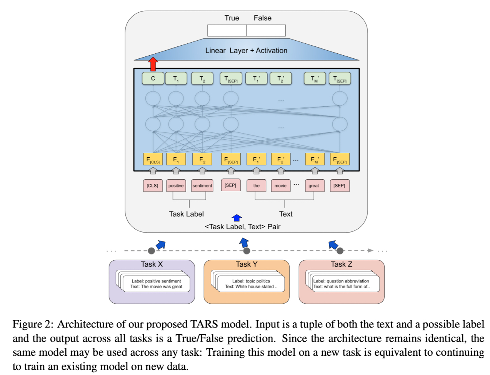
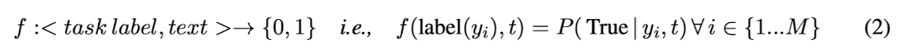
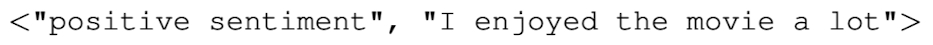
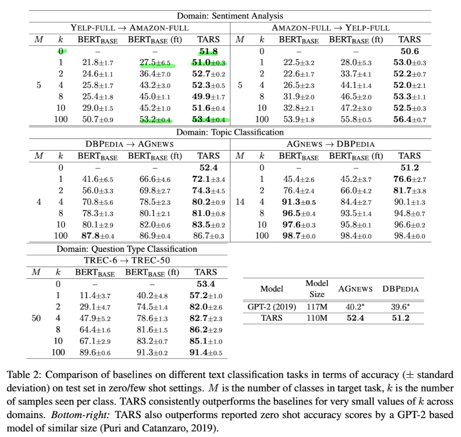
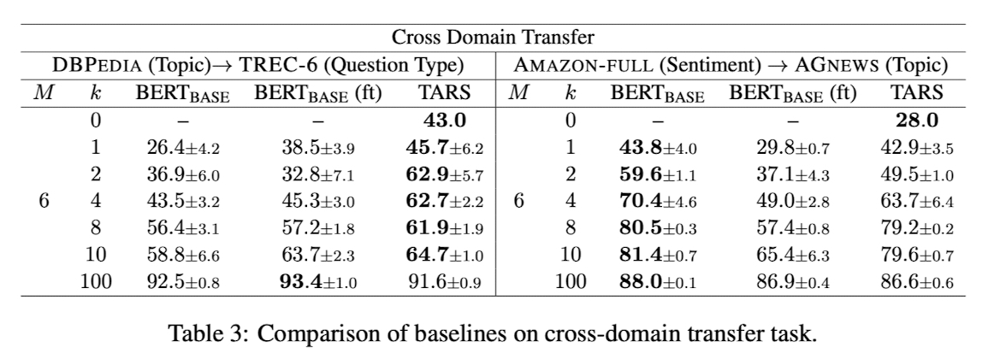

  
# Task-Aware Representation of Sentences for Generic Text Classification paper review

ACL - 2020

[Task-Aware Representation of Sentences for Generic Text Classification](https://aclanthology.org/2020.coling-main.285/)

이미 정의된 K 개의 클래스를 분류하도록 학습한 Classifier 에 추가된 클래스를 가지고 전이학습을 시킬 때 이전의 학습해서
K 개의 클래스를 분류하기 위한 정보를 담고 있던 linear layer 를 버리고 새로운 linear layer 를 밑바닥부터 학습해야 하는
문제를 해결할 방법 제시한 논문

## 1. 저자가 뭘 해내고 싶어했는가?

Text classification 에 대한 SOTA(State-of-the-art) approache 들은 BERT-style transformer 구조 위에 linear layer 를 
추가해서 이용함 

이러한 approach 는 효과적이지만 few-shot 또는 zero-shot 전이 학습 시나리오에서 사용의 한계를 가지고 있음

1. 예측을 위한 클래수의 개수가 사전에 정의되어야 함  
    새로운 클래스가 이미 학습된 classifier 에 추가되는 전이학습에서 linear layer 에 포함된 모든 정보들은 버려지고 
    새로운 linear layer 는 처음부터 학습됨
2. 이 approach 는 클래스의 자연어 이름에 의해 제공되는 명시적 의미 정보를 활용하는 것과는 대조적으로 학습 데이터로부터
암시적으로 클래스의 의미만을 학습  
    예를들어, 뉴스 기사의 topic 을 예측하기 위해 학습된 classifier 는 그들 스스로 의미 정보를 가지는 "business" 또는 
    "sports" 같은 클래스를 가질 것임

이 논문에서는 이러한 한계를 다루는 text classification 의 새로운 형식을 제시함

이것은 임의의 분류 문제를 일반적인 이진 분류 문제로 바꿔줌

적은 학습 데이터에서도 우수한 성능 그리고 학습 데이터가 전혀 없는 새로운 클래스에서도 예측할 수 있도록 하는 방법 제시

## 2. 이 연구의 접근에서 중요한 요소는 무엇인가?

### Main Idea

task 에 특화된 Decoder 를 일반적인 이진("True", "False") Decoder 로 변경

transformer 의 Input 은 클래스를 판별할 text 뿐만 아니라 클래스의 label 로 구성됨

예를들어, texet 가 positive 또는 negative 감성을 가지는지 아닌지를 예측하기 위해 학습된 이진 감성 분류기에 들어가는
input 은 분류가 될 text 뿐만 아니라 가능한 label 두개로 구성됨

BERT 에서 사용하는 [SEP] 토큰으로 클래스 label 과 text 를 구분함

모델에 들어가는 input 의 구성은 이렇게 되어있음

`[CLS]-token + class label + [SEP]-token + text`

BERT 를 통과한 후 [CLS] 토큰의 representation 을 마지막 linear layer 에 입력으로 줘서 이진 분류함

### Task-Aware Representations

논문에서 제안한 approach 는 분류 문제를 sentence 와 잠재적인 클래스 label 이 transformer 에 주어지는 "query" 로 
재구성되어 이 클래스 label 이 유지되는지 여부를 예측함

같은 Decoder(linear layer) 가 임의의 task 들에도 사용될 수 있고 클래스 label 자체에 의해 제공되는 정보도 transformer
모델에 의해 설명됨

장점으로 학습 데이터가 없는 클래스에 대한 예측도 반환할 수 있음

### Contribution

1. 전통적인 전이 학습 approache 들의 결정적인 단점을 다루는 text 분류의 새로운 형식 
TARS(**T**ask-**A**ware **R**presentation of **S**entences) 를 제시했고 TARS 가 얼마나 task 들에 대해 끊김없이 학습
될 수 있는지를 보임
2. TARS 의 zero-shot 그리고 few-shot 전이 학습 능력의 평가를 다른 task 들(sentiment analysis, topic detection, 
question type detection)과 다른 도메인(newswire, restaurant reviews, product reviews) 로부터 text classification
dataset 들을 사용하여 baseline 과 비교하기 위해 수행하고 의미적 거리의 영향을 조사함
3. 모든 코드를 공개했음

### Result

같은 도메인에서의 source data 와 넓은 카테고리를 가지는 target data 에 대한 전이 학습 결과를 보여줌

#### Zero-shot classification in TARS far above random baseline

모든 경우에 TARS 에 의해 얻어진 zero shot(k=0) accuracy 는 random baseline 보다 상당히 높음

#### Stronger few-shot results than baselines, but advantage levels off

TARS 는 상대적으로 빠르게 target task 에 적응할 수 있고 모든 모델이 클래스당 매우 적은 수의 예제를 볼 때 훨씬 더 높은
accuracy 를 얻을 수 있음

하지만 $text{BERT}_{text{BASE}}$ 와 $text{BERT}_{text{BASE}}$(ft) 은 더 많은 훈련 데이터를 볼 수 있다면 성능이 더 좋음

TARS 는 매우 적은 양의 데이터를 가진 영역에서 유용함

#### Effectiveness of transfer learning depends on semantic distance

의미적으로 상당히 다른 데이터셋들 사이의 전이 학습을 평가함

DBPEDIA 에서 TREC-6 으로의 전이는 k <= 10 일 때, 두개의 task 사이의 의미적 거리가 있음에도 불구하고 상당한 성능을 
보여줬지만 AMAZON-FULL 에서 AGNEWS 로의 전이(상당히 다른 언어와 도메인)에서 직접 target task 데이터로 학습된
$text{BERT}_{text{BASE}}$ 모델이 모든 전이 학습 approach 들 보다 성능이 뛰어남

여기에서도 TARS 가 여전히 $text{BERT}_{text{BASE}}$(ft) 를 능가한다는 점은 흥미로움

의미적으로 거리가 있는 task 들에 대해서도 전이학습에서 TARS 의 Robustness 함을 볼 수 있음
