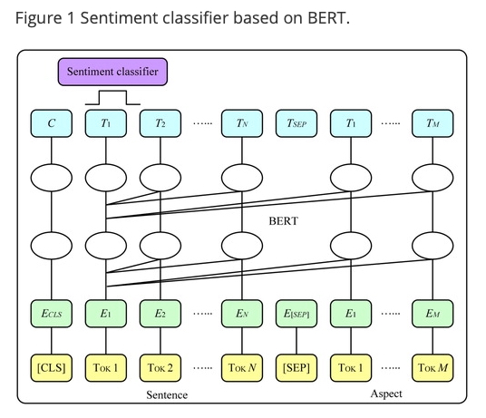
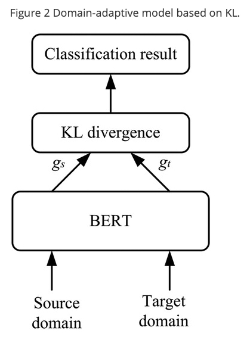
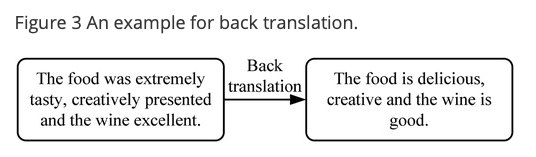
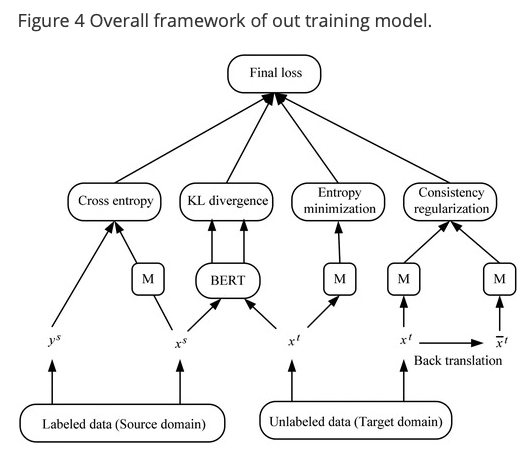
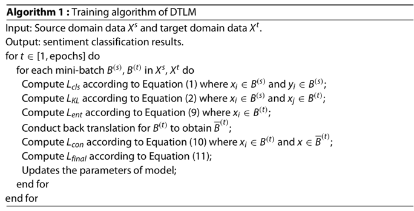

  
# Deep transfer learning mechanism for fine-grained cross-domain sentiment classification paper review

CONNECTION SCIENCE - 2021

[Deep transfer learning mechanism for fine-grained cross-domain sentiment classification](https://www.tandfonline.com/doi/full/10.1080/09540091.2021.1912711)

cross-domain sentiment classification 이란 target domain 에서 감정의 정도 분류를 돕기위해 source domain 에서 
유용한 정보를 이용하는 것임

상대적으로 적은 target domain data 에 대해서 분류 성능을 향상시키기 위해 양이 많은 source domain data 를 이용해서 
유용한 정보를 얻어내고 전이시키는 방법에 대한 논문임

## 1. 저자가 뭘 해내고 싶어했는가?

존재하는 방법들의 대부분은 source domain 과 target domain 사이의 변하지 않는 특징을 뽑아내는 것에 집중함 

하지만 이런 방법들은 target domain 에서 레이블이 없는 데이터를 더 잘 활용할 수 없음

이런 문제를 해결하기 위해, 세분화된 cross-domain sentiment classification 을 위한 
Deep Transfer Learning Mechanism(DTLM) 을 소개함

## 2. 이 연구의 접근에서 중요한 요소는 무엇인가?

### Contributions

1. context 를 인코딩하기 위해 사전학습된 BERT 를 사용하고 두개의 domain 사이의 feature 적응 문제를 해결하기 위한
수단으로서 KL Divergence 방법을 사용
2. target domain 에서의 label 이 없는 샘플을 처리하고 모델이 보지 못한 데이터에 대해서 일반화 능력을 강화하기 위해 
**entropy minimisation, semi-supervised learning 방법 그리고 consistency regularisation 을 소개**
3. 풍부한 양의 source domain 으로부터 학습된 지식을 이용하고 target domain 에서 부족한 label 된 데이터의 문제를 
해결하기 위해 soruce domain 으로 ACSA(Aspect-Category Sentiment Analysis) 데이터셋을 사용

### Main Idea

#### Sentiment Classifier

세분화된 감성 분석 task 는 source domain 에 대한 aspect 에 기반함

이 때, aspect 는 이 두개의 논문에서 제안된 모델을 사용해서 추출한다고 함 

- [Aspect Term Extraction with History Attention and Selective Transformation(2018)](https://arxiv.org/abs/1805.00760)
- [Hierarchical Attention Transfer Network for Cross-Domain Sentiment Classification(2018)](https://ojs.aaai.org/index.php/AAAI/article/view/12055)

BERT 는 다른 domain 의 text data 를 공유된 feature space 로 매핑하기 위한 feature encoder 로서 소개됨

세분화된 감성 분석 task 를 BERT 에 적용하기 위해, aspect 와 category 는 review text 와 결합된 "sentence" (문장)으로서 
여겨짐

그리고 두 문장(aspect 와 category(문장 1), review text(문장 1)) 사이의 "relationship" (관계) (감정의 정도)를 
예측하는 것으로 변환됨

위 그림에서 볼 수 있듯이 

`[CLS] tokenized Review [SEP] tokenized Aspect`

이와 같은 형태로 입력이 들어가고 마지막 hidden state 들 중 [CLS] 토큰 위치의 `C` 를 이용해 Sentiment classifier 를 
통과시킴

이 때, 예측값과 실제값 사이의 차이인 cross-entropy loss 를 최소화 시키면서 모델을 최적화함

#### Domain-adaptive model

cross-domain 문제에서 학습 데이터와 테스트 데이터는 IID(Independent and Identical Distribution) 가정을 만족시키지
못할 수 있고 이 두 샘플은 다르지만 관련이 있음

다른 domain 은 다른 feature space 분포를 가지기 때문에, cross-domain 구현의 열쇠는 source domain 과 target domain 
사이의 차이점을 제거하는 것임

계산을 단순화하기 위해, embedding space 에서 sample feature 분포의 평균값의 거리를 계산하기 위한 KL divergence 를 
사용함

다른 domain 의 리뷰들이 BERT 에 의해 인코딩 된 후에, 그들의 feature vector $ \lbrace \xi^s_i \rbrace^{N_s}\_{i=1} $ 
그리고 $ \lbrace \xi^t_i \rbrace^{N_t}\_{i=1} $ 가 얻어질 수 있음

KL Divergence 는 두개의 확률 분포들의 일치 정도를 측정하기 위해 사용되는 지수임

두 분포 사이의 차이가 클수록 KL divergence 도 커짐

$$ L_{KL} = KL(g_s \parallel g_t) + KL(g_t \parallel g_s) $$

$$ g_s = \frac{g'_s}{\parallel g'_s \parallel_1} $$

$$ g'_s = \frac{1}{N^s} \displaystyle \sum_{i=1}^{N^s} \xi^s_i $$

$$ g_t = \frac{g'_t}{\parallel g'_t \parallel_1} $$

$$ g'_t = \frac{1}{N^t} \displaystyle \sum_{i=1}^{N^t} \xi^t_i $$

$\parallel \cdot \parallel$ 은 정규화 작업을 나타냄

두개의 확률 분포 벡터 $ P, Q \in \mathfrak{R}^k $ 가 주어지면, KL divergence 는 아래와 같이 정의됨

$$ KL(P \parallel Q) = \displaystyle \sum_{i=1}^{k} P(i) \log(\frac{P(i)}{Q(i)}) $$

#### Information mining method for target domain based on semi-supervised learning

이 방법은 target domain 에서 레이블이 없는 샘플들을 처리하기 위해 entropy minimisation 과 
self-consistent regularisation 을 사용함

Minimum entropy 는 target domain 의 예측 값을 제약할 수 있고 target 샘플과 분류 결정 경계 사이의 거리를 증가시켜
target domain 의 예측 결과에 대해 더 높은 신뢰도를 얻을 수 있음

target domain 에서 입력으로 레이블이 없는 샘플은 감정 범주의 확률 분포를 다음과 같이 얻음

$$ \bar{\mathsf{y}}_i^t = F(\xi^t_i ; \theta_f) $$

entropy minimisation 방법의 필요 조건에 따르면, 범주의 확률 분포에 대한 entropy minimisation 을 수행하는 것이
필요하고 loss function 은 다음과 같음

$$L_{ent} = \frac{1}{N^t} \displaystyle \sum^{N^t}_{i=1} \sum_{c \in C} \bar{\mathsf{y}}_i^t (c) \log \bar{\mathsf{y}}^t_i (c) $$

$C$ 는 모든 범주(Category) 를 의미

또한 데이터가 교란될 때 동일한 확률 분포를 출력하기 위해 consistency regularisation 방법이 도입됨

output 분포 $p_{\theta}(\mathsf{y} \vert \mathsf{x})$ 를 얻기 위해 모델에 input $\mathsf{x}$ 를 입력으로 주고

그런 다음, model 의 hidden layer 에 매우 작은 방해 $\epsilon$ 을 주입하여 output 분포 
$p_{\theta}(\mathsf{y} \vert \mathsf{x}, \epsilon) $ 도 구함

마지막으로, 이 두개의 output 분포 사이의 거리를 최소화하는 것이 필요함

NLP 에서 text input 은 이산적이기 때문에, noise 를 주입하는 방법에 대한 몇가지 제한이 있음

그래서 이 논문에서는 data augmentation 을 위한 back-translation 방법을 사용함

back-translation 이란 이전의 번역된 샘플을 다시 source language 로 되돌리는 방법을 말함

이것은 샘플의 원래 의미를 유지하면서 다른 표현을 얻을 수 있음

target domain 에서 샘플 $\mathsf{x}^t$ 와 back-translation 된 $\bar{\mathsf{x}}^t$ 가 주어지면, 
이 샘플들을 분류하기 위해 source domain 에서 학습된 분류기를 사용해서 두개의 확률분포  
$p(\mathsf{y} \vert \mathsf{x}^t ; \bar{\theta})$ 와 $p(\mathsf{y} \vert \bar{\mathsf{x}}^t ; \theta)$ 를 얻을 수 있음

이 두개의 loss 함수는 다음과 같음

$$ L_{con} = KL(p(\mathsf{y} \vert \mathsf{x}^t ; \bar{\theta}) \parallel p(\mathsf{y} \vert \bar{\mathsf{x}}^t ; \theta)) $$

$\theta$ 는 모델 파라미터들을 나타내고 $\bar{\theta}$ 는 현재 파라미터가 고정된 걸 의미

#### Training model

요약하자면, loss 함수는 4개의 파트를 포함함

1. source domain 에서의 cross-entropy loss
2. source domain 과 target domain 으로부터의 feature 분포 사이의 KL divergence 에 의해 측정된 차이
3. target domain 에서의 minimum entropy
4. back-translation 후에 consistency loss

training model 의 전반적인 프레임웍은 다음의 그림에서 볼 수 있음

최종 loss 함수는 다음과 같음

$$ L_{final} = L_{cls} + \lambda_1 L_{kl} + \lambda_2 L_{ent} + \lambda_3 L_{con} $$

$\lambda_1, \lambda_2, \lambda_3$ 은 하이퍼파라미터임

DTLM 모델의 학습알고리즘은 다음과 같음

aspect 를 추출하는 방법에 관한 논문을 읽을 필요가 있어보임

label 되지 않은 데이터의 정보도 활용하겠다는 점에 대해서는 나쁘지 않음

