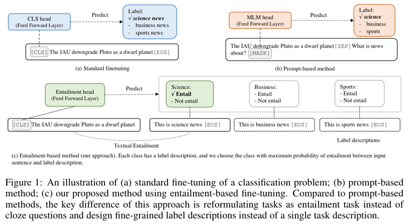

  
# Entailment as Few-Shot Learner paper review

COMPUTER SCIENCE - 2021

[Entailment as Few-Shot Learner](https://arxiv.org/abs/2104.14690v1)

## 1. 저자가 뭘 해내고 싶어했는가?

사전 학습된 대규모 언어 모델은 few-shot 학습자로서 놀라운 능력을 보여줬음

그러나 이들의 성공은 train 과 serving 이 어려울 정도로 모델 parameter 를 많이 늘리는데 크게 달려있음 

이 논문에서 작은 언어 모델을 더 나은 few-shot 학습자로 바꿀 수 있는 EFL 이라는 새로운 접근방식을 제안함

## 2. 이 연구의 접근에서 중요한 요소는 무엇인가?

### Main Idea 

NLP task 를 textual Entailment task 로 먼저 재구성하는 새로운 접근방법을 제안함

여기서 가정은 Entailment 는 모든 분류 task 들을 모델링하기 위한 통합된 방법으로서 사용할 수 있다는 것임

Figure 1 (c) 에서 보여주듯이, 주요 아이디어는 class label 을 label 을 설명하기 위해 사용될 수 있는 자연어 문장으로 
바꾸는 것임

작성중

