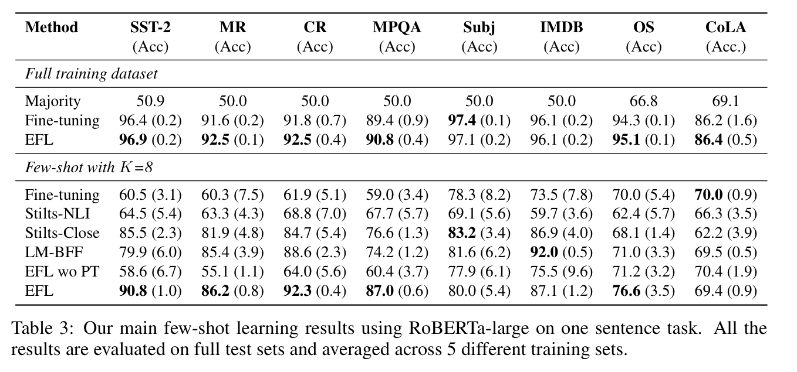
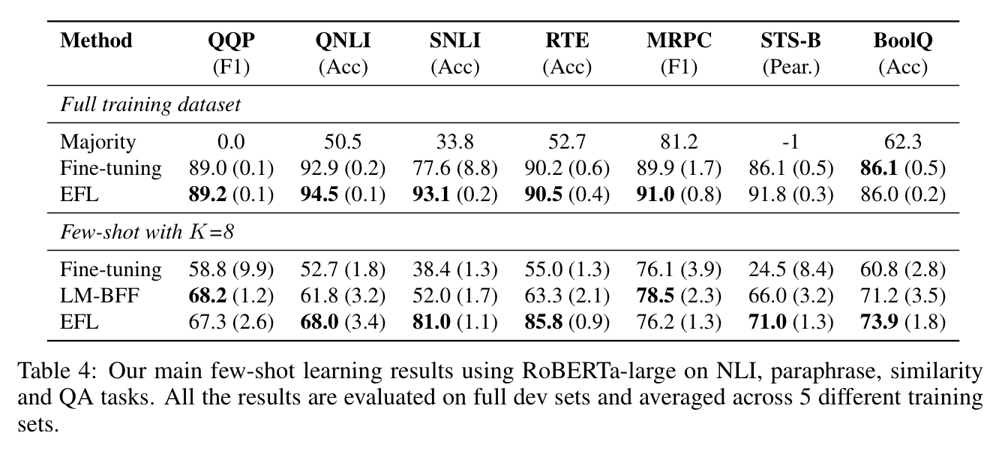

  
# Entailment as Few-Shot Learner paper review

COMPUTER SCIENCE - 2021

[Entailment as Few-Shot Learner](https://arxiv.org/abs/2104.14690v1)

## 1. 저자가 뭘 해내고 싶어했는가?

사전 학습된 대규모 언어 모델은 few-shot 학습자로서 놀라운 능력을 보여줬음

그러나 이들의 성공은 train 과 serving 이 어려울 정도로 모델 parameter 를 많이 늘리는데 크게 달려있음 

이 논문에서 작은 언어 모델을 더 나은 few-shot 학습자로 바꿀 수 있는 EFL 이라는 새로운 접근방식을 제안함

## 2. 이 연구의 접근에서 중요한 요소는 무엇인가?

### Main Idea 

NLP task 를 textual Entailment task 로 먼저 재구성하는 새로운 접근방법을 제안함

여기서 가정은 Entailment 는 모든 분류 task 들을 모델링하기 위한 통합된 방법으로서 사용할 수 있다는 것임

Figure 1 (c) 에서 보여주듯이, 주요 아이디어는 class label 을 label 을 설명하기 위해 사용될 수 있는 자연어 문장으로 
바꾸는 것임

예를들어, 감정 분류 input/label 쌍을 다음의 textual entailment 샘플로서 재구성할 수 있음

[$x$: I am in love with these actors[EOS], $y$: positive] -> 
[$x$: I am in love with these actors [SEP] This is a great movie [EOS], $y$: entailment]

task 를 entailment 스타일로 변환함으로써, 표준 사전학습된 언어모델들은 매우 효과적인 few-shot 학습자임을 증명했음

다른 이점은 다양한 task 들은 문장쌍의 entailment task 로 재구성되기 때문에 few-shot 성능을 더욱 향상시키기 위한
쌍별 증강 데이터를 구성 하기 위해 contrastive learning 을 사용할 수 있음

제안된 approach 는 여전히 각각의 task 를 위한 모델의 fine-tuning 이 필요하지만 강력한 성능을 달성하기 위해 엄두도
못낼 정도로 큰 언어모델은 필요하지 않음

게다가, entailment 모델들은 모든 사람이 다양한 저장소를 통해 다운로드하고 fine-tuning 할 수 있어 few-shot 학습자를
민주화?(쉽게 쓸 수 있고) 상업적 black-box API 로 제한하지 않음

### Main Result

15개 NLP task 들의 main result 들을 보여줌

제안한 모델 EFL(Entailment as Few-shot Learners) 매우 좋은 성능을 냄

K=8(class 별로 sample 8개) few-shot 조건에서 EFL 평균 8.2% 향상

예외는 CoLA 데이터셋뿐

전체 학습 데이터셋에서 EFL 은 표준 파인튜닝한 RoBERTa-Large 모델에 비해  대략 평균 1.9pt 향상을 보여줌

이러한 결과들은 few-shot 학습을 위한 더 나은 접근 방식, 나아가 다양한 NLP 작업에 대한 통합 접근 방식으로서
제안된 entailment 에 기반한 방법의 효과를 확인함

좀 더 자세한 내용은 논문 참고 해주세요.

