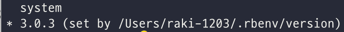

# m1 맥북에어 github blog 준비과정

깃허브 블로그를 써보고자 마음먹고 구글링을 하면 ruby 를 설치하라고 한다.

그렇지만 밑에 에러가 뜨면서 ruby 설치하기도 전에 막힌다 :sweat:

```
$ gem install bundler
ERROR:  While executing gem ... (Gem::FilePermissionError)
    You don't have write permissions for the /Library/Ruby/Gems/2.3.0 directory.
```

그이유는 맥북 시스템에서 이미 Ruby를 사용하고 있어서 라고 한다.

혹시라도 있을 맥북 초기화를 위해 나를 위해 과정을 남겨보려한다.

## m1 맥북에어 ruby 재설치

### 1. iterm2 or terminal 을 rosetta 로 실행하도록 세팅하기

1. 응용프로그램에서 iterm2 우클릭 후 복제 선택
    
2. iterm2 복사본 이름 변경 -> 저는 iterm2 rosetta 로 했습니다:)
    
3. 복사본 우클릭 후 정보가져오기 선택
    
4. Rosetta 를 사용하여 열기 선택
    

### 2. 현재 rbenv 제거하기

1. iterm2 rosetta 에서 ```$ rm -rf `rbenv root` ``` 실행
2. `$ brew uninstall rbenv`

### 3. ARM version Homebrew 삭제

```$ /bin/bash -c "$(curl -fsSL https://raw.githubusercontent.com/Homebrew/install/master/uninstall.sh)"```

### 4. x86_64 version Homebrew 설치

```$ arch -x86_64 /bin/bash -c "$(curl -fsSL https://raw.githubusercontent.com/Homebrew/install/master/install.sh)"```

### 5. `$ brew install rbenv` 실행

만약 "Error: Cannot install in Homebrew on ARM processor in Intel default prefix (/usr/local)!" 이 뜬다면
`$ arch -x86_64 brew install rbenv` 실행

### 6. 마지막으로 `$ arch -x86_64 rbenv install x.x.x`

이때, x.x.x 는 버전 ex) 3.0.3

### 7. rbenv version 을 확인해보자

`$ rbenv versions`



처음엔 설치한 3.0.3 에 * 표시가 있지 않고 system 에 있을것이다.

### 8. `$ rbenv global 3.0.3` 을 iterm2 에서 실행하자

이제는 위에처럼 3.0.3 위치에 * 표시가 생겼을거다

### 마지막으로 rbenv PATH를 추가하기 위해 본인의 쉘 설정 파일 (..zshrc, .bashrc) 을 열어 다음의 코드를 추가하자

`$ vim ~/.zshrc`

.zshrc 파일을 열고 밑에 코드를 가장 아래에 추가해주자

```
[[ -d ~/.rbenv  ]] && \
  export PATH=${HOME}/.rbenv/bin:${PATH} && \
  eval "$(rbenv init -)"
```

코드를 추가했으면 적용을 위해 마지막으로 실행하자 

`$ source ~/.zshrc`

이제 `$ gem install bundler` 코드를 실행하면 문제없이 잘 설치된다.

## gem install 명령어를 사용하여 jekyll 을 설치한다.

젬(gem)은 분산 패키지 시스템으로 라이브러리의 작성이나 공개, 설치를 도와주는 시스템이다.
리눅스에서의 apt 시스템과 유사하다. 루비는 젬(gem)을 사용하여 라이브러리 설치를 진행한다.

`$ gem install jekyll`

나의 jekyll 버전은 이렇다.

```
$ jekyll -v
> jekyll 4.2.2
```

이제 기본적인건 설치가 다 되었다 다음으로 넘어가자.
