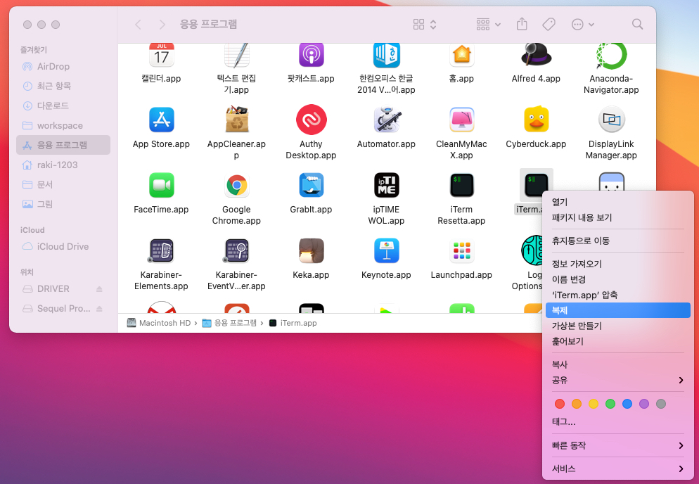
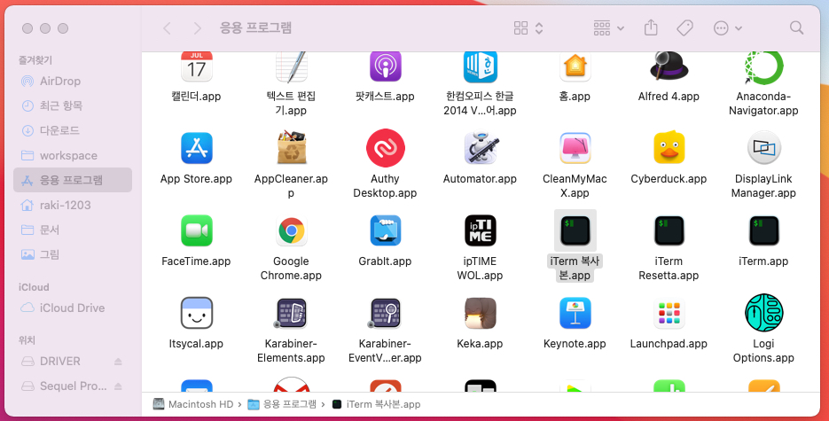
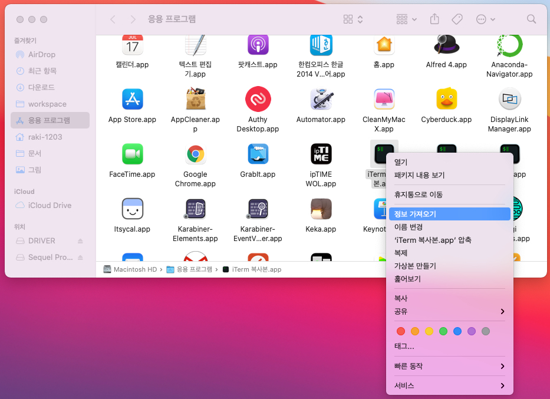
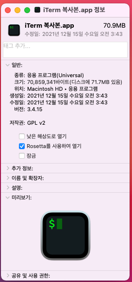

# m1 맥북에어 ruby 재설치

## 1. iterm2 or terminal 을 rosetta 로 실행하도록 세팅하기

### 순서
1. 응용프로그램에서 iterm2 우클릭 후 복제 선택
    
2. iterm2 복사본 이름 변경 -> 저는 iterm2 rosetta 로 했습니다:)
    
3. 복사본 우클릭 후 정보가져오기 선택
    
4. Rosetta 를 사용하여 열기 선택
    

## 2. 현재 rbenv 제거하기

### 순서

